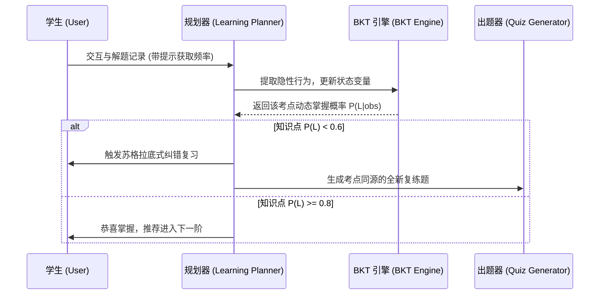

# 珞珈数智助教 (Luojia Math Tutor)

[](LICENSE)

**面向 STEM 教育的可验证学习智能体 (Verifiable Learning Agent)**

传统 AI 辅导系统的通病是“越俎代庖”——学生一问，AI 就忍不住直接给出完整计算过程。这不仅剥夺了学生的思考机会，在面对复杂数学推导时也极易产生大模型固有的“幻觉”。

珞珈数智助教将单纯的“AI 问答”重构为**具有持久化记忆、弱点洞察与教学步骤验证的自适应辅导系统**。项目采用双轨执行引擎，完美平衡了“大模型的启发式引导”与“符号引擎的确定性校验”。

---

## 🎯 The Problem: 为什么不用直接问 ChatGPT/DeepSeek？

当学生向通用大模型提问数学题时，往往面临两大死穴：
1. **直接泄露答案 (Direct Answer Leak)**：大模型基于自回归的概率引擎，天然倾向于“给出最终答案”以讨好用户。
2. **逻辑幻觉 (Logical Hallucination)**：复杂的微积分与线性代数推导中，一旦中间一步算错，后续全部崩溃。

本项目提出了一种全新的解法：**将大模型的“教学”与“解题”职责彻底剥离**。

---

## 💡 Architecture: Teach + Verify 双轨架构

本项目构建了一个基于 LangGraph 的解耦多智能体工作流 (Multi-Agent Workflow)：

```mermaid
graph TD
    User([学生]) --> |提出数学问题| Router{Policy Router}
    Router -->|概念讲解与宏观引导| Teacher[Teacher Agent]
    Router -->|数学推导与计算过程| Verifier[Verifier Agent]
    
    subgraph 核心双轨引擎 (Dual-Track Engine)
        Verifier -->|1. 静默编写 Python 代码<br>2. SymPy 沙盒强校验<br>3. 提取定位错因| Teacher
        Teacher -->|基于裁判的绝对正确结论<br>采用苏格拉底式启发提问| User
    end
    
    style Verifier fill:#f9d0c4,stroke:#333,stroke-width:2px
    style Teacher fill:#d4e6c1,stroke:#333,stroke-width:2px
```

通过这一架构，**裁判（Verifier）专心算题找错，老师（Teacher）基于绝对正确的裁判结论去引导学生**，从而形成了一条坚不可摧的防御链，真正实现了“绝不泄露最终答案”的底线。

---

## 🧠 Learning Loop: 基于 BKT 的动态掌握度追踪

漂亮的 UI 不等于学生建模 (Student Modeling)。本项目引入了真实的教育学算法来动态衡量和量化学生的学习效果。



- **贝叶斯知识追踪 (Bayesian Knowledge Tracing, BKT)**：彻底摒弃简单粗暴的 `正确数 / 总数` 算分。系统基于学生的做题历史、获取提示的频率（Hint Level）等隐性行为，动态计算知识掌握概率 `P(L|obs)`。
- **动态规划 (Learning Planner)**：Agent 在每轮对话前会检查 BKT 数据模型，并动态决定接下来的教学策略。
- **举一反三 (Quiz Gen)**：对于错题，后台 Agent 会基于薄弱概念，自动生成核心知识点同源、但数值不同的全新复练题。

---

## 📊 Evaluation: LuojiaMathBench V8 评测基准

没有评测的 Agent 只是玩具。本项目专门构建了教育场景的零样本评测集 `LuojiaMathBench V8`。

该 Benchmark 专门用来测试**“大模型在面对学生各种花式伪装求解答时，能否守住底线，精准定位错因并不泄露答案”**（即 Golden Edge Cases）。

| 架构 / 模型 | 教学引导合规率 (Passed) | 答案泄露/代替思考率 (Leak) | 逻辑幻觉率 (Hallucination) |
| :--- | :--- | :--- | :--- |
| **GPT-4o (单体系统)** | ~35% | 极高 (>60%) | 中等 |
| **DeepSeek V4 (单体系统)** | ~40% | 极高 (>50%) | 较低 |
| **Luojia Tutor (V8 Multi-Agent)** | **90% (18/20)** | **极低 (<10%)** | **零 (依托 SymPy 强校验)** |

*评测证明：重构为双轨多智能体架构后，系统在 Error Localization (错因定位) 和 Pedagogical Alignment (教学对齐) 上取得了极其显著的质的飞跃。*

---

## 📺 System UI & Demos (系统界面预览)

为了提供顶级的交互体验，系统采用了极致优雅的“书院中国风 (Zen Academy Style)”，并配备了完善的教育学组件。

*(由于 GitHub 单文件体积限制，高清视频演示已被移出仓库。你可以在本地运行以查看真实效果，或参考下方核心组件说明)*

*   **🎛️ 智能双栏工作台**：左侧为苏格拉底对话框，右侧实时显示基于对话一键总结的 A4 级排版随堂笔记。
*   **🕸️ 动态能力雷达图**：在 Dashboard 中，系统将把后台的 BKT 数学期望值，实时渲染为多维知识点掌握度雷达图。
*   **📝 交互式草稿板与 OCR**：内置的 Whiteboard 允许手写推导公式，支持一键拍照搜题，由 MinerU 引擎负责复杂公式提取。

---

## 🛠️ 其他辅助工程特性

虽然核心在于 Agent Workflow，但本项目同样具备完善的工业级全栈实现：

*   **混合 RAG 检索引擎**：不仅包含 Semantic Embedding，更引入了 BM25 本地关键字检索，通过 RRF (Reciprocal Rank Fusion) 合并。实现 100% 离线高可用。
*   **全栈交互体验**：Next.js 14 (App Router) + FastAPI + SQLite。内置定制的 LaTeX 数学键盘，支持将解答过程 TTS 语音播报。
*   **智能动态标签 (Dynamic Tagging)**：基于 LLM 自动将碎片化的对话归类为精准考点标签（如“微积分”、“矩阵变换”）。

---

## 📁 项目目录结构

```text
├── apps/web                     # Next.js 14 前端项目 (React, TypeScript, Tailwind)
│   ├── app/                     # App Router 路由 (chat, mistake-book, notebook, dashboard)
│   ├── components/              # 核心 UI 组件 (草稿板, 公式键盘, 消息泡, 雷达图等)
│   └── lib/                     # API 请求与前端封装
├── apps/api                     # FastAPI 后端项目 (Python, SymPy, SQLite)
│   ├── app/
│   │   ├── api/                 # API 路由接口 (会话, 错题, 掌握度, RAG, Bilibili)
│   │   ├── agents/              # 智能体组件 (Harness 质量评估器, Vision 识图)
│   │   ├── memory/              # SQLite 数据库模型与仓储 (repository.py, mastery.py BKT引擎)
│   │   └── tutor/               # 多智能体调度中枢 (graph.py, policy_router.py, prompt_builder.py)
│   └── pyproject.toml           # 依赖与打包配置
└── luojia-math-tutor/           # 珞珈数智助教核心 Skill 定义文件夹
    ├── SKILL.md                 # 助教的核心工作流提示词与平台联动指令
    └── references/              # 本地数学概念参考知识库与工具使用指南
```

---

## ⚙️ 本地快速部署

### 1. 前置准备
*   安装 [Node.js](https://nodejs.org/) (v18+)
*   安装 [Python](https://www.python.org/) (v3.10+)

### 2. 配置环境变量

**后端配置**：在 `apps/api/` 下创建 `.env`，参考 `apps/api/.env.example`：
```env
APP_ENV=local
DATABASE_URL=sqlite:///./luojia_tutor.db
LLM_PROVIDER=deepseek
LLM_BASE_URL=https://api.deepseek.com
LLM_API_KEY=your_deepseek_api_key
LLM_MODEL=deepseek-chat
ALLOW_USER_API_KEY=true
```

**前端配置**：在 `apps/web/` 下创建 `.env.local`：
```env
NEXT_PUBLIC_API_BASE_URL=http://localhost:8000
```

### 3. 安装与运行

在根目录下使用以下命令启动全栈服务：

```bash
# 1. 安装前端依赖并运行
cd apps/web
npm install
npm run dev

# 2. 安装后端依赖并运行 (新终端)
cd apps/api
pip install -e .
python -m uvicorn app.main:app --reload --port 8000
```

你也可以在根目录下直接使用脚本：
*   启动 API 端：`npm run dev:api`
*   启动 Web 端：`npm run dev:web`

启动成功后，打开浏览器访问 [http://localhost:3000](http://localhost:3000) 即可开启学习之旅。

---

## 🧪 自动化测试与质量校验

项目内置了完整的校验链条，可以通过根目录的测试指令验证系统正确性：

```bash
# 执行全部校验 (包含知识库 JSON 格式自检与 API 端 pytest)
npm test

# 仅执行数学知识库 JSON 校验
npm run test:knowledge

# 仅运行后端 API 测试
npm run test:api
```

---

## 💡 经典演示路径 (演示建议)

你可以使用以下数学典型问题来体验完整的“启发式引导 + 错题记录 + 掌握度分析”闭环：

1.  **初次试探（触发引导）**：输入 `“我算 ∫ x^2 dx = x^3，对吗？”`
    *   *AI 表现*：后台会静默通过 SymPy 验算得出错误，识别原因为“漏掉常数项或系数算错”，并在前端给出考点分析，以苏格拉底式提问引导你发现漏了什么（不直接说答案）。
2.  **查看面板**：右侧学习面板会展现被识别的考点（不定积分）和掌握度。
3.  **整理随堂笔记**：点击输入框上方的“生成随堂笔记”按钮，AI 会提炼本段对话并自动在 `/notebook` 视图生成漂亮的 LaTeX 整理文档。
4.  **错题本与雷达图**：点击该题的“加入错题本”按钮，然后访问 `/dashboard` 和 `/mistake-book`，可以看见错题记录和更新后的掌握度能力雷达图。
5.  **举一反三**：在错题本卡片上点击“举一反三”，系统将基于该错题考点自动生成一道相似计算，测试你是否真正掌握。

---

## 👥 许可证与说明

*   本项目核心代码、脚本及 Skill 配置遵循 [MIT License](LICENSE)。
*   `luojia-math-tutor/references/textbook/` 下的教材 PDF 仅供本地科研与学习参考，请在遵守法律的前提下合规使用。
