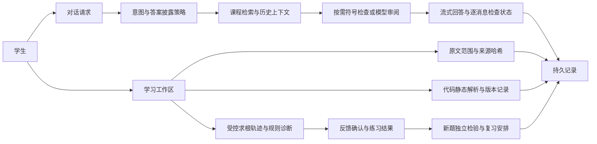

# 珞珈数智助教 · Luojia Math Tutor

> 接续交付：[U04–U06](planning/complete-upgrade-2026-10/delivery-u04-u06.md)已完成积分引用、代码静态提示讨论与讲回证据定位首版，API880/Web65及增量14/33通过。正式经审判断与真实模型质量仍pending；原规划/回执保留历史状态。

> 新交付：[U01–U03](planning/complete-upgrade-2026-10/delivery-u01-u03.md)：线性实验同页讨论、教材选段引用与只读任务续接；API847/Web64及来源/可靠性回归通过。实际网页以固定模型和临时库验收，真实模型质量与教学收益仍待验证。

后续补充升级：[完整计划与18个可验收切片](planning/complete-upgrade-2026-10/README.md)（本轮只规划，尚未实现）。

> 分批提交与[S5.3离线预算切片](planning/agent-v3-2026-10/13-delivery-s5-3-offline-and-commits.md)：API819/Web56通过；模拟传输预留/并发/取消/恢复等合同已验收，真实供应商能力、费用上界与live仍关闭。

> S5.2当前交付：[8道dev材料与2条ASGI流程首版](planning/agent-v3-2026-10/12-delivery-s5-2.md)，API780/Web56与E0合同通过。内容为agent准备、真人审核/真实模型质量仍pending；[题解与rubric](evaluation/s5/development-content-v1.md)可直接审阅。

规划入口：[产品、Agent工程与S5共同排期](planning/README.md)。

> 当前S5.1首版：[离线评测/实际图fixture与解释报告](planning/agent-v3-2026-10/10-delivery-s5-1.md)已实现，API749/Web56与E0合同通过；[验证目标](planning/agent-v3-2026-10/11-s5-1-evaluation-rationale.md)说明case取舍和后续启动条件。8道dev草案gold仍pending，无真实模型质量或教学收益结论。模式/工具弹出面板已改实色背景。

> 当前交付（2026-10-07）：[S5.0本步核验与学习资格](planning/agent-v3-2026-10/09-delivery-s5-0.md)已在工作区实现：有界AST、固定worker、输入/候选绑定、双学习写入资格、历史范围标注；API700/Web56，E0 v2 38/92及增量10/45均通过，Web构建通过。首页曲线动画和操作文案已更新。后续质量runner/gold和linear引用按[日程](planning/agent-v3-2026-10/04-roadmap.md)推进，未宣称真实模型质量或教学收益。下方旧回执数字保留历史日期。

> 当前规划（2026-10-07修订）：A0–A3、S1–S4为既有工程交付；2026-10-04离线回执为API655/Web51、E0 v2 38合同/92实例。下一步先完成[S5.0核验与学习资格合同](planning/agent-v3-2026-10/08-s5-0-verifier-contract.md)，再做聚焦评测和linear只读实验引用，见[修订日程](planning/agent-v3-2026-10/04-roadmap.md)。该段为实施前规划快照；当前S5.0交付见上方，质量评测/产品接入仍待做。


**把条件讲清，把过程算明。**

陪你读教材、做数值实验的 AI 数学助教。学习工作区以**非线性求根**作为首个完整练习模块，并新增**线性方程组与数值积分实验首版**；对话同时保留高等数学、线性代数与概率统计的辅导入口。

[](LICENSE)
[](apps/web/package.json)

[功能与学习路径](#功能与学习路径) · [快速开始](#快速开始) · [验证与评测](#验证与评测) · [当前边界](#当前边界) · [规划与交接](#规划与交接)

## 快速开始

以下命令适用于 **Windows / PowerShell**，从仓库根目录执行。CI 使用 Node.js 24、Python 3.12；前端声明 Node.js ≥20.9，后端声明 Python ≥3.10。建议使用项目虚拟环境安装 Python 依赖。

### 1. 安装依赖

```powershell
npm.cmd ci
npm.cmd --prefix apps/web ci
python -m pip install -e ./apps/api
```

### 2. 配置本地环境

仅在文件不存在时复制示例，保留你已有的配置：

```powershell
if (!(Test-Path apps/api/.env)) {
    Copy-Item apps/api/.env.example apps/api/.env
}
if (!(Test-Path apps/web/.env.local)) {
    Set-Content apps/web/.env.local 'NEXT_PUBLIC_API_BASE_URL=http://127.0.0.1:8000'
}
```

编辑 `apps/api/.env`，让 `LLM_PROVIDER`、`LLM_BASE_URL`、`LLM_MODEL` 和 `LLM_API_KEY` 对应你的模型服务。完整设置见 [.env.example](apps/api/.env.example)。密钥与数据库均不应提交。

没有模型密钥时，受控求根实验、过程诊断、章节参考自检和静态代码审阅仍可使用；模型聊天、模型伴读解释等能力需要有效配置，不能把无模型的来源对照当作模型生成。

### 3. 分别启动两个终端

终端 A：

```powershell
npm.cmd run dev:api
```

终端 B：

```powershell
npm.cmd run dev:web
```

打开 [本地首页](http://localhost:3000)，API 文档位于 [本地 Swagger](http://127.0.0.1:8000/docs)。根目录的 `dev:*` 与 `npm test` 脚本使用 `npm.cmd`；其他系统请在 `apps/api` 手动启动 uvicorn，在 `apps/web` 使用 npm 启动前端。

### 4. 选择账号或本地演示

本地示例为 `APP_ENV=local`、`AUTH_REQUIRED=false`，未登录请求使用演示身份。注册账号为 3–64 位字母、数字或 `_.@-`，首字符为字母或数字；密码至少 10 个字符。登录或注册成功后进入今日学习。

账号凭证保存在当前浏览器。退出清除本地凭证并卸载当前页面，保留本地学习草稿；**尚未提供密码找回、邮箱验证、令牌刷新或服务端会话撤销**。

## 功能与学习路径


**小珞**是珞珈数智的 AI 助教形象：数学学姐的交流风格，陪你辨清公式条件、观察迭代过程、解释自己的理解。首页使用全身立绘，聊天欢迎区使用缩小布局。

从一项任务开始：**读材料 → 做实验 → 提交自己的过程 → 确认反馈 → 换题检验 → 到期复习**。系统生成的实验轨迹是参考帮助；你自己的提交和独立检验分别记录。

| 功能 | 页面 | 当前可以做什么 |
| --- | --- | --- |
| F1 今日学习 | `/study` | 安排 15/30 分钟任务，继续跨日未完成记录，提交求根轨迹、确认反馈、换题检验与间隔复习。反馈待确认时防止覆盖提交。 |
| F2 教材伴读 | `/reading` | 阅读课程摘录或自己的已上传材料，核对适用条件、选择原文段落提问，把摘录和问题保存为带来源的笔记。 |
| F3 数值实验 | `/lab`、`/numerical-lab` | 求根三类算法；新增 Jacobi / Gauss–Seidel、梯形 / Simpson / 自适应 Simpson 实验，预测、回放、对照与数值核对；新模块不计独立成绩。 |
| F4 章节自检 | `/assessment` | 六道开发参考题；草稿恢复、题号导航、首次作答确认，交卷后查看参考解析和复习入口。 |
| F5 讲给助教听 | `/teach-back` | 用自己的话解释条件，将原句对应到条件，保存补充版本；模型可用时提供明确标注的审阅意见。 |
| F8 数值代码作业 | `/code-workshop` | 限定 Newton 作业的 Python AST 静态审阅、代码行定位、保存版本对照；手动轨迹单独诊断。**学生代码不执行。** |

F6 视频伴学与 F7 教师简报仍在规划，见[扩展功能与启动条件](planning/learning-experience-2026-10/04-extensions.md)。

已有的对话助教 `/chat`、错题本 `/mistake-book`、随堂笔记 `/notebook` 和课程图谱 `/graph` 继续保留。默认给予适量提示；直接讲解或明确请求完整解答时可给完整过程。练习出题与答案披露分别处理。

## 一个可复现的体验例子

1. 打开求根实验，选择“牛顿法：0 → 1 → 0 循环”。写下对 `f(x)=x³−2x+2`、`x₀=0` 的预测，再运行参考实验。
2. 用滑块、前后步按钮或播放观察循环。把初值改为 `−2`，写下新预测，保持函数、目标和阈值一致后运行，再对照两次记录。
3. 在教材伴读选择牛顿法，核对“初值足够接近根”等条件，将所选原文加入笔记。也可以到讲回页面解释这些条件。
4. 在今日学习提交**自己计算**的指定轨迹和停止依据，读完反馈后确认结果。练习成功可以换题检验；独立检验期间，已接入保护的聊天、伴读解释、参考实验等入口阻止新的帮助请求。
5. 用章节自检复习条件与误差判断，或进入代码作业修订模板。章节参考分、静态提示和手动轨迹都不等于已证明掌握。

小残差、相邻差小与根误差小是不同判断；一次数值实验也不能证明一般收敛。

## 实现与证据边界


```mermaid
flowchart LR
    Student[学生] --> Chat[对话请求]
    Student --> Workspace[学习工作区]
    Chat --> Policy[意图与答案披露策略]
    Policy --> Context[课程检索与历史上下文]
    Context --> Check[按需符号检查或模型审阅]
    Check --> Answer[流式回答与逐消息检查状态]
    Workspace --> Root[受控求根轨迹与规则诊断]
    Workspace --> Source[原文范围与来源哈希]
    Workspace --> Code[代码静态解析与版本记录]
    Root --> Feedback[反馈确认与练习结果]
    Feedback --> Probe[新题独立检验与复习安排]
    Answer --> Store[持久记录]
    Source --> Store
    Code --> Store
    Probe --> Store
```

- **对话**：LangGraph 按请求调用教学策略、课程检索、受限 math/SymPy 工具或模型审阅。工具执行成功只说明计算代码运行成功；模型审阅仍是意见，不能把整段解释标成数学证明。
- **求根过程**：受控表达式解析、轨迹诊断与 RootEpisodeService 分开处理更新、停止依据和反馈确认。系统参考实验不计为独立完成；未知结果不计成功。
- **材料**：课程知识包与个人上传原文分别呈现。选段保留字符范围与来源哈希；抽样生成的教材笔记明确标注覆盖限制。
- **学习记录**：SQLite 保存会话、课程与学习任务。BKT 后验是基于观测和参数的估计，复习阶段是调度规则；二者都不替代无 AI 的迁移测验或延迟保持证据。
- **帮助保护**：未完成的独立检验阻止应用中新请求的讲解、参考实验等帮助；历史内容和外部工具不能据此排除。

### 存储与配置

| 配置 | 作用 |
| --- | --- |
| `DATABASE_URL` | 主应用数据库，默认使用 SQLite。 |
| `COURSE_STORE_PATH` | 显式指定课程与学习工作区持久库；路径相对 API 工作目录。文件 SQLite 未指定时派生 `<数据库路径>.course.db`；内存库不保证重启恢复。 |
| `AUTH_REQUIRED` / `AUTH_TOKEN_SECRET` | 控制鉴权及令牌签名。生产环境要求鉴权与独立配置的签名密钥。 |
| `LLM_PROVIDER` / `LLM_BASE_URL` / `LLM_MODEL` / `LLM_API_KEY` | 服务端模型配置。 |
| `ALLOW_USER_API_KEY` | 是否接受当前请求转发的用户模型密钥，示例默认关闭。 |
| `MINERU_API_KEY` | PDF/Word 上传解析配置；课程摘录与已有 Markdown 伴读不要求重新上传。 |
| `NEXT_PUBLIC_API_BASE_URL` | 前端访问后端的地址，构建时注入。 |

任务、答案和保存版本由服务端控制；未确认选项、实验复盘及部分编辑草稿保存在当前浏览器，不能承诺跨设备同步。生产部署需要同时配置 `APP_ENV=production`、`AUTH_REQUIRED=true`、独立随机签名密钥和明确的 `CORS_ORIGINS`；本地演示配置不能直接作为线上配置。

### 搜索与图示

聊天联网检索支持自动、开启和关闭。搜索摘要是来源线索，不等于全文核实或证明验证。逐轮检索状态与来源保存在消息元数据中；旧回答不补造检索记录。

公式与静态图示用于辅助理解。完成的动态 HTML 可主动运行于独立 iframe，并可停止/重启；禁止外联和父页面 DOM 访问，30 秒定时卸载。**该定时器不能保证强制终止同步 JavaScript 死循环**；动态预览不进入数学验证或学习计分。

## Agent 工程可靠性

聊天请求先确认任务，候选回答通过交付检查后再发送。可疑表述最多进行一次纯文字修复；仍不通过、模型截断或流异常时给出安全失败回执，不能标成完整答案。交付 Guard 检查显式协议 / 执行声明和练习答案标签；**检查通过不代表数学正确**，间接语义仍待评测。

每轮生成 UUID 执行记录，保存有限公共步骤和终态，回答与终态在同一 SQLite 事务中提交。聊天旁可折叠回看过程；浏览器停止生成会触发服务端图任务与工具清理，刷新可恢复取消 / 中断记录。过期运行只标记 interrupted，不自动重放。缺少 provider usage 时保存 null，不推算成本。

新增 schema migration 6，已有部署启用前应使用 SQLite backup API 备份实际数据库；代码回滚保留新表。A0–A3、S1–S4工程交付见 [A0–A2 回执](planning/agent-engineering-2026-10/delivery-a0-a2.md)和[S3/S4 回执](planning/agent-engineering-2026-10/delivery-s3-s4.md)。离线评测 CLI 默认 v2，冻结 **38 个协议合同 / 92 个参数化实例**；v1 的19/40保留为历史版本。真实模型行为/数学质量对照（S5/A5）尚未完成，协议通过率不代表模型正确率。受控工具链已接普通Chat，但默认关闭，需精确模型/端点能力声明；缺usage不补零。旧学生表达式核验的解析与范围缺口尚待S5.0修复，不能把新typed路径的安全边界泛化到所有入口。

## 验证与评测

截至 **2026-10-04**，本轮重新跑通知识 JSON、**API 655 项、前端工具测试 51 项**，E0 v2为 **38/38协议合同、92/92实例**。生产构建、类型检查、lint **0错误/10条既有warning**及隔离桌面/手机页面验收是此前[S3/S4交付回执](planning/agent-engineering-2026-10/delivery-s3-s4.md)中的验证，本次文档审计未重复执行。完整口径见[当前基线](planning/agent-v3-2026-10/00-current-baseline.md)；历史多领域实验回执和[学习体验审查](planning/learning-experience-2026-10/xiaoluo-chat-lab-review.md)保留当时结果。这些是工程验证，不是教师gold、真实供应商验收或真人学习效果评测。

Windows 根目录：

```powershell
npm.cmd test
npm.cmd run test:knowledge
npm.cmd run test:api
npm.cmd run test:web:ui
npm.cmd --prefix apps/web run typecheck
npm.cmd --prefix apps/web run lint
npm.cmd run build:web
```

构建前先停止正在服务的 Web 开发/预览进程，避免 `.next` 被同时写入。`pytest` 必须从 `apps/api` 运行；离线测试门控会禁用 dotenv 和真实模型密钥，不应移除。

仓库保留[LuojiaMathBench V8 样本](data/LuojiaMathBench_v8.jsonl)及[旧评测归档](evaluation/report_v5_archive.md)。旧 README 报告过 20 条 V8 样本的教学合规率 90% 和直接答案泄露率 5%；这些是**历史运行结果**，本轮未重新运行模型评测，不能作为当前求根工作区的效果或泛化结论。逐样本结果生成在忽略的 `results/`，干净克隆不包含这些运行文件。

## 当前边界

- 交付 Answer Guard 已覆盖显式规则及一次修复，数学语义尚未形成覆盖全部回答的闭环；不能承诺“绝对正确”或“零幻觉”。
- F8 的学生代码隔离执行环境（C0）尚未验收，首版仅作静态审阅；支持的手动轨迹不能证明程序运行正确。
- F4 为开发版章节参考练习；F5 原句对应与模型意见都不直接增加独立成功。
- F1 仍以受控 Newton 任务为主，F2 仍是课程摘录与 Markdown 原文伴读；完整 PDF 标注、跨设备草稿、完整教师后台仍待实现。
- 密码找回、邮箱验证、服务端会话撤销、真实模型质量、教师核对及真人学习效果仍需后续验证。

## 项目结构

```text
apps/api/app/api/                # FastAPI 路由与鉴权入口
apps/api/app/tutor/              # 教学编排、求根任务、伴读及代码静态审阅
apps/api/app/knowledge/          # 课程图谱、持久记录与复习策略
apps/api/app/math_tools/         # 表达式解析、求根诊断与参考轨迹
apps/api/tests/                  # 离线后端回归测试
apps/web/app/                    # 首页、对话、六类学习入口与账号页面
apps/web/components/learning/    # 共享学习界面与轨迹回放
apps/web/lib/                    # 请求、输入校验与前端工具测试
apps/web/public/brand/           # 用户提供的 Logo 与小珞立绘
luojia-math-tutor/               # 助教 Skill 与课程参考资料
planning/learning-experience-2026-10/ # 六个月功能规划与实施回执
scripts/                        # 评测、数据校验与维护脚本
results/                        # 本地生成证据，不跟踪
```

## 规划与交接

- [六个月功能规划](planning/learning-experience-2026-10/README.md)：F1–F8 的范围、启动条件与主线衔接。
- [F1–F4 首版](planning/learning-experience-2026-10/f1-f4-delivery.md)、[首页及 F5/F8](planning/learning-experience-2026-10/home-f5-f8-delivery.md)、[小珞与流程加强](planning/learning-experience-2026-10/xiaoluo-chat-lab-review.md)：实现与验收边界。
- [M0/M1 课程图谱](COURSE_GRAPH_M0_M1.md)、[M2/M3 求根过程](COURSE_GRAPH_M2_M3.md)：课程与研究主线。
- [分支日志](luojia_tutor2_branch_log.md)、[研究规划](luojia_tutor2_course_graph_research_refined.md)、[交接文档](CODEX_HANDOFF.md)、[贡献约定](AGENTS.md)。
- [海报更新提示词](planning/learning-experience-2026-10/poster-update-prompt.md)：现有视觉材料的更新说明。

## 项目海报


新版海报展示小珞、求根实验与六项学习入口；实验面板为静态示意，功能范围与验证证据以上文为准。

<details>
<summary>查看第一版海报</summary>


第一版保留为历史归档。图中的性能数字、绝对验证措辞和旧功能排列不作为当前能力说明。

</details>

## 许可证

核心代码、脚本及 Skill 配置采用 [MIT License](LICENSE)。教材文件和引用材料遵循各自的授权范围；仓库代码许可证不自动授予教材内容的使用权限。

### 离线 Agent 可靠性评测

运行 `python scripts/eval_agent_reliability.py`，结果保存为 `results/agent-reliability.json`（不跟踪）。当前 v2 含 38 个协议合同、92 个参数化实例，覆盖生成异常、固定计算进程回收、原生工具请求、调用计量、交付 Guard、数据库原子性和 owner 隔离；v1 历史19合同/40实例保留。报告公开分子/分母、Git SHA、案例与源码哈希；这是离线 fixture 协议评测，不是模型准确率。CI 同步执行并上传报告。

### 多领域数值实验首版

从首页“数值实验台”进入 `/lab`，切换到 `/numerical-lab`：

| 领域 | 方法 | 核对范围 |
| --- | --- | --- |
| 非线性求根 | 二分、不动点、Newton | 原有求根规则、练习与独立检验流程 |
| 线性方程组 | Jacobi、Gauss–Seidel | 浮点残差、更新次序、严格行对角占优充分条件；不把步差小当成已解出 |
| 数值积分 | 复合梯形、复合 Simpson、自适应 Simpson | 加密 / 局部细分与误差估计；不声称严格积分误差已达标 |

新模块支持预测、逐步回放、方法对照、保存参数复用、账户历史与数值答案核对，沿用现有 owner-scoped 学习记录，不新增数据库迁移或依赖。参考帮助不计入独立成绩，不执行学生程序；当前自检 / 独立 probe 未完成时，新模块的参考读取、运行与核对均被服务端阻止。

积分反例 `sin(16*pi*x)^2` 的真实积分为 1/2，但均匀采样可能落在零点，因此“误差估计很小”和“与参考结果相符”不代表正确积分。可改分段数复核。线性/积分实验问题目前仍复制到聊天，属于用户提供的上下文。已保存的 Newton 实验已接入服务端可信引用与实验内聊天。F1/F4/F8 的专门任务、成绩和代码审阅仍以求根为主，不宣称全课程学习闭环完成。

本轮交付和后续路线见 [A3 与多领域数值实验回执](planning/agent-engineering-2026-10/delivery-a3-numerical.md)。

S1/A4.1 与 S2/A6.1/A4.2 已交付 Newton 单路径：实验内问小珞 → 服务端读取真实轨迹 → 用户编辑参数并预览 → 明确保存 → 同页更新。桌面侧栏、手机抽屉、版本检查、每卡三次预览与幂等保存已接入；业务卡片由服务器组装。完整交付与边界见 [S1/S2 回执](planning/agent-engineering-2026-10/delivery-s1-s2.md)。

S3/A6.2 与 S4/A7 已接入普通聊天的原生固定函数 `math_differentiate` / `numerical_run`、最多两轮预算、实际子进程取消/超时/输出回收，以及客户端调用 span、正文首片段时间、提供方 usage 和可选价格版本。模型生成 Python 不再执行。网页“本轮过程”可回看工具与请求、用量覆盖；缺失用量和费用保持未知，不把计算成功当整段数学证明。新计算工具默认关闭，只有实际模型/端点的匹配能力配置才启用；配置与验收见 [S3/S4 回执](planning/agent-engineering-2026-10/delivery-s3-s4.md)。本轮无真实模型能力/真实账单或教学收益验证。

下一步 S5/A5 行为与质量评测；A8 持久恢复有条件启动。详见 [聊天与工作区审阅 / 日程](planning/agent-engineering-2026-10/chat-workspace-review.md)、[Runtime 判断](planning/agent-engineering-2026-10/runtime-review-schedule.md)与 [计算工具切片](planning/agent-engineering-2026-10/a6-tool-runtime.md)。

前一轮补齐章节自检期间共享帮助限制、求根实验缓存重试/历史读取及伴读解释检查，当时离线知识 JSON / API589 / Web45 通过，未重跑前端构建或真实模型。本轮 S1/S2 已另完成上述生产构建与浏览器验收。已打开材料、旧聊天、外部帮助和在途请求不由入口检查完全收回。
