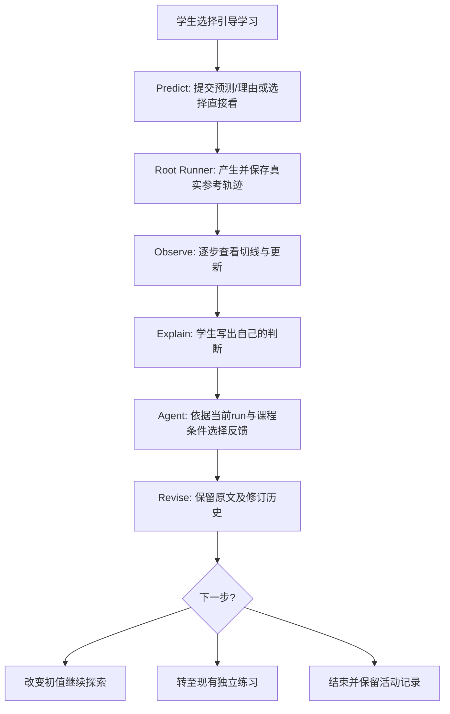

# 珞珈数智助教 2.0｜统一研发路线图 v4

> **更新日期**：2026-10-08
> **定位**：个人主导的、面向数值分析的可信数学教学 Agent；同时追求 Agent 技术深度、完整的学生使用体验和可复现的工程/数学质量证据。
> **唯一核心仓库**：[Leionel/luojia-math-tutor-skill](https://github.com/Leionel/luojia-math-tutor-skill)
> **核对基线**：`feature/course-graph-2.0` / `50e5c1651476a7aca21a2c8dc1afcf7d5ae21665`，仅指 2026-10-08 查到的**远端**代码，不代表本地未提交工作。
> **状态**：规划文档，未执行任何代码更改、模型实验或 CI 修复。
> **版本关系**：本文件**取代**此前对话中的 v2/M1 Prompt 与 v3 路线图作为后续决策依据；旧材料归档为设计背景，不自动发给 Codex 执行。实际仓库应将本文件的里程碑简表并入现有 `planning/README.md`，**不再新增并行状态看板**。

---

## 0. 最终决策（先读）

**一条产品/技术主线、两项并行能力、一套贯穿式评价。**

- **主线**：打造一个能根据真实数学证据理解问题、调用受控工具、识别错误、选择恰当教学动作并持续接续任务的 **Math Tutor Agent**。
- **Agent Intelligence（核心研发）**：数学条件与推理、受控工具链、教学决策、检索/图谱、学习证据边界、成本及可靠性。
- **Learning Experience（同场景落地）**：让学生在 Chat / Lab / Study 中真实参与、看懂反馈、自由决定要提示还是完整解答，且状态可恢复。
- **Evidence & Evaluation（贯穿两者）**：工程可靠性、数学/教学质量、交互可用性分别测试；**不以大样本用户招募或教育效果显著性检验作为近期前置条件**。
- **个人项目资源分配建议**：Agent/工程约 55%、体验约 25%、评测/成果展示约 20%。这是时间预算启发式，而非要求 Codex 按比例创建工单。

**本轮执行顺序：R0 → R1 → R2 → R3（由证据决定）→ R4。** 每次只下发一个有限范围的 Codex 任务，完成后暂停人工验收。

### 不再争论的边界

1. 不再从零开发 Root Runner、重新实现 Course Graph、另建学习成绩系统或 Agent 框架。
2. `newton-participation-demo.html` 是**交互参考原型**；不把其独立 HTML、浏览器脚本、预计算数据或演示存储当作正式产品部署。
3. 不让“看过参考轨迹、猜中选项、解释文字看起来不错”自动变成独立掌握度；不把 LLM 判断当作数学证明。
4. 不再按 F1–F8、U01–U18、S1–S5 三套旧计划分别推进；保留原编号用于溯源。
5. 不为丰富 GitHub 行业标签而新增项目。三个现有项目承担不同技术叙事。

---

## 1. 已有能力与真实缺口（远端事实）

| 方面 | 已有基础 | 真实缺口 / 下一步 | 证据性质 |
|---|---|---|---|
| **求根实验** | `/lab` 已有 Newton / 二分 / 不动点、预测文本、受控 `root_runner.py`、迭代轨迹与回放、历史对照 | 当前预设选项直接写出 `0→1→0`；普通回放会露出未来轨迹；缺少完整的可恢复引导活动 | 源码核对 |
| **Chat ↔ Lab** | `LabTutor` 能读取受版本约束的实验上下文、同页与逐步问答；`TutorConversation` 已存在 | Agent 能否根据学生**原始预测及修订**选择教学动作，还需端到端验证 | 源码核对 / 能力未证实 |
| **反思记录** | `lab-reflection.tsx` 可输入自由解释 | 目前主要在浏览器 `localStorage`；不能作为可信的服务端学习证据或跨设备历史 | 源码核对 |
| **学习机制** | `LearningWorkspace` 有提交/ACK、受助/独立结果与探针；`StudentOverlay` 保存过程事件 | 不能把新交互另造成绩系统，亦不能无审查地改变 BKT / mastery | 源码核对 |
| **数学 Agent** | LangGraph、Intent/Hint Policy、数学工具、S5.0 边界化本步检查与 Guard | 数学条件是否被正确应用、错误归因、教学动作选择的独立质量证据不足 | 部分工程交付 / 数学质量待测 |
| **Course Graph** | 单元/关系/Teaching Case、边界过滤与证据检索已有 | 尚无证明图谱对教学决策带来净增益的消融；旧 seed 的默认 verified 路径需复核 | 源码核对 / 效果待测 |
| **S5 评测** | 离线 runner、8 道 dev 数学材料草案、固定模型流程、Mock 预算合同 | 人工金标准/独立复核、真实模型内容评价和供应商准入待完成；近期 CI 不通过 | 文档/CI |
| **鉴权与资源** | U08 临时库中可撤销会话已实现，上传 POST 有身份 | `GET /api/uploads/{filename}` 缺归属校验；上传文件 owner 元数据和带认证的图片展示必须一起处理 | 源码核对 |

**2026-10-08 远端 CI 状态**：[Actions #24](https://github.com/Leionel/luojia-math-tutor-skill/actions/runs/37730488523) 上，知识数据及 Web Job 通过，API 为 **890 passed、8 failed、1 skipped**。失败集中在 S5 content 文件绑定和 manifest/hash 不匹配。**不得将历史的 899 passed 当作当前 HEAD 测试通过。**

### 实施前必须确认

Codex 开始任何阶段时先检查本地分支、`git status`、HEAD、当时最新远端 CI、相关代码与测试。若本地已有更新，以事实重排任务；不得将本文件的历史观察写成尚未修复的当前 Bug。

---

## 2. 唯一里程碑主线

| 阶段 | 核心问题 | Agent 交付 | 学生体验交付 | 必须存在的证据 / Gate | 状态 |
|---|---|---|---|---|---|
| **R0｜恢复可信基线** | 结果、数据与访问边界能否信任？ | CI/S5 一致性修复、权限链路、可复现依赖 | 现有合法资源和页面不能回归 | 同一 HEAD CI 通过；匿名/跨用户拒绝且 owner 可查看 | **NOW / BLOCKED** |
| **R1｜Agent × Newton** | Agent 能否依据真实轨迹提供合适的数学辅导？ | 绑定真实实验的教学决策与范围清楚的数学反馈 | 预测→观察→解释→修订，可恢复、可跳过 | 3 类 Agent 场景、真实 Oracle、负例和 UI E2E | **NEXT** |
| **R2｜可信 Agent 评测** | 相对简化 LLM 方案增益在哪里？ | 经过人工审核的数学/教学质量对照、失败簇与成本报告 | 对代表性使用路径做可用性校验 | E0/E1/E2 分开；固定题目/模型/预算/版本 | **NEXT，材料可并行准备** |
| **R3｜失败驱动升级** | 哪一个技术短板最值得修？ | 只针对 R2 最大的可复现失败簇改进一项 | 在现有界面验证改进确实可见 | 单因素复验；无明显增益则不扩建 | **DECIDE LATER** |
| **R4｜工程与求职展示** | 能否用几分钟证明技术价值？ | 可读架构、复现脚本、真实指标与设计取舍 | 90–150 秒无断层 Demo | README、技术记录、讲得清的代码路径 | **持续积累，最后冻结** |

以上阶段不要求一个月全部完成。学生体验与 Agent 同场景迭代；评测方案从 R1 就开始准备，而不等 UI 完工再想指标。

### 粗略时间预算（非承诺）

- **10 月上旬～中旬**：R0，约 2–5 个集中开发日，找到 CI 失败原因并修复安全基础。
- **10 月中下旬～11 月上旬**：R1，约 4–8 个集中开发日，开发真实 Agent × Newton 交互垂直切片。
- **11 月**：R2，约 4–8 个集中开发日 + 独立人工审核与可选获准模型调用。
- **11 月下旬～12 月**：R3，只有 R2 显示值得改进的失败簇才实施；否则继续做质量/稳定性。
- **12 月～寒假前**：R4，冻结演示版本并准备实习简历和技术面试，不因无限扩充功能挤占求职准备。

工作日估计根据个人项目规模给出，**未测量实际 Codex 产能、人工评分用时与 provider 等待**，要随第一轮真实耗时调整。

---

## 3. R0：下一次 Codex 唯一应该立即执行的工作

### 3.1 必须处理

**R0-1｜恢复 CI：**

- 复现 8 个 S5 相关失败，调查为什么内容文件绑定、manifest SHA 或评测记录版本不一致。检查代码生成与数据文件、换行规范化、hash 计算和版本边界；**不能未经证实把原因归咎于操作系统换行**。
- 修复真实根因。严禁删除失败测试、跳过 manifest 校验或随意把预期 hash 改成当前值来“刷绿”。
- 保留实验/文档状态：`agent_prepared_only` 不能变成 teacher gold；固定模型合同不能冒充真实数学能力。

**R0-2｜上传文件授权：**

- 追踪 POST 上传→可信 owner 元数据持久化→GET 授权读取→前端图片/文档展示整条链路；文件 UUID 不是权限凭证。
- 匿名、跨用户、未知/无 owner 文件均不得意外访问；正常用户必须仍能查看自己上传的资源。
- 注意原生 ``/Next Image 请求未必携带前端 Bearer Header，必要时采用安全受控读取或受保护资源加载机制，不允许用永久公开 URL 绕过访问控制。

**R0-3｜依赖、文档与风险：**

- 验证 `apps/api/pyproject.toml` 与 `uv.lock`，特别是已声明的 `python-dotenv`；执行干净的 locked 环境检查。当前 CI 使用 `pip install -e apps/api`，此项与 uv lock 一致性分别报告。
- 更正 README 中有关 U08 正式数据库迁移、U16 静态降级及最新测试状态的过期描述。
- **仅核查**图谱旧种子默认 `verified`、公开教材使用权、生产数据库 U08 备份/恢复 Gate；除非明确得到安全独立的修复方案，不做破坏性迁移、删除、重写历史或生产部署。

### 3.2 验收和停止

- 当前目标 SHA 的 CI/API/Web/知识校验真实通过，附日志或可复现命令；不能把旧回执累计测试数当本次结果。
- 上传资源至少通过 owner 正例、匿名负例、跨用户负例；完成一次 UI 实际资源显示验证。
- 提交小而聚焦的 commit，报告 SHA、修改文件和阻塞项；**不得未经请求 push、部署、读正式库或进行付费模型调用**。
- **R0 完成后停下来等待验收，再启动 R1。**

---

## 4. R1：以 Newton 原型为设计参考，交付「真实 Agent × 学习活动」

### 4.1 原型的正确角色

**参考文件**：`newton-participation-demo.html`（2026-10-08 提供的静态 HTML）。其演示了聊天/实验双视角、预测卡片、函数切线动态图、逐步观察、提示和直接解释、学生修订、初值对照、下一题入口、右侧学习记录。

但这份 Demo 使用**打包的离线轨迹和固定反馈逻辑**，进度主要存储在 `localStorage`，Chat/Lab 视图切换并不代表真实生产 Agent 多入口，后续新题也是开发参考。它**不是**已集成的数学 Agent 能力、后端记忆或独立测评。

| 原型元素 | R1 处理方式 | 真实系统的落点 |
|---|---|---|
| “先预测，再看 Newton” | **必需**；引导模式不泄露结果，允许跳过 | `/lab` 的可选引导入口 / Chat 活动卡片 |
| 动态函数、切线和横轴交点 | **优先**；对已揭示步骤可视化，不让静态曲线冒充精确证明 | 扩展现有 `LabPlayback` 或复用现有 SVG，数据来自 Root Runner |
| 0→1→0 逐步披露 | **必需**；引导模式不能提前展示后续点、完整轨迹文本或含答案标签 | 已保存 run + 客户端状态/服务端活动状态 |
| 学生理由、解释及修订历史 | **必需**；原话不覆盖，owner+任务+版本绑定 | `LearningWorkspace` / 现有学习存储的小型扩展 |
| Agent 对解释给反馈 | **必需**；必须是真实 `TutorConversation` 路径，引用当前实验来源 | `learning_context.py`、`EvidencePack`、`TeachingPolicy` |
| 暂停 / 继续、证据侧栏 | **简化保留**；先重可恢复和清晰，不造新 Dashboard | 已有 Chat/Lab/Study 状态与紧凑状态提示 |
| 初值对照（0 与 −2） | **复用**已有对照能力；同一函数不同初值产生新 run | `/lab` 现有运行和历史记录 |
| 新题练习 | **优先复用**已有独立探针，不能将原型练习算成正式独立成绩 | `RootEpisodeService` / `LearningWorkspace` |
| 原型嵌入式 JS、预计算 JSON、localStorage 成绩 | **不迁移为事实来源** | 服务端 API / 已审数学判断 / 真实计算 |

### 4.2 产品结构：两种模式而非第二套页面

- **自由探索**：保留 `/lab` 现有的任意合法函数/参数/方法实验与完整结果查看；学生可立即得到答案。
- **引导学习**：从 Chat 或 Lab 进入 Newton 教学活动；先看函数 `f(x)=x³−2x+2` 与 `x₀=0`，再提交预测，逐步观察，然后解释并修订。
- 两种模式应**共用同一个 Root Runner、结果记录、实验引用和聊天体系**。引导入口以参数/活动上下文区分，而不是复制 Lab、再造 Agent workflow 或新页面。
- 原页面的“牛顿法：0 → 1 → 0 循环”及“默认示例会在 0 和 1 之间循环”等文案，在**引导学习路径**中必须被遮蔽或替换；自由探索可正常标识教材示例。
- 引导式回放**只展示到学生主动揭示的步骤**，不要像现有图表一样以淡线提前绘出后续数据；屏幕阅读器标签、预设名、Chat 模板与提示同样要避免提前说出答案。这里是 UI 教学披露策略，**不是用于防止恶意学生读取 API 的保密控制**。

### 4.3 四步主流程与 Agent 的实际职责

Agent 在 R1 **至少真正负责**：理解学生陈述、结合绑定的参考轨迹和必要条件，判断应澄清、纠错、承认正确，还是回答完整解法；准确地表述已计算、已核验、暂无法判断。**不要为演示“Agent 很聪明”而新增第二个 Decision Agent、ProofState 或多套 Router。**

#### R1 的三类最小教学判断

| 学生表达/行为 | 正确的 Agent 行为 | 典型失败 |
|---|---|---|
| “Newton 法只要有根就会收敛” | 用本次迭代反例指出局部收敛条件和初值邻域的限制 | 把局部定理讲成全局，或凭有限数值轨迹声称不存在根 |
| “残差已经很小，所以根误差也必然很小” | 区分 `|f(x)|` 与 `|x−x*|`；指出缺少额外误差界条件 | 直接将残差阈值宣布为根误差保证 |
| 学生正确算出迭代步骤且依据正确 | 承认本步正确，讨论未检验条件或允许结束 | 为了制造辅导过程而凭空挑错 |

这三类必须通过实际 Agent 对话路径或明确标记的固定模型回放验收；**固定模型流程通过只能证明工程链路，真实教学质量留给 R2 独立评分**。

### 4.4 数学事实与证据边界

指定 `f(x)=x³−2x+2`、`f'(x)=3x²−2`、`x₀=0` 时，精确 Newton 更新为：

\[
x_1=0-\frac{2}{-2}=1,\qquad x_2=1-\frac{1}{1}=0.
\]

这组**精确代数代入**支持以 0、1 交替出现的二周期；数值 Runner 给出该输入下的实际参考轨迹。**对一般自定义输入，浮点值重复、残差小、停止于预算上限均不能自动作为严格收敛/发散证明。**

记录三种彼此不同的事实：

1. **学生真实行为**：预测、理由、查看与提交的解释、修订版本、选择跳过；跳过不是能力不足。
2. **外部参考/帮助**：看过参考轨迹、使用提示、直接获得完整答案、修改参数后的新 run；这不是独立作答证据。
3. **数学核验证据**：受控计算的参数、runner/oracle/version、轨迹、停止原因、所核验条件与未知条件。

活动引用至少校验 `owner + run_id + input_hash + runner_version + graph_revision`，从旧结果进入新参数时必须重新绑定。旧版本草稿允许阅读，但不得冒充新版本已验证事实。

**禁止**：自由解释凭关键词自动评分；LLM 候选误解直接写 mastery/BKT；把参考计算 `reference_help` 提升为 `independent_probe_success`。若现有模式不能保存修订，新增**最小且版本化**的数据记录，避免建立全局 Event Sourcing 平台。

### 4.5 R1 验收合同（工程 + 数学 + 体验）

- **真实交互**：从 Chat/Lab 的现有入口启动引导，预测前不剧透，预测后逐步计算并解释，修订可保存；愿意直接看解答的人不被强制阻拦。
- **真实数学**：基准二周期轨迹和初值 −2 的对照来自当前 Oracle；显示计算与证明范围，测试非零导数、停止原因及不同初值。
- **真实 Agent**：至少上表三类案例完成有范围的提示/纠错/承认正确；断开模型时明确离线/不可用状态，不使用静态模板假装真实 LLM 推理。
- **状态连续**：刷新、重试、重复 requestId、上下文切换和取消后仍能正确恢复或说明未保存；学生原预测与多个修订版本可查询。
- **身份安全**：同一账号合法恢复，跨账号/失效引用拒绝，注销或身份改变时旧内容不残留。
- **前端可用**：桌面和约 390px 移动端，键盘可达、错误状态可读、无错位/遮挡；不要为了动效牺牲数学可读性。
- **测试界限**：E0 / E2 合同通过只能称为工程与交互验收，不声称学习效果提高或模型数学正确率已达某值。

**R1 交付物**：一个实际产品入口、一段 90–150 秒可录 Demo、关键正负例回归、一份只记录真实变更的交付回执；结束后暂停人工验收。

---

## 5. R2：无需大量用户也能做的可信评价

**目的**：为 Agent 岗简历形成可以被追问、可以被复现、能够解释限制的质量证据，而不是生成好看的数字。

| 层级 | 核心指标 | 当前可做？ | 不能代表什么 |
|---|---|---|---|
| **E0｜工程可靠性** | CI、工具超时/失败、权限、状态恢复、预算、成本与延迟 | 是 | 不是数学正确率 |
| **E1｜数学与教学 Agent** | 条件核对、首错定位、正确步骤不误判、恰当提示/完整解答、弃权、证据越界 | 有人工 gold 后可做 | 不是学生学习增益 |
| **E2｜任务可用性** | Demo 关键任务完成、是否剧透、Chat/Lab 转接、移动端、帮助选择 | 本人/少量同学可做 | 不是普遍学生满意度或因果效果 |
| **E3｜学习增益** | 无 AI 独立迁移、延迟测验、信任校准 | 后续条件成熟才做 | 目前不设置必达目标 |

### 最小可实施评价方案

1. **S5 继续用，不重建**：优先复核已有 8 道 dev 材料，记录作者审核与独立审核的真实状态；保持确认集未通过审核时禁用“正式确认分数”。
2. **用错误家族构造样例**：Newton 初值/局部条件、残差 vs 根误差、正确步骤误判、缺少前提、工具未知/失败、主动学习模式提前泄露答案。基于实际人力增加少量未用于提示调参的 held-out 题。
3. **先对照三档**：同一基础模型下，对比 (A) 直接 LLM、(B) LLM + 受控 Math Tools、(C) LLM + Tools + Teaching Policy / 绑定上下文。每次只改变一个主要因素；Graph 效果单列后续消融，不把多模块收益归功于一个模块。
4. **消耗外部模型费用前取得批准**：明确服务商、模型、费用上限、次数和请求边界；S5.3 目前 Mock 预算不能宣称真实 provider 已验收。
5. **报告完整范围**：`N`、题目来源、人工审核级别、模型版本、温度/预算、可用工具、成功/失败/未知/未运行、指标分母、p50/p95/费用及失败案例。正确率、首错定位和成本分别报告，拒绝用一个总分掩盖硬错误。
6. **负结果也有价值**：若加入 Graph 或复杂编排未带来质量改善，只报告无增益/增加成本，并保留简单版；不为了简历数字继续堆组件。

R2 的文档要能让另一名工程师复现你声称的结果。**固定模型 fixture、合同回归、真实 LLM run、人工数学评分分别标注，永不相加为一项“准确率”。**

---

## 6. R3：Agent 改进由失败簇决定

只有 R2 观察到可复现短板，才选择一个最小改进方向：

| 若真正出现的问题是…… | 优先修复 | 不做 |
|---|---|---|
| 数学条件跨多步丢失 | 当前题目的轻量 Assumption / Claim / Tool Evidence 绑定 | 通用形式证明引擎 |
| 学生错误常被误归因 | 区分算错、条件不明、模型候选错误，避免污染 Overlay | 全量 BKT 重写 |
| Graph 检索相关但教学不改善 | 做 Teaching Case / prerequisite 的可解释教学动作对照 | 直接上 Neo4j / GNN |
| 提示过早、抢答或无意义追问 | 改教学动作策略与披露控制 | 强制多轮苏格拉底流程 |
| 延迟/成本高且增益小 | 限制工具预算、简化 Route 或 Context | 新增更多 Agent 角色 |

选择一个**已有第二场景**（如线性方程组、数值积分）测试能力迁移，而非创建新的课程/Repo。R3 应至少有“同一组题升级前后”的复现证据；若没有改进，停止扩建并说明结论。

---

## 7. R4：简历与 GitHub 展示规划

### 7.1 珞珈数智助教的简历卖点

目标不是证明“我做了一个数学问答网站”，而是证明：

- **系统设计**：LangGraph / FastAPI / Next.js 中，谁控制工具调用、可信数学结果、数据权限与回答交付。
- **Agent Intelligence**：遇到数学条件不充分、步骤错误或工具无法证明时，如何选择澄清/纠错/弃权，而不乱编答案。
- **可靠性与评测**：经过人工审核的数学案例与消融结果，出现失败时如何修复及权衡成本。
- **完整闭环**：学生能在一个可运行的产品中经历“预测→核验→解释→修订”，且引用/历史可恢复。

### 7.2 三个 GitHub Repo 的不同定位

| 仓库 | 技术叙事 | 核心展示 |
|---|---|---|
| [珞珈数智助教](https://github.com/Leionel/luojia-math-tutor-skill) | **Math Reasoning & Trustworthy Tutor Agent** | Oracle + Teaching Policy + Graph/Context + Eval + 真实学习闭环 |
| [ProjectMemo](https://github.com/Leionel/projectmemo) | **Stateful Agentic Product** | 时态记忆/状态版本、用户确认行动、Web/鸿蒙跨端、回执与幂等 |
| [Math Modeling Evidence Harness](https://github.com/Leionel/math-modeling-harness) | **Agent Infrastructure** | MCP、Gate、执行回执、确定性检查、证据溯源、独立审阅 |

即使其中两个项目应用在数学场景，三者证明的是**不同层次的 Agent 工程能力**。近期不新增第四个大项目，不刻意追求“电商/金融/医疗”等领域标签。

### 7.3 最终成果包

- **README 首屏**：问题是什么、为何普通 LLM 不够、系统如何约束数学事实、实际跑出了什么、怎样 5 分钟试用。顶部避免按时间堆积十几条旧完成公告。
- **90–150 秒 Math Tutor Demo**：错误的初始判断 → 逐步 Newton 计算 → 证据绑定的 Agent 反馈 → 学生修订 → 查看活动记录。
- **60–90 秒 ProjectMemo Demo**：方案 A→B、证据确认、记忆演进、用户确认行动、DONE 回执。
- **技术附录**：清晰架构图、受控工具与信任边界、运行命令、真实 CI、E1 评测表、失败案例及工程权衡。
- **面试复盘**：能独立解释最关键 3–5 个源码调用链、典型缺陷的定位过程、为什么选择最小改动、哪些是 AI 辅助代码但自己能够调试维护。

**简历量化描述必须等 R2 的真实指标出现才能填写**：`N`、明确 baseline、成功率/定位率或错误减少、延迟/成本、测试边界。不得提前虚构用户数或数学准确率。

---

## 8. 旧编号、旧 Prompt 与现有规划的处理规则

| 旧内容 | 处理方式 |
|---|---|
| F1–F5/F8 | 已有首版继续保留；R1 只打磨 Newton 相关体验，不重做全站 |
| U01–U06/U16 | 保留交付回执；不再重复列为待办 |
| U08 | 临时库能力已做；正式迁移属于单独部署 Gate，需获批准的备份/恢复验收 |
| S5.0–S5.3 | 工程基础保留；R0 修当前失败，R2 补真人审核/真实数学质量证据 |
| U07/U12 | 转入 R2，分别受人工审核和真实 provider 授权限制 |
| U09–U11/U13–U15/U17–U18 | 条件池；实际需要、授权/资源具备后再启动 |
| Course Graph 2.1、BKT 重大升级 | R3 备选，不预先承诺实施 |
| `newton-participation-demo.html` | R1 的交互原型和视觉参考，不是代码库内的第二套产品 |
| 旧 M1/G0/Prompt A/B、v2/v3 Roadmap | **历史背景**；R0/R1 具体实施 Prompt 要按本 v4 决策改写并分批执行 |

**唯一状态入口**：仓库现有 `planning/README.md`。只显示 `Now / Next / Conditional / Delivered / Blocked` 和当前 Gate；其余历史规划保留来源/阶段记录，不修改历史测试数据。完成一阶段后可增加一份短回执，但不得再生成第四套、第五套并行的“总规划”。

---

## 9. 阶段关口与停止规则

**R0 → R1**：CI 绿、上传资源 owner 路径无跨用户泄露、合法显示正常；或者存在明确、与 R1 无关且已隔离的非阻塞风险，经人工认可后才开始。

**R1 → R2**：真实组件能够完成主要活动；实际受控数学来源与学习行为不混淆；三类教学案例有端到端测试；现有 Chat/Lab/Study 未回归。

**R2 → R3**：至少形成小规模有人工审核的、可复现的模型数学/教学错误清单。**未形成可靠失败簇时不做 Graph/Memory 大扩建**。

**R3 → R4**：不等于所有功能完成；仅当已有成果足以制作真实、可复现、可维护的 Demo 时即可冻结，给实习投递预留时间。

所有阶段须遵守：保护当前工作区、不擅自 push/部署/迁移正式数据库、不未经批准进行付费调用、不执行未经隔离的模型脚本与学生代码、不把测试通过称为教育效果证明。

### 每轮 Codex 输出固定格式

1. 实际 HEAD、工作区状态、本轮处理的**唯一目标**。
2. 修改的代码路径与核心设计决定；列出复用的已有模块。
3. 真实运行的测试与结果（成功、失败、未运行分开）。
4. 可执行的 Demo 路径与一条失败/安全边界示例。
5. 未解决问题**最多三项**，并明确是否阻塞下一轮。
6. 变更 commit SHA；未经请求不 push；**完成后停止**。

---

## 10. 从现在开始的精确行动

**下一次只给 Codex R0 实施指令。** 修复当前 CI 的 S5 绑定问题及上传 owner 读取路径，验证锁文件，更新必要事实文档，然后停止并等待验收。不要在 R0 中顺手建设 Newton 教学工作流。

**R0 验收后，单独发 R1 指令**，将 `newton-participation-demo.html` 作为交互设计参考，改造真实 `/lab` / `TutorConversation` / `LearningWorkspace`，重点是避免提前泄露结果、动态切线观察、证据绑定的 Agent 数学反馈和持久修订，且复用已有探针。

**R1 验收后才在 R2 做真实模型质量对照**。同时从现在开始准备一小批独立审核数学题，但不在本轮大范围重做 benchmark、运营面板或图谱。

**本阶段成功定义**：个人作品集里有一个能亲自解释其关键代码、具有可信数学证据与实际 Agent 教学决策、拥有完整学生体验、且能用真实小规模评测说明优势与边界的代表项目。

## 11. 原始依据（便于回查）

- [核心 GitHub 仓库与当前旧规划](https://github.com/Leionel/luojia-math-tutor-skill/tree/feature/course-graph-2.0/planning)
- [2026-10-08 GitHub Actions #24：API S5 失败记录](https://github.com/Leionel/luojia-math-tutor-skill/actions/runs/37730488523)
- [ProjectMemo 仓库](https://github.com/Leionel/projectmemo)
- [Math Modeling Evidence Harness](https://github.com/Leionel/math-modeling-harness)
- `newton-participation-demo.html`：本次提供的 Newton 交互参考原型（静态离线版）
- [ICAP Framework，学习参与设计参考](https://doi.org/10.1080/00461520.2014.965823)
- [Bastani et al., PNAS：生成式 AI 与数学学习](https://doi.org/10.1073/pnas.2422633122)
- [MathTutorBench：数学教学能力评价参考](https://aclanthology.org/2025.emnlp-main.11/)

> 上述文献只提供教学与评价设计的外部参考，**不证明本项目已经产生学习增益**。仓库技术事实与外部研究结论不能互相冒充。
