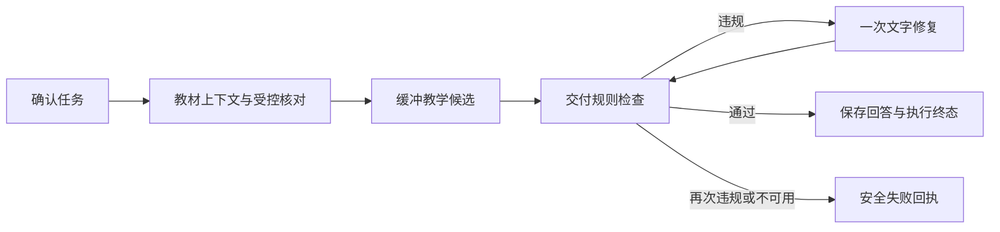

# A0–A2 Agent 工程交付回执

日期：2026-10-03。目标：AI 应用 / Agent 工程实习。A0 已交付，本轮复验后顺序完成 A1、A2；A3–A5 保持规划状态。

## 实际实现

| 切片 | 当前行为 | 证据边界 |
| --- | --- | --- |
| A0 | 模型必须正常终止且有正文；截断 / 异常 EOF 不发 done；不确定任务先澄清；工具取消回收 | 工具执行成功不等于数学正确；学生程序仍不执行 |
| A1 | 发送候选前检查交付规则；最多一次纯文字修复，再次不通过则拦截 | delivery-v1 为显式高精度规则，不是通用数学或语义证明器 |
| A2 | SQLite 持久执行回执、递增事件、原子消息终态、取消 / 中断记录、owner 隔离、折叠过程与刷新回看 | run-v1 只表示执行状态；完成不代表客户端已确认反馈或独立学习成功 |

修复预算由代码限制为一次；图中的返回边不允许继续循环。Teacher / Examiner / Proof 共用交付检查，受控求根只读检查 Oracle 回执契约，保留显示 ACK 和独立 probe 原有权限。

## 持久化与取消协议

新增 schema migration 6：agent_runs。每轮 UUID，绑定 owner / session；记录 prompt / guard 版本、时间、阶段 / 状态 / 轮次 / 耗时、白名单错误码、内置模型别名。没有可信 provider usage 就保存 null；自定义模型别名暂不记录。记录不包含 prompt、tool code / stdout、密钥、供应商原始报错、原始上传或私有推理。

步骤 seq 原子递增，重复 / 乱序事件不写入，最多保存 64 条，超量置 truncated。终态使用条件更新，晚到事件不能覆盖。成功 / 澄清 / 失败消息和对应 run 终态在同一 SQLite 事务中提交；存储失败不发 done。消息元数据只是缓存，读取时使用 owner 所属表记录覆盖，公开演示的旧消息读取也不会暴露其他用户的缓存回执。

取消先关闭图并等待其拥有的子进程 / 数据库写入结束，再落 cancelled。专用 SSE response 同时监听 ASGI disconnect，避免缓冲模型没有下一个 chunk 时无法观察取消；覆盖 ASGI 2.3 / 2.4。已经提交的业务学习记录不因取消自动回滚，已经提交的成功终态也不会被后来的取消覆盖。

活跃请求每 30 秒续租；启动与读取历史时，把超过 120 秒没有续租的 running 标 interrupted。刚重启但租约尚未过期的记录需等待租约到期再刷新。不会恢复图、重放学习写入或补造 done。机器 / worker 长时间停顿也可能导致租约过期；晚到工作不得再完成该 run。

手动重试创建新 UUID，关联原 owner / session 下的终态 run；序号从零开始。用户截断旧会话时隐藏对应回执，避免已删除回答重新出现在历史；保留关联所需的非正文记录。删除整个会话级联删除其回执。

## 界面

回答旁“本轮过程”默认折叠，只展示公共动作。交付规则检查与数学核验分别标注；未知协议版本忽略；旧历史无回执时不补造。未上传图片不显示“核对图片”，审阅服务未能确认时显示未充分确认。客户端停止后有一次有界状态复查，暂未取得终态时显示“状态待同步”；刷新从历史恢复取消 / 中断回执。

离线隔离库浏览器检查：修复、拦截、停止生成、刷新后的记录恢复；桌面与 390px 布局、键盘 Enter 展开 / 收起、48px 回执摘要触控高度。390px documentWidth=390，无横向溢出。断连修复前实际服务端仍 running，修复后实际 SQLite 记录为 cancelled；进程重启后的旧过期记录为 interrupted。界面样例明确标注离线 fixture。

## 验证

- npm.cmd test：知识 JSON、API **559**、Web **43** 全通过；API 49.90 秒，5 条原有警告。
- apps/web typecheck 通过；lint 0 error / 10 条现存 warning；生产 build 通过（最后一次完整构建回执见本地日志）。
- 新增回归包含旧库备份 / 升级 / DDL 失败回滚、消息与终态事务失败、重复 / 越权事件、并发终态、取消时提交成功的竞争、ASGI 断连和监听清理、失败落库、编译图真实阶段与一次修复、关闭 Guard 保留空正文门控、修复工具请求不得执行、成功但无输出的执行 / 数学证据区分。
- 本地 ignored 日志：results/a2-agent-runs-tests.log、a2-web-build.log、a2-web-lint.log。CI 命令加入两个新前端协议测试；远端 CI 未在此回执确认。

首次把新版本用于已有部署前，用 SQLite backup API 备份实际 DATABASE_URL 对应库并核对 integrity_check；本轮只在临时库 / 隔离演示库迁移，未启动正式库。回滚代码保留新表；不要降级删除回执表或覆盖旧数据库。后续迁移应增加版本，不能重新编辑已发布的 migration 6。

## 求职表达与后续

可以描述：基于 FastAPI / LangGraph / SQLite 实现教学 Agent 的终止协议、有限交付修复、持久执行追踪及取消清理；以离线故障注入回归验证终态一致性、owner 隔离和刷新恢复。测试数量表示当前仓库工程覆盖，不能称模型准确率。

A3 下一步：版本化失败案例 manifest、独立评测 CLI、可核对的分子 / 分母与 CI 门控。A4 任务上下文与可纠正记忆、A5 真实模型对照仍待实现；尚无真实模型质量、教师 gold、真人学习效果、学生代码正式 sandbox 或部署验收证据。

本轮代码提交：A1 `5197ddf`；A2 `f7c865a`。文档回执另批提交；远端分支以最终推送核对为准。
