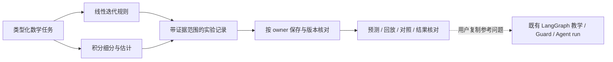

# A3 与多领域数值实验首版交付

日期：2026-10-03。用户授权顺序：A3 → 线性方程组 → 数值积分。此前求根 MVP 是验证一个完整学习流程的起点；本轮扩展实验领域，保留原有求根成绩、独立测验和学生代码静态审阅边界。

## A3：版本化离线协议评测

- 命令：`python scripts/eval_agent_reliability.py` 或 `npm run eval:agent`。
- 冻结集：`evaluation/agent_reliability_v1.json`，19 个协议合同、40 个参数化实例。HTTP 模型替身、实际编译图、Orchestrator、临时 SQLite 和受控进程 fixture 分别验证对应层级。
- 报告：ignored `results/agent-reliability.json`。记录案例版本、范围、分子 / 分母、Git SHA、tracked dirty 标记、Python 版本、耗时、manifest 和 API / 测试 / runner 源码 SHA256。
- 缺失、重复、未知、跳过、错误实例和非零 runner 退出码都不能通过。报告解析器另有回归覆盖。
- CI 保持离线，增加独立命令并上传结果 artifact；本地通过不代表远端 CI 已通过。

首轮结果 **19/19 合同、40/40 实例通过**。进行了两次临时源码破坏验证，并在 `finally` 恢复原始字节：

| 故意破坏 | 实际评测结果 |
| --- | --- |
| 将 `finish_reason=length` 当作成功 | 非零退出，`model_failures` 合同失败，39/40 实例通过 |
| 将最终 Guard 改为永远放行 | 非零退出，`guard_repair`、`guard_withhold`、`compiled_graph` 合同失败 |

这是合同 fixture 的通过数，不是模型正确率、真实 OS 子进程存活测量、强隔离或学生学习效果。超时 / 取消案例使用受控进程替身断言 cleanup；完整学生代码执行 C0 仍未开放。

## 第二、第三领域：数值实验首版

入口：`/lab` 的领域导航 → `/numerical-lab`。首页及工作区导航使用“数值实验”，原求根实验继续可用。

| 领域 | 已实施方法 | 证据范围与停止规则 |
| --- | --- | --- |
| 线性方程组 | Jacobi、Gauss–Seidel | 2–8 阶有限方阵；按各方法更新顺序计算；绝对残差阈值；严格行对角占优是充分条件，条件未成立不判必然发散；误差界公式浮点值不含残差舍入误差 |
| 数值积分 | 复合梯形、复合 Simpson、自适应 Simpson | 受限 AST 解析、保守区间定义域检查；均匀加密或优先细分误差估计最大的局部区间；估计阈值 / 明确预算停止；不输出严格积分误差证书 |

公共请求使用有辨识字段的 `NumericalTask`；公共结果使用 `numerical-lab-v1`，分别保留任务参数、步骤、停止状态、证据范围、预测、时间和 source hash。线性矩阵维数 / 初值维数、零对角、非有限值、超预算、积分奇数 Simpson 分段和不合法区间均拒绝；函数求值上限 8193，均匀分段上限 4096，线性迭代 / 自适应细分预算最多 100。

持久化复用现有 CourseStore 的 owner-scoped `numerical_lab` 学习记录，不新增表、依赖、模型调用或任意代码执行。相同请求 ID / 参数返回原记录，改参数不能复用 ID；浏览器重复提交也复用稳定请求 ID。不同 owner 不可读取或核对他人实验。核对必须引用保存的 source hash，服务端使用原任务参数而非客户端覆盖参数。

页面包含运行前预测、逐步播放 / 步进 / 滑杆、残差或误差估计对数图、方法对照、末值对照、求值次数、历史恢复、保存参数复用和数值答案核对。积分同一问题允许改变初始分段数对照，横轴明确是步骤而非等计算成本。运行与核对互斥，避免旧核对反馈覆盖新实验。当前自检 / 独立 probe 未完成时，服务器阻止该模块参考读取、运行及核对。

线性答案只核对浮点代入残差；积分答案只比较本次参考数值。两者均不计独立成功或掌握度。积分反例 `sin(16*pi*x)^2` 在 [0,1] 的真实积分为 1/2，但初始分段 4 可能全采在零点，估计很小仍不准确；提供变更分段数实验及专门回归，阻止将参考相符包装为正确性证明。

## 当前范围

新模块完成的是实验和数值核对首版。F1 今日任务、F4 章节测验、F8 专门代码作业仍以求根为主。新实验可复制明确标注“系统参考帮助”的问题到聊天；这属于用户提供的数据，不是服务器可信的实验快照，也未增加新的 Agent 工具调用或声称已验证整段模型回答。

## 验证与后续

完整本地 suite：知识 JSON、**API 583 / Web 45** 通过。前端类型生成及检查、生产 build 通过；lint 0 错误 / 10 条既有警告。没有新增 warning。回执日志位于 ignored `results/numerical-delivery-tests.log`、`numerical-delivery-build.log`、`numerical-delivery-lint.log`。

真实浏览器使用隔离 SQLite、关闭 dotenv / 模型 key 的本地 API：验证两种迭代、下一步 / 键盘滑杆、残差核对、自适应积分、方法对照、刷新恢复及保存参数复用；390px 页面无横向溢出。实际模型质量、全课程教师 gold、学习收益、部署和远端 CI 未验证。

下一阶段沿 A4 优先接一条可信任务路径：服务端校验 owner、source hash、任务可用性与独立帮助权限，然后把有限实验快照交给现有教学图。之后才扩展两个新领域的专门任务 / 无参考检验 / 延迟复习，分别建立 domain-specific 题集和误差合同。A5 真实模型质量评测仍单独执行，保留开发集 / 未见集和人工数学复核。

简历目前可以陈述“实现版本化离线故障合同评测及带证据范围的多领域数值实验”；不可陈述“模型准确率提升”“全课程学习闭环”“积分误差有严格保证”或“新实验已自动接入可信 Agent 任务记忆”。

分批实现提交：A3 `ee373ae`、数值后端 `3234132`、交互前端 `467b522`。提交前完整验证通过；文档另批。首页实验总数包含新记录，并按 owner 隔离。截图保存为 `results/numerical-lab-desktop.jpg`，本地验证服务已停止；未部署。
