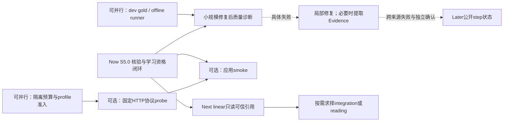

# Agent v3：修订后的实施日程

> 2026-10-07 S5.2首版更新：[12交付回执](12-delivery-s5-2.md)。8道公开dev逐题解答/rubric已准备并绑定（agent_prepared_only），2条固定模型ASGI流程/3个run/18项阶段通过；真人审核、独立二审、真实模型内容与4道确认题仍pending。工程/API780/Web56与E0合同通过，不能转写成数学准确率或teacher gold。

> 共同排期入口：[项目规划总索引](../README.md)。产品F1–F8与工程A/S是同一项目的映射；原估算/时间段以下方修订日期为历史情景，不重复安排已交付S5.0/S5.1首版。

> 2026-10-07 S5.1首版更新：offline/dry-run/replay、四类真实图固定fixture采集及解释报告已实现，见[10交付回执](10-delivery-s5-1.md)和[11验证目标](11-s5-1-evaluation-rationale.md)。8道development输入/rubric仍是待复核草案；S5.2内容质量与真人二审、S5.3 live/预算未完成。旧“CLI不存在”或“仅规划”描述以下方日期为历史快照，不代表当前入口。

> 当前交付更新（2026-10-07）：S5.0 已在工作区实现并完成离线工程验收，见[09交付回执](09-delivery-s5-0.md)：API700/Web56，E0 v2 38合同/92实例，S5.0增量10合同/45实例；前端typecheck/lint/build通过。S5.1–S5.2质量runner/gold及live、linear接入仍待实施。下方原审计/规划描述保留日期，不代表当前源码状态。

修订：2026-10-07，采纳[07独立审阅](07-plan-review.md)并保留其原文。**规划已修改，生产功能尚未实施。** A0–A3、S1–S4为既有交付；本轮不改变历史测试数字或宣称S5.0完成。

六个月数值分析主线继续。假设每周约3个集中开发日，每日约6小时；工期是中低置信度预算，先做一个正常任务贯通后校准，不以AI速度代替验收。

## 依赖与并行准备

固定HTTP协议probe只依赖安全隔离harness/profile/预算，不等待S5.0或完整数学题库；通过应用图的smoke与质量运行依赖S5.0安全版本，数学质量还需对应题gold。linear不等待全题库或开放证明对照，但需本身owner/帮助/数值范围回归。离线准备不得在旧unsafe学生入口运行风险输入。所有live仍需准入与另行消费授权，本轮不启动。

## Now：S5.0 诚实的本步核验与学习资格

- **Goal**：安全核对真正的学生候选，正常能力保持，代算/heuristic/unknown不冒充学生正确性。
- **Evidence / Why**：G1/G2及07 R1/R2；350ms collector与约1.3–1.4s worker冷启动不兼容，两处学习sink资格不同。
- **Dependencies**：核对当前SHA/dirty；保留固定worker、Guard、owner、帮助与probe合同；先冻结[08操作/输入矩阵](08-s5-0-verifier-contract.md)。
- **Scope**：有界一元等价/导数候选、有限表示规范化、原输入/域/候选绑定、独立核验deadline、mistake/mastery资格、旧消息legacy与可见状态。其余操作逐项列降级，不强制通用CAS。
- **Files likely affected**：verifier.py、step_checker.py、typed_tools.py/math_worker.py、fast_context.py、misconception.py、prompt_builder.py/orchestrator.py、web/lib/message-status.ts与对应测试；具体字段以现有投影复用为先。
- **Migration**：优先versioned metadata，无新表；历史正文保留、送入prompt时标来源；聚合掌握度无可逆证据，不承诺精确重算。
- **Tests**：真实compiled graph与临时SQLite、08矩阵、代算、unknown仍有误区线索、缺域、旧消息、超时/取消/帮助锁；桌面/手机与SSE/刷新状态一致。
- **Eval**：E0增量版本与正常能力/降级清单；固定模型只证明工程合同，公开回归不变封存题。
- **Acceptance Criteria**：无unsafe入口/回退；必保留正常子集可判定；两sink无不合法写入；未知与代算显示诚实；原owner/help/probe/交付合同仍绿。全部unknown不能验收。
- **Rollback**：明确停止自动核验并保留输入；不恢复eval/旧Python；安全止血和完整能力恢复分别标状态，不改历史成绩。
- **Explicit exclusions**：新Evidence服务、全定义域/洛必达证明、多变量、学生执行C0、正式库重算、checkpoint。
- **估算**：4–7开发日含跨层回归/必要页面核对；不是实测。两周约6日只承诺本片，超范围操作恢复延期。

## Now / 可并行准备：S5.1–S5.2 聚焦评测与gold

- **Goal**：回答正常能力与数值讨论的具体失败，支持一个局部产品决策。
- **Evidence / Why**：07 R3/R4；全32/36/8对当前决策过宽，完成/弃权/coverage未闭合。
- **Dependencies**：准备可与S5.0并行；修复后执行/结论依赖安全版本；独立确认需要第二复核者，缺人则pending。
- **Scope**：8 dev共用case池、4独立封存候选、2 dev流程；offline/dry-run、固定任务分母、适用性/弃权/覆盖、同初始状态独立干预。规模为投入起点，原全量目录移backlog。
- **Files likely affected**：拟新增evaluation/s5/manifest.json/dev数据、scripts/eval_tutor_quality.py和harness测试；复用既有图/Guard/SQLite fixtures。
- **Migration**：无生产表、默认npm test继续离线；合成数据/独立封存目录，无正式会话抽取。
- **Tests**：case缺失/重复、N/A与未答/not_run、零分母、多合法轨迹、无gold、状态重置、fixed fixture与live分开。
- **Eval**：[02评测合同](02-evaluation-s5.md)；逐题对照与primary failure，不作总体准确率排名。
- **Acceptance Criteria**：同版本offline可复跑；版本/hash/分母完整；正确与失败例可定位；缺复核不造确认结论；用过确认题调优后不再称未见。
- **Rollback**：独立runner暂停不影响应用，保留manifest与已跑报告；不自动扩题或换模型。
- **Explicit exclusions**：完整题库门槛、历史安全adapter必做、全课程证明、多种新抽象、真人学习效果。
- **估算**：runner/评分入口2–3日；人工出题/二审/盲评分项计量，先计时4题校准。

## Optional：S5.3 协议probe、预算与小smoke

- **Goal**：取得具体供应商工具续轮与usage证据，明确请求/费用准入。
- **Evidence / Why**：07 R5；S4是事后回执，未知能力bootstrap与发送前预算尚未实现。
- **Dependencies**：隔离harness、明确model/endpoint/价格和单次预算许可；固定HTTP协议probe可独立准备，通过应用图的smoke等S5.0；不等待全题库，数学质量仍需对应gold。
- **Scope**：发送前transport预留、固定允许路径、禁外部embedding/后台任务、最多3协议请求及8单run smoke；无授权或费用上界缺失则pending。
- **Files likely affected**：评测harness/profile/tests；get_http_client若需注入仅加最小可选入口，不建生产router或计费服务。
- **Migration**：无生产schema；私有profile不提交key/原始endpoint；unknown能力不虚填已验证。
- **Tests**：第52请求、并发预算、失败不退款、usage未知、取消/恢复不重置、错误端点/重定向/旁路拒绝、币种与额外计费。
- **Eval**：实际请求、usage覆盖、已知费用与未知部分、协议结果分开；不当作学习或总体质量验收。
- **Acceptance Criteria**：发送前限额可断言；上界可核对才称硬费用预算；模型/端点能力记录真实；预算停止后不续跑。
- **Rollback**：停live保留消费/not_run，不自动重试、改供应商或增加额度。
- **Explicit exclusions**：自动付费扩跑、全held-out必跑、计费SaaS、任意模型脚本、生产密钥开关修改。
- **估算**：预算/供应商适配2–4日另列；运营确认等待不算开发日，不占两周必交。

## Next：S9.1 linear已保存实验的只读可信Chat

- **Goal**：选中迭代问小珞，无需复制矩阵/轨迹，减少入口割裂。
- **Evidence / Why**：numerical-lab当前复制跳转，owner/保存记录/hash/轨迹已有；用户收益大小仍待观察。
- **Dependencies**：S5.0基本边界达标；linear本身合同/数值scope回归与少量内容gold；不等待完整S5、Evidence或Lean。
- **Scope**：复用LearningContext/共享conversation，linear ref与有界snapshot、selected iteration、矩阵/RHS/runner/hash/version校验、引用与追问。继续使用原实验台编辑/运行/保存，重跑后显式绑定新记录；不复制Newton参数卡。
- **Files likely affected**：learning_context.py、routes_numerical_lab.py、web/lib/learning-context.ts、numerical-lab/page.tsx及共享lab/conversation；learning_actions.py仅兼容需要时动，不新增写动作。
- **Migration**：versioned ref union，旧root_lab合法、旧记录scope明确；优先已有JSON，无新表。
- **Tests**：owner/hash/删除/版本、维数/选中行/截断说明、帮助锁、引用不写mastery、刷新/草稿/取消/390px、新记录重绑定和Newton回归。
- **Eval**：新增一条真实linear流程coverage；正确引用、残差/误差说明与人工内容分别验收；复制次数为可用性线索，不等于学习收益。
- **Acceptance Criteria**：Agent读到所选真实轨迹、未知/遗漏不编造、下一问引用正确记录；没有模型自动保存或独立计分；原实验台和Newton可用。
- **Rollback**：关linear引用入口，保留独立实验/历史与Newton；旧ref仍可读。
- **Explicit exclusions**：新preview/save卡片、同时integration/reading、万能Workspace、自动成绩写入。
- **估算**：另估2–3日并用首条贯通校准；模型建议→参数卡→preview/save另立后续增量。

## Later / conditional：证据绑定、状态与其它工作区

- **Goal**：只解决观察到的多结果误指、前提丢失或实际工作区痛点。
- **Evidence / Why**：scope/候选资格真实缺口已纳入S5.0；独立Evidence类型、ReasoningState的净收益未证实。
- **Dependencies**：跨来源具体失败、便宜局部字段修复已比较、独立确认仍有收益；A8需同state恢复需求，Lean需形式化价值，二者不互为默认前置。
- **Scope**：现有metadata/单一构造函数先行；只有至少两个消费位置确需同一claim绑定且局部字段仍误指才抽小Evidence类型。公开step先做有限实验；integration或reading按需求择一。
- **Files likely affected**：出现具体失败后才确定typed result/meta/guard/UI的小改动；不提前新增verification_evidence.py、图数据库、checkpoint或formal服务。
- **Migration**：可选versioned字段；若A8真启动另写checkpoint/备份方案，不承诺零迁移。
- **Tests**：claim/hash/stale/域、未知/假验证、学生原句保留、帮助/隐私；恢复幂等及形式statement一致性只在相应实验启动后验证。
- **Eval**：同机制失败的局部干预与新的独立确认，含额外calls/费用/泄漏风险；重复开发题只能说明回归，不证明泛化。
- **Acceptance Criteria**：有可解释净收益才立下一切片；无收益维持现有结构；不凭题数或类名开工。
- **Rollback**：关实验字段/入口，保留旧消息读取与受控核验，不恢复unsafe路径。
- **Explicit exclusions**：完整IR/Reasoning Graph、广泛Lean、MCTS/多Agent辩论、无界反例/策略搜索、任意Python、A8默认启动、多工作区同时泛化。

## 两周与四至六周

**两周只承诺S5.0核验闭环**。约6个开发日不足以同时承诺runner、全gold、预算、live与linear。题目/离线runner准备可并行，缺第二复核者或live许可不阻塞独立离线工作。

四至六周：第1–2周S5.0；第3周聚焦runner/gold，具备准入才另行smoke；第4–6周按失败选择局部修复或linear只读引用，补页面与独立确认演示。若确认题用于决策或调优，后续改善需新封存题。没有新封存题时只报告已知题回归。integration/reading、参数写卡、ProofState均非同时必交。

完整原S5形态的情景预算：安全operation/deadline3–5日，资格/历史/UI1–2日，runner2–3日，live准入2–4日，结果/干预/集成2–3日，合计10–17日；**包含S5.0，不能重复相加，非实测承诺**。历史adapter另估。36题作者6–12h、二审5–9h、行为/流程/争议4–8h只是分项情景；输出盲评按实际份数另算，原10–14h只能覆盖部分复核。首批计时后重新估量，不换个更大数字当保证。

## 停止条件与验证

unsafe入口、正常子集全unknown、代算/未知写入、owner/help/原子终态回归、历史来源假确认均先修再推进。缺gold只停对应数学确认；缺能力/计费上界只停live，不自动扩大范围绕过。

实施时：npm.cmd test；E0 CLI；新runner offline/dry-run需先实现；UI改动做typecheck/lint，停dev后build与隔离浏览器验证。源码回归、协议、人工gold、真实模型、页面、远端CI/部署分别报告。本轮仅文档检查，不复跑业务测试或构建。

PLAN VALIDATION：本文件与08定义唯一Now结果及跨层验收；02定义聚焦评测；准备依赖可并行、live许可不默许；Scope/回滚/STOP明确；工期/人工/供应商假设列出。偏离继续写implementation-notes.md，核验、评测与新产品能力尚未实施。
