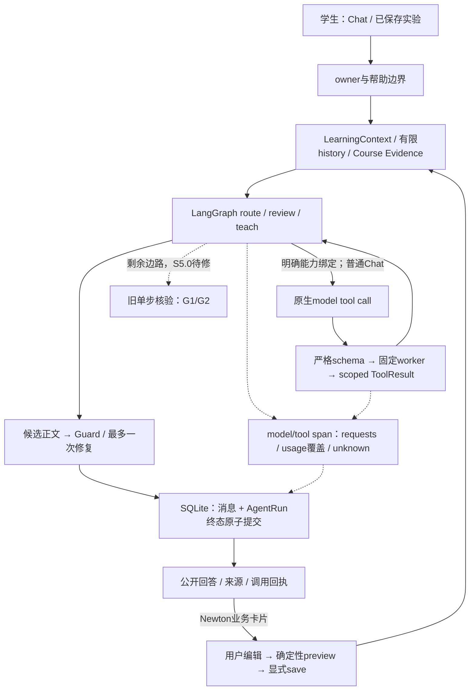

# AI应用 / Agent工程实习：成果与证据

> 2026-10-07 S5.2首版更新：[12交付回执](12-delivery-s5-2.md)。8道公开dev逐题解答/rubric已准备并绑定（agent_prepared_only），2条固定模型ASGI流程/3个run/18项阶段通过；真人审核、独立二审、真实模型内容与4道确认题仍pending。工程/API780/Web56与E0合同通过，不能转写成数学准确率或teacher gold。

> 2026-10-07 S5.1首版更新：offline/dry-run/replay、四类真实图固定fixture采集及解释报告已实现，见[10交付回执](10-delivery-s5-1.md)和[11验证目标](11-s5-1-evaluation-rationale.md)。8道development输入/rubric仍是待复核草案；S5.2内容质量与真人二审、S5.3 live/预算未完成。旧“CLI不存在”或“仅规划”描述以下方日期为历史快照，不代表当前入口。

> 当前交付更新（2026-10-07）：S5.0 已在工作区实现并完成离线工程验收，见[09交付回执](09-delivery-s5-0.md)：API700/Web56，E0 v2 38合同/92实例，S5.0增量10合同/45实例；前端typecheck/lint/build通过。S5.1–S5.2质量runner/gold及live、linear接入仍待实施。下方原审计/规划描述保留日期，不代表当前源码状态。

修订：2026-10-07，依据07审阅；仅收紧表述，未新增生产成果。

本文件面向用户已选择的AI应用/Agent工程方向。简历内容需按本人真实贡献调整，不能把计划、AI生成意见或工程合同写成已验收的数学/教学效果。

## 当前可用的工程成果

| 可陈述的成果 | 证据 | 诚实边界 |
|---|---|---|
| 基于FastAPI、LangGraph、Next.js实现课程助教与学习工作区 | 当前app源码；S1–S4交付回执 | 是垂直应用，不是通用自主Agent |
| 将Newton实验的owner/版本/步骤引用带入Chat，形成编辑→确定预览→显式保存 | `learning_context.py`、`learning_actions.py`、`lab-tutor.tsx`、其离线回归 | 目前可信bridge只覆盖Newton；不是全部数学领域 |
| 限定两个原生数学工具，类型参数与固定worker，两轮预算、超时/取消/输出上限 | `typed_tools.py`、`math_worker.py`、`test_typed_math_runtime.py` | 默认关闭且需绑定能力声明；无任意Python/学生代码执行；非OS强隔离证书 |
| Guard在交付前检查显式违规，最多一次无工具修复，失败不冒充成功 | `answer_guard.py`、`graph.py`、`test_answer_guard.py` | 不证明全回答数学正确，也不覆盖全部语义泄漏 |
| owner-scoped执行回执、过程span、原子消息/终态、取消与中断恢复读 | `run_trace.py`、`agent_runs.py`、`test_agent_runs.py` | 只恢复回执/历史，未做执行checkpoint或自动replay |
| 请求边界、model/tool parent、usage覆盖、版本化费用估算 | `call_observation.py`、`pricing.py`、`test_call_observation.py` | unknown不补零；provider未实测的能力、账单不能当成果 |
| 可复跑失败注入与版本化E0评测 | 2026-10-04回执：知识JSON、API655/Web51；协议38合同/92实例 | 92实例是655回归的子集，不相加；不是Agent/数学准确率 |
| 识别并规划修复旧表达式入口和核验语义缺口 | 本轮固定探针与G1/G2源码证据 | **已发现，尚未修复**；不能写“已全面解决安全问题” |

## 可直接调整的简历要点

> 珞珈数智助教｜AI应用与Agent工程实践｜FastAPI / LangGraph / Next.js / SQLite

- 构建教材证据与数值实验驱动的数学助教，打通已保存Newton轨迹到聊天、参数预览和显式保存；在服务端校验owner、输入哈希、计算版本和选中步骤；该Newton引用路径区分参考帮助与独立学习记录，普通文字核验的学习资格仍待修复。
- 实现两类固定数学工具与原生协议适配、交付Guard，完成离线固定响应及真实worker验证，实际供应商另验；限定参数schema、两轮计算预算、固定子进程超时/取消/输出回收；将候选回答检查与消息/执行终态原子保存结合，避免截断或失败被记录为完整交付。
- 建立模型/tool调用回执与离线协议评测，在HTTP调用边界记录请求尝试、因果span及provider报告的usage，缺失费用保持未知；2026-10-04源码52373b6的本地回归为655项后端、51项前端，协议子集38合同/92实例。不是费用硬上限或真实供应商验收。

如简历只能留两条，合并第一/第二，保留评测与调用证据。不要写“38/38准确率”“工具执行成功即可验证数学”“支持安全执行任意代码”“使成绩提升XX%”。当前G1仍未修复，安全措辞必须限定到新typed路径。

## 下一阶段才能添加的成果

| 未来成果 | 必须先取得的证据 |
|---|---|
| 统一旧单步核验的受控输入与scope/unknown | S5.0真实入口回归、worker取消、学习写入边界通过 |
| 建立E1/E2/E3任务级评测 | 冻结manifest、独立人工gold、精确分母、配置/hash可复跑 |
| 数学质量或任务成功改进 | 同条件共有子集对照或明确单因素消融、逐题差异、区间与局限，不是新能力覆盖冒充accuracy提升 |
| 真实provider tool calling与usage | opt-in smoke、具体model/endpoint绑定和脱敏记录；费用范围明确 |
| 有效反例/公开证明步骤 | witness或step的独立核验、未支持/unknown可见、学生修订流程验收 |
| 改善学生学习迁移 | 教师gold、独立未见probe与真人实验设计；工程脚本成功不能代替 |

## 面试架构图

Course Evidence支持条件候选/教材归属；ToolResult只支持相应计算；Guard检查交付；AgentRun记录执行。讲清这些“为什么不等于数学证明”，比多Agent数量更有技术辨识度。

## 3分钟演示脚本

1. **40秒产品路径**：在隔离演示库打开保存的Newton实验，选一步问小珞，显示真实引用；修改初值、预览，确认保存后继续讨论。说明卡片是服务端映射，模型没有自主保存权限。
2. **50秒工程路径**：使用S3/S4既有离线验收fixture展示一次原生求导、续轮和Guard修复，展开模型/tool span、请求数与usage coverage；显眼标“固定模型响应/离线演示”。不要拿合成费用当真实账单。
3. **40秒失败路径**：取消或截断回答，展示run cancelled/failed与不可执行卡片；或展示积分估计不能宣称严格误差保证的拦截。
4. **50秒评测与缺口**：E0报告38/92及其分母；本次无副作用探针显示正确“互斥≠独立”被旧核验误判，说明下一阶段先scope/gold后Reasoner。S5.0没完成前不演“已修复后的效果”。

视频/网页只能用隔离合成数据，录制前实际核对交互。真实模型演示只能在smoke与预算批准后增加，内容可失败，不能偷偷切离线响应伪装live。

## 面试追问准备

- 为什么用LangGraph而没有多Agent团队？现有图承担分支/状态/教学节点；质量瓶颈要通过S5测，增加协调模型不自带正确性。
- 函数调用安全吗？协议schema和固定worker只限制新路径的可执行能力；本次审计发现旧解析边路，说明安全要覆盖所有入口。OS隔离/内存配额仍是另一层。
- 如何判定完成？provider finish协议、Guard和durable terminal是三个不同边界；模型生成完也不等于消息已提交。
- 用户中断时如何一致？取消HTTP/模型/拥有的worker；SQLite提交持锁等待并同步，原子提交已成功时不能因晚取消冒充回滚。
- 为何不立即做checkpoint？AgentRun是审计记录；有实际长任务state恢复需求再做A8，避免side effect重放。
- 教材图是否推理？参与案例/前提候选检索与教学约束，但未验证当前题的前提/证明依赖；不能把RAG来源当证书。
- 如何证明模型提升？先给出E1/E2/E3的gold、分母、共有能力对照、coverage与消融区别；未跑就说未跑。
- 为什么先修核验而不先建Evidence/ProofState？先用现有字段绑定候选、scope与学习资格；局部修复仍无法消除误指时才提取Evidence，跨步状态另需独立净收益证据。

## 证据包入口

版本控制内：S1/S2、S3/S4 delivery；evaluation v2及runner；本轮00–05规划与源码。生成证据：`results/agent-v3-audit-tests.log`、`agent-v3-audit-reliability.json`、`agent-v3-audit-probes.json`。公开前只导出合成、脱敏且与SHA匹配的证据，不提交学生库、env、raw endpoint或私人推理。远端CI/部署、live模型、人工gold和学习收益分别验收。
