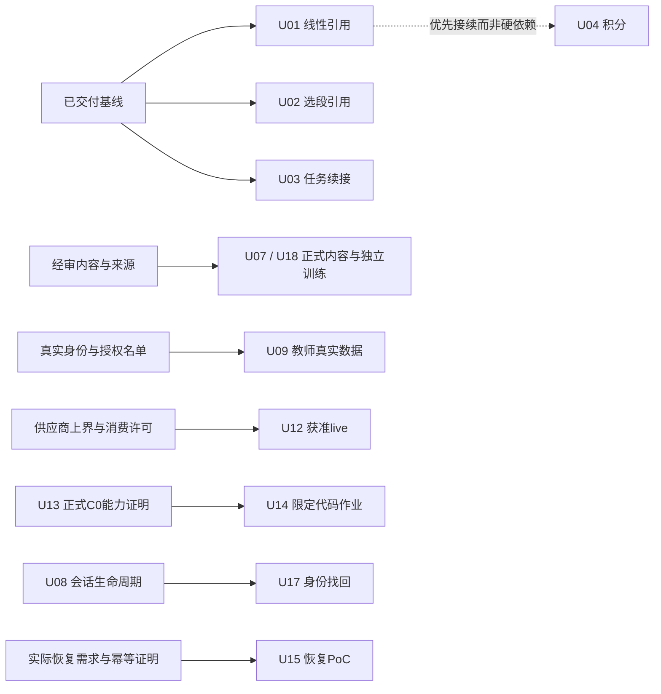

# 珞珈数智完整升级计划

> 最新：[U08可撤销登录会话](delivery-u08.md)与U16静态降级已接续实现。API899/Web70及增量11/19通过。**正式启动前先验收数据库备份/恢复；migration7会在Repository初始化时应用，旧v1需重新登录。** 当前网页仅隔离演示，不是正式库上线回执。

> 接续交付：[U04–U06](delivery-u04-u06.md)已完成积分引用、代码静态提示讨论与讲回证据定位首版，API880/Web65及增量14/33通过。正式经审判断与真实模型质量仍pending；原规划/回执保留历史状态。

实施更新：用户已授权 U01–U03 并要求 commit；三片首版已完成，见[交付回执](delivery-u01-u03.md)。下文“本轮只计划”是原规划轮次的历史边界；其余15片仍为计划，不能视为已实施。

日期：2026-10-07；时区Asia/Hong_Kong。基线HEAD：`d9b9c849bf160a29f7d45efd330601b1083493b7`。

**用户已选择：先补完整计划；逐功能拆可验收切片；保留全部目标。本轮没有实施任何切片。** 产品F1–F8、Agent后续与原六个月研究主线都保留；本计划补的是总索引“还需要补什么”，不重新立项已经交付的首版。18个本地切片是待执行计划，不是外部工单、自动化或已派发任务。

## 要升级成怎样的产品

学生读教材、选实验的一步、继续今日任务和修改代码时，小珞能看见**当前有来源、版本和权限的对象**；解释后可以回到原工作区完成操作。学习服务仍决定提交、确认、帮助和独立成绩，模型不成为状态权威。

首先交付一条可演示体验：线性实验选行→同页提问→显示所引用的矩阵/迭代→回到同一记录；随后接教材选段和任务续接。内容、账号与反馈改善跟进。视频、教师真实数据、学生代码执行、真实模型消费和真正执行恢复分别按条件启动。

这直接组合F3与A4/A6/S5，不把产品升级改成“更多Agent/更多页面”。成功判据是来源正确、动作结果可回查、任务可续接、错误/未知可解释；不是页面数量、BKT上涨或多几段思考动画。

## 已验证基线与未验证事项

| 事项 | 本轮核对结果 | 对计划的影响 |
|---|---|---|
| 实验可信Chat | `learning_context.py`只允许root_lab且限定Newton；`numerical-lab/page.tsx`还在复制草稿后跳Chat | U01新增linear路径，不能写成已支持 |
| 数值记录 | `routes_numerical_lab.py`保存source_hash；runner返回numerical-lab-v1/task/rows。现有记录没有统一graph_revision | 新ref按真实保存字段设计，不伪造旧记录课程版本；旧版不符则重新运行/明确legacy |
| 共享会话 | TutorConversation/useTutorConversation与LabTutor已处理scope、取消、草稿/会话；ContextBanner现在直接渲染Newton字段 | 复用生命周期，引用显示与root动作须按kind分支，不能给linear套Newton参数卡 |
| 伴读来源 | source_excerpt已按owner文档/section/hash/字符范围取quote；解释有独立source_only/model_explanation状态 | U02复用该来源边界，不拼接重叠chunks冒充原教材 |
| 今日任务 | LearningWorkspace已有task/session/episode绑定和提交/ack/复习去重 | U03补入口衔接，不重建任务库；独立待答时不能用新context绕开帮助锁 |
| F8静态 | code_hash/assignment/previous_id和code_executed=false已有；没有独立静态规则版本字段 | U05只补版本与可讨论的finding，不执行学生程序、不回算历史 |
| 账号 | register先create_auth_user再_token_response；issue_token为两段自定义HMAC Bearer v1，含exp/role，无服务端sid撤销记录 | U08修签发失败残留与真实会话退出；不能假设这是JWT/OIDC或teacher配置变更已即时撤权 |
| 视频 | 现有资源路由提供推荐/元数据；未发现本规划对应的字幕伴学入口 | U11以真实字幕样例开始，标题/封面不算字幕 |
| 执行恢复 | RunTrace源码明示leased durable terminal，不是graph checkpoint | U15须先证明实际恢复需求，不能把刷新历史说成已恢复执行 |
| HTML图示 | dynamic CSP允许inline script；StaticArtifact 30秒setTimeout卸载 | U16不把定时卸载当同步JS强杀，先安全降级，受控实验/首页动画保留 |
| 隔离设施 | 当前host可找到docker.exe/wsl.exe命令；未启动或验证daemon、资源限制、宿主边界 | CLI存在不证明C0；U13先探针，U14须有真正C0回执 |
| 评测/预算 | S5.0/5.1/5.2首版与S5.3Mock-only预算已有提交；最近回执API819/Web56、预算16合同39实例 | 这些是以前轮次的工程证据，本轮不重复跑、不当数学质量；真人复核/封存/live仍pending |

证据来源均为当前源码或已有交付回执。344个业务/测试/工具/评测文件的规划前hash位于ignored `results/complete-upgrade-plan-baseline.json`；本轮末核对不变。没有读正式学生库、密钥、原上传文件或确认题答案。

## Slices

每个切片独立包含可见行为、边界、验收、失败处理和回滚；编号是取阅顺序，不意味着所有前号都阻塞后号。

| 切片 | 可单独交付的升级 | 对应 | 真依赖 / gate | 工程情景 |
|---|---|---|---|---|
| [U01](slices/01-linear-context.md) | 线性实验选行同页可信Chat | F3/A4/A6 | 无 | 2–4日 |
| [U02](slices/02-reading-context.md) | 教材选段与Chat共享来源 | F2/A4 | 无 | 3–5日 |
| [U03](slices/03-study-continuity.md) | Chat查看并续接当前任务 | F1/A4/A6 | 无 | 3–5日 |
| [U04](slices/04-integration-context.md) | 积分实验解释真实误差估计 | F3/A4 | 无；在前两条稳定后优先接续 | 2–4日 |
| [U05](slices/05-code-static.md) | 静态代码版本/finding可讨论 | F8/A4 | 无 | 2–4日 |
| [U06](slices/06-teachback.md) | 讲回评语绑定原句与条件 | F5/F2 | 限定已核对条件卡 | 2–4日 |
| [U07](slices/07-assessment-content.md) | 章节参考题/解答有版本和复核 | F4/M4/S5.2 | 正式gold需真人记录 | 4–7日＋审核 |
| [U08](slices/08-account-sessions.md) | 注册失败无残留、会话可真实退出 | 账号/试用 | 正式库迁移先备份与恢复演练 | 2–4日 |
| [U09](slices/09-teacher-summary.md) | 教师授权名单简报与证据回查 | F7/M4/M5 | 真认证/角色撤销/真实授权范围；fixture可先做 | 3–5日＋授权 |
| [U10](slices/10-pdf-source.md) | 原PDF页/区域定位与标注 | F2 | 原件/映射/owner权限可核实 | 4–7日 |
| [U11](slices/11-video-transcript.md) | 字幕时间点伴学 | F6 | 真实字幕/使用范围 | 3–5日 |
| [U12](slices/12-provider-live.md) | 真实供应商准入＋获准小smoke | A5/A7/S5.3 | 实际费用上界/能力/消费授权 | 3–5日＋等待 |
| [U13](slices/13-code-isolation.md) | C0隔离能力探针 | F8 | 独立可终止试验环境 | 探针2–4日；runner实现另估 |
| [U14](slices/14-code-execution.md) | 一份限定代码作业运行反馈 | F8 C1 | U13**正式C0通过**＋作业测试规范 | 4–7日 |
| [U15](slices/15-execution-resume.md) | 一条确有需求的执行路径恢复 | A8 | 真实需求＋可观察/幂等副作用 | PoC3–6日 |
| [U16](slices/16-artifact-fallback.md) | 图示静态降级与聊天恢复 | 界面可信度 | 无；任意脚本恢复须真隔离 | 2–4日 |
| [U17](slices/17-identity-recovery.md) | 验证身份后的凭证找回 | 账号完善 | U08＋可靠身份/投递方案 | 3–6日＋配置 |
| [U18](slices/18-linear-study.md) | 今日计划的线性任务/独立训练 | F1/M2/M3 | 经审题目、独立oracle、帮助排除 | 4–7日＋审核 |

U01与U02形状类似，不构成硬依赖；同文件冲突只影响排期。U09可用当前认证做fixture/范围验证，只有真实数据启用必须实证身份与权限，不默认等完整账号重构。U18不等待U01参考Chat；独立oracle与帮助控制才是实依赖。



## 推荐推进顺序与投入

1. **先打通U01。** 作为第一条产品/Agent组合演示，把真实矩阵与所选迭代贯穿API、prompt、可见来源和刷新。小切片绿后再复用，不先造万能Workspace框架。
2. **U02、U03接续，U16按图示实际入口风险尽早安排。** 三种上下文承担不同帮助规则；独立待答任务不能套reference-help路径。此阶段重点是学习连续性与反馈可读性。
3. **U04/U05/U06/U07与U08。** 按使用需求/已确认失败选择下一项，一次一个可验收结果。U07的作者/真人审核可独立准备，缺审核只停对应正式内容，不堵软件fixture。
4. **U09/U10/U11/U12/U18有条件接入。** 某条外部条件缺失就保留pending并推进其它无阻塞切片；不虚构字幕、授权、价格或教师gold。
5. **U13→真正C0→U14，以及有需求才U15；U17身份渠道确认后做。** 可先做独立可行性探针，不把探针报告“结束”当C0通过。

工程估算假设沿用每周约3个集中开发日、每日约6小时；是预算情景，没有实测AI提速系数。**所有18目标保留不等于六个月内全部承诺完成。**

- 首条U01：2–4日；U01–U03组合：8–14日。
- 优先软件组U01–U08＋U16：22–41日，不含真人内容审核/等待。
- 全18项情景合计：约51–99日，另有C0正式runner建设未知成本。按3日/周约17–33周，明显可能超过原六个月理论78日预算。
- 剩余实际可用日数、课程/求职占用和当前已投入工时没有完整计量，不能把原78日全当剩余额度。

因此按里程碑推进，实施U01后实测更新估算；条件目标可延伸到六个月外，保留目标不删除。真人审核、供应商配置、素材与试用招募等待单列，不以AI编码速度抵消。

## 不新增什么，以及为什么

- 不重建课程图、任务数据库、第二工具Registry、通用model router或一整套“AgentOS”；当前服务已有对应权威边界。
- 不在首条复制Newton参数卡到全部领域，不同时全接所有工作区。先只读引用，把写动作与用户确认另做窄切片。
- 不以某个新class或新框架当目标；VerificationEvidence/ProofState/Lean只有经复核同机制失败与低成本修复对照后再立项。
- 不把F8静态检查改名成执行，不开放任意程序、NumPy/Notebook/多语言作业作为首个C1。
- 语音、全课程字幕抓取、完整学校后台、SSO与大规模恢复都保留后续候选，本次计划不作为同时必交。
- 最小安全/owner/帮助/范围/恢复不能为了“简单”删掉。动态HTML定时器、Docker命令存在、费用fixture均不能当实际隔离/定价证据。

## 原扩展目标保留清单

这些是原八功能规划的后续目标，保留而非删去；先完成相应首片，真实需求和gate到位后再细化窄切片。以下额外工作**未计入18项51–99日**，也不增加六个月必交承诺。

| 后续目标 | 接续入口 | 启动条件与最小结果 |
|---|---|---|
| F1 45分钟组合/章节目标/更多任务族 | U03/U18后 | 已有跨域任务、确认与复习正确；再加一个组合，不以阅读/代算充当独立成功 |
| F3 多域参数建议→预览→显式保存 | U01/U04后 | 每个域自己的固定schema、help/owner/最新preview/幂等；先一域，不把模型文字当已运行或已保存 |
| F3 阻尼Newton/更多方法对比与误差说明 | 现有root runner后 | 新算法独立数值验收、runner版本和停止范围；比较实际工作量，不能用步数假装相同成本；未有oracle不独立计分 |
| F5 语音转写/跨表示解释 | U06后 | 转写文本用户编辑确认，保留原录制/版本；实际ASR费用与数据传输范围先确认，识别文本不自动证明理解 |
| F7 经审任务布置/分组/批量反馈 | U09后 | 真实名单和权限；教师确认后server执行；不自动固化能力标签或给外部渠道发消息 |
| F8 NumPy/Notebook/其他语言 | U05、真正C0/C1后 | Notebook作为JSON数据的静态导入可先做；kernel/新库/新image须重验隔离和数学任务，上传输出不是服务器执行证据 |

没有为这些扩展预建新Provider、队列平台或通用Skill Registry。明确下一个用户需求后再展开单独文件，避免本计划变成无界承诺。

## 代码与设计边界

源码定位（按当前HEAD，未来实现前复核）：

- 引用与服务端状态：`apps/api/app/tutor/learning_context.py`、`learning_actions.py`、`learning_workspace.py`、`reading_explanation.py`、`learning_extensions.py`；路由`api/routes_tutor.py`、`routes_numerical_lab.py`、`routes_learning.py`。
- 数学/内容：`math_tools/numerical_lab.py`与原root oracle；`evaluation/s5/development-content-v1.json`、`review-protocol.md`及S5报告工具。不让被测checker单独产gold。
- UI：`apps/web/components/tutor-conversation.tsx`、`learning/lab-tutor.tsx`、`learning/context-banner.tsx`、`lib/use-tutor-conversation.ts`、`lib/learning-context.ts`、`app/numerical-lab/page.tsx`。复用semantic palette与真实角色/来源状态。
- 账号/权限：`apps/api/app/auth.py`、`api/routes_auth.py`、Repository；角色当前来自配置且写入token，撤权行为需要明确测试，不是“改配置就已即时撤销”的既定事实。
- 隔离/图示：原固定AST/owned worker仅用于有限工具；`apps/web/lib/visual-artifact.ts`与`components/static-artifact.tsx`。学生程序/任意JS需要自己的已验证边界。
- 实际费用：`scripts/s5_budget.py`仅Mock，`app/llm`中现有能力与usage回执继续使用；live最小可选注入在明确供应商合同后决定。

U01建议的最小接口决策：保留现有root ref类和root动作schema；增加固定linear ref/union到聊天请求，字段仅record_id/source_hash/schema_version/selected_step，由server取数。现存记录没有graph_revision就不填“当前revision”伪装历史。新的source种类按自己的scope取数/渲染，不做任意名字到服务执行的泛型注册。

会话历史、课程学习事件、系统参考实验、用户原话、模型意见、普通估计和独立成绩分别保留authority；新卡片不能改旧事件。跨库/供应商不承诺无依据原子性，“已保存”“已运行”“已完成”分别需要对应receipt。

## 验收合同

每片先给一个通过示例、一个失败/未知示例、一条取消或恢复路径，以及实际source/版本/owner/帮助结果。条件slice的真实设施/人工/材料回执不可用Mock替代。

通用命令（未来**实施时**执行，本轮规划不执行）：

```powershell
# root；npm test内部从apps/api跑pytest，保持离线门控
npm.cmd test
python scripts/eval_agent_reliability.py --output results/upgrade-agent-reliability.json
# 只选择本片需要的S5增量manifest，不无理由重复所有历史评测
npm.cmd --prefix apps/web run typecheck
npm.cmd --prefix apps/web run lint
# UI修改时：先停止当前任务拥有的dev/preview，再构建并恢复
npm.cmd run build:web
```

期望：受影响回归与完整必要检查通过；无新增不解释的lint错误；语义/来源/状态/帮助回归无假成功。不以旧819/56数字证明新片通过。前端独立工具测试接root和CI列表；pytest从apps/api，conftest禁dotenv/密钥门控不改。

实际UI验收：桌面与390px、浅/深色、键盘/focus、减少动态、草稿/刷新、空/401/409/500/超时、取消、换引用/账号中迟到流、失效材料；生成真实截图与safe receipt。浏览器工具不可用则标该部分未验收，不伪造截图。

每片一个focused commit/PR：领域合同→同页完整行为→对应回执一起可复查；保存原WIP，不扫入prototype/egg-info/runtime原dirty。测试绿不代表推送、CI、部署、供应商/真人验收。正式库变更另需已验证备份、migration、integrity和恢复；不在规划期触碰正式库。

## 六个月研究主线与简历证据

原M4教师核对、M5小规模试用、M6/M7无AI跨表示与延迟保持、M8复现/负面结果继续。当前可先用合成/开发材料演示，正式招募与数据使用范围、研究题与训练题隔离、样本/缺失/对照协议需要真实条件。10–20人只能是可用性试用目标，不能直接变因果效果结论或充分研究样本量。

适合AI应用/Agent工程实习的可验证成果依序为：跨对象来源绑定与最小权限；可取消/恢复/幂等状态；来源分层评测与真实trace；有环境证据的隔离执行。只有真实审核/运行支持时才写数学质量指标，只有合格研究支持时才写学习收益。

## Review Notes

本计划用planning技能按现有索引扩写并拆分；用户选择了“先完整计划”和“逐功能可验收/保留全部目标”。两个答复均已落实，无丢弃。切片granularity为已选格式，本地文件未派发执行、没有外部工单。

| 维度 | 原索引作为执行计划 | 本版 | 说明 |
|---|---:|---:|---|
| Completeness | 2 | 5 | 每片非理想状态、rollback/STOP明确 |
| Feasibility | 3 | 4 | 先3条可复用竖切片；C0/供应商/原件/真人条件未验证，不给虚假全5 |
| Scope | 3 | 5 | 全目标拆为18独立结果，首片不先建横向框架 |
| Testability | 2 | 5 | 每片checkable AC与共同命令/真实环境区分 |
| Risk | 3 | 5 | owner/帮助/身份/数据迁移/计费/执行的blast radius与停用路径明确 |
| Assumptions | 3 | 5 | 已验证源码、外部未知、投入情景与无效条件分列 |

<!-- UNRESOLVED: Feasibility4/5 for conditional slices: actual C0 boundary, original PDF/subtitles, real reviewer/roster, provider upper cost bound and available remaining days remain unverified. These require their named probes/real evidence; do not certify the full portfolio ready for deployment. -->

允许先准备/实施的建议：U01–U03与U16最小软件切片；条件项只进入对应探针/素材/身份准备，未满足gate不正式启用。该建议不是本轮自动执行授权，用户已要求本轮只计划。

PLAN VALIDATION：
- Answers the request：§要升级成怎样的产品、§Slices覆盖“还需要补什么”，F1–F8全部有映射。
- Answers landed：2/2答复进入范围与切片粒度；原六个月主线和AI应用/Agent岗位目标保留。
- Scope gate：§不新增什么，复用服务/stdlib/现有库，不能简化掉正确性/owner/帮助。
- Assumptions explicit：§已验证基线、§投入、条件gate与Feasibility未闭合；不保证全18项六个月完成。
- Verification：§验收合同命令与实际UI/真人/设施分别验证；本轮只验证文档链接、切片覆盖与源码hash不变。

实施偏离统一写[implementation-notes.md](implementation-notes.md)的Deviations；非STOP的保守实现可完成并记录。旧两目录不删除，当前范围以本计划＋各片共同索引为准。
