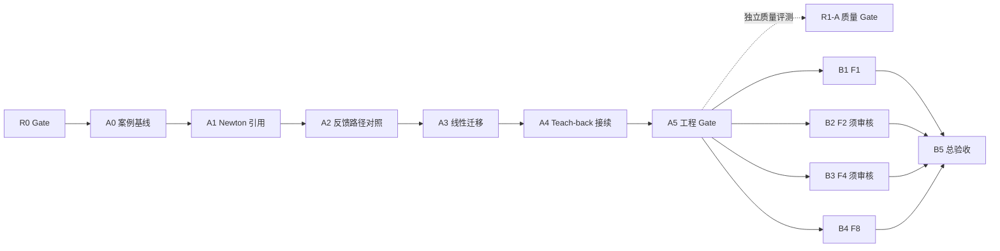

# R1｜Math Tutor Core v1：R1-A 与 R1-B 冻结实施基线

日期：2026-10-08。状态：**R1 实施基线已冻结**；“未启动”及下文 R0 前不开工是冻结时的默认顺序，后续用户明确授权 A0–A2 的本地工作及当前状态以 [`planning/README.md`](README.md) 为准。性质：基于本地源码、既有规划及交付回执的修订方案，不是实施回执或模型质量报告。唯一当前状态入口为 [`planning/README.md`](README.md)；[`v4 路线图`](../luojia_roadmap_v4_2026-10-08.md)和 F/U/S 旧计划保留为历史与目标来源。本文件把 R1 拆为 **R1-A Math Agent Core → R1-B Learning Workspaces Enhancement**。两段依赖递进，单人一次实施一个可验收切片；R0 未完成前均不启动代码实施。后续范围或 Gate 变更须先在唯一状态入口记录理由，再修订此基线。

## 0. 总体判断与审阅基线

建议接受“两段 R1”的产品目标，但不接受“所有场景共用同一额外 LLM 审查节点”作为先验架构。**R1-A** 先在 Newton、Jacobi/GS、Teach-back 三种不同证据形态上验证一套小型共用合同：学生主张从哪里来、数学证据支持到哪一步、何时承认正确/纠错/追问/弃权、反馈如何回到任务。各域保留专用数学检查。**R1-B** 在 A 的合同与回归稳定后，逐片增强 F1 任务推荐、F2 教材条件推理、F4 章节自检分层反馈和 F8 算法静态诊断；不把 F1–F8 一次性重写成新平台。

本地审阅基线：`feature/course-graph-2.0` / HEAD `da67dd54abd910bca7219b9ed398807c3764cbf5`，相对跟踪分支 ahead 7。原有未提交修改、删除和未跟踪文件保留；本轮只改规划与交接文档。v4 所记远端 `50e5c165` 和 Actions 失败为彼时快照，不代表当前本地 HEAD。[`M1 Prompt A`](m1-g0-delivery.md) 与 [`M1 Prompt B`](m1-newton-delivery.md) 已报告本地上传 owner 收口、锁文件、Newton 持久活动及当轮 API903/Web71；它们不证明当前目标 SHA 的远端 CI、正式数据库迁移、真实模型数学质量或学生学习收益。R0 由并行工作处理，本文件不覆盖其修改或验收结论。

以下 `tutor/`、`math_tools/`、`knowledge/` 相对 `apps/api/app/`，`web/` 相对 `apps/`。行号只对应本次本地基线。此轮未运行付费模型、未访问正式学生库，也未以旧测试数字冒充新运行结果。

## 1. 现状审计：保留的事实与真实缺口

| 范围 | 已有实现，应该复用 | 缺口与不可越过的边界 | 可核对位置 |
|---|---|---|---|
| Chat / Agent | LangGraph 的 fast context、fallback route、verifier、teacher、examiner；SQLite 会话、固定数学工具、Answer Guard 与 AgentRun 回执 | `ACTION_BY_INTENT` 把意图映射到默认动作，不等于按学生数学主张选择教学动作；引用讨论被设为 `Intent.CONCEPT`/`verification_mode=none`，原生工具关闭。Guard 管交付声明，不能证明数学正确 | `tutor/graph.py:220-265,605-707,764-768`；`tutor/intent_router.py:24-34`；`tutor/orchestrator.py:398-403`；`tutor/answer_guard.py:51-55` |
| Newton / F3 | Root Runner 产生受限输入的轨迹与停止原因；M1 已保存预测、解释、修订、帮助曝光，绑定 owner、run/hash/version，Lab 内可讨论 run | `root_lab` 快照只含轨迹摘要，不含活动原话；点击讨论不能自动评估已保存解释。当前 `concealFuture` 只隐藏未来折线，回放控件仍可跳到末步；轨迹图不是曲线与切线图。固定题 `0→1→0` 精确代入不能证明一般输入的循环或发散 | `math_tools/root_runner.py:17-86`；`tutor/newton_activity.py:37-60,91-101,115-151`；`tutor/learning_context.py:22-54`；`web/components/learning/newton-activity.tsx:84-101`；`web/components/learning/lab-playback.tsx:5-39` |
| Jacobi/GS / F3 | U01 已交付线性实验与 owner/hash/schema 绑定的只读 Chat 引用；numerical_lab 给出真实迭代与残差 | 现有引用主要供解释；尚未证明 Agent 能从学生说法中区分残差、收敛条件、唯一性与未知，也未证明同一教学合同能跨 Newton/线性复用 | `math_tools/numerical_lab.py:14-32,62-97,175-181`；`tutor/learning_context.py:57-64,150-200`；U01 回执 |
| Teach-back / F5 | U06 已有学生原句跨度、条件映射、补充版本、逐条件结构化模型意见和失败降级 | 现有 `model_teach_back` 是领域专用审阅，`verified=False`；无需把它再包装为第二个 Agent。可复用引用、状态与追问合同，但必须保留逐条件语义 | `tutor/learning_extensions.py:41-117`；`tutor/teachback_evidence.py:28-51`；`tests/test_teachback_evidence.py` |
| F1 今日学习 | 15/30 分钟任务、恢复、ACK、求根独立 probe、复习与 Chat 只读续接已有 | 默认任务仍围绕 Newton；`overview()` 的计数、读过材料或看过参考轨迹都不等于跨域掌握。新增推荐应先依据可解释任务状态，不自动生成能力画像 | `tutor/learning_workspace.py:70-145,195-225`；`tutor/study_summary.py:14-40`；U03 回执 |
| F2 教材伴读 | 课程/私有 Markdown 选段、owner/hash/字符范围、条件卡和来源状态已有 | `reading_units()` 的条件卡标为 `development_card`；Course Graph 的候选条件常为 `not_checked`。必须把“教材写了条件”和“本题满足条件”分开；精确 PDF 页区域另依 U10 素材 | `tutor/learning_context.py:135-149`；`tutor/learning_workspace.py:240-265`；`knowledge/evidence_builder.py:28-46` |
| F4 章节自检 | 六题开发参考训练、首次作答、交卷后答案/解释、错项单元与帮助锁已有 | 当前 `assessment_public()` 主要给一次参考匹配和同层解析，尚无经审核的条件级分层反馈；参考分不是正式数学能力或学习收益 | `tutor/learning_workspace.py:332-354`；`tests/test_learning_workspace.py:233-257`；U07 草案 |
| F8 代码作业 | U05 有固定 Newton 作业、AST 静态提示、规则版本、原代码/hash、手填轨迹核对及 Chat 引用 | `static_findings()` 的局部模式依赖变量含义，不能推断任意算法正确；未执行学生代码。新增诊断应限定作业契约与可定位行，避免把静态线索当运行错误 | `tutor/learning_extensions.py:120-199`；`tutor/learning_context.py:109-134`；`tests/test_code_context.py` |
| Graph / Memory / S5 | EvidencePack 汇合 Course Graph Case、检索、边界与历史计数；StudentOverlay 不估掌握度；S5.0–5.3 有有界 checker、离线 runner、8 道 dev 草案和 Mock 预算 | Case 命中不证明前提成立；图谱与学习状态对动作选择的增益未消融。S5 人工 gold、真实模型/供应商能力与费用仍待核实；工程合同不能换算为数学正确率 | `knowledge/evidence_builder.py:46-109`；`tutor/fast_context.py:321-358,622-642`；`knowledge/student_overlay.py:102-106`；`evaluation/s5/README.md` |

最重要的三个瓶颈仍是：**学生主张与可信来源未进入同一轮教学判断；数学证据的支持范围与模型意见容易混淆；缺乏把路由、上下文、工具、教学动作和最终表达分开的质量对照。** R1-B 的高价值机会是让同一可信反馈真正改变学生下一步能做什么，而不是多出四个入口。已有源码可以证明数据流缺口；它本身不能证明模型错误率或某种新架构必然增益。

## 2. R1-A 目标合同：共用边界，保留领域检查

**先复用的合同，不先建框架**：每次反馈能够回查 `student_claim_ref` 或当前用户消息、`source_ref`、`math_evidence` 的来源/版本/范围、`review_kind`（确定性检查、模型意见或未检查）、`suggested_action`、`unknown_reason` 与最终回复。优先放在已有快照、ToolResult、message metadata/AgentRun；只有 Newton、线性、Teach-back 至少两个实际消费者发生相同的误指/复制问题，才抽一个极小的共享 DTO。不同域的数学条件由 Root Runner、numerical_lab 和 Teach-back 条件卡/审阅分别处理，不做通用 MathProblem IR 或全局 Reasoning Graph。

Newton 已保存的解释/修订应只在学生明确选择“请评我的这段解释”时附带版本化引用。服务器按 owner 重读活动、run 和原话，重验 input_hash、runner_version、graph_revision 与帮助锁；普通“解释第 k 步”继续只带 run，不暗中注入旧主张。Jacobi/GS 直接复用 `linear_lab` 来源，学生主张来自当前 Chat 输入；Teach-back 保留 `create_teach_back`/`model_teach_back` 的逐条件审阅，在 Chat 与回执层复用动作词汇、原句跨度、来源/版本、unknown 和修订入口，**不强行经过同一个模型调用节点**。无引用的开放式问题沿用现有固定工具/本步 checker，缺少受支持证据就追问或注明未知。

学生文字始终是待审主张；参考轨迹是帮助，不是学生独立作答；`VerifyResult`、Root Runner、numerical_lab 和真实返回的 ToolResult 只支持声明范围内的计算事实；LLM 的条件判断不是证明。R1-A 不因自由解释、reference_help 或模型意见写 mastery/BKT、独立成功或确定性 mistake。Graph 只提供候选来源/条件，`not_checked` 不能改称已满足。会话/任务仍以 SQLite 与 LearningWorkspace 为权威，不另建长期 Memory。

### 三种反馈路径先比较，再选择

| 候选 | 实际做法与已有基础 | 可能收益 | 主要风险、成本和降级 |
|---|---|---|---|
| **D0 直接生成** | 把 owner/版本校验后的有界来源与学生原话送给现有 teacher/Guard，一次模型回答；作为最低成本对照 | 保留现有会话与最短调用链；适合证据直接、问题清楚的情况 | 模型可能漏条件、误判正确步骤；Guard 只能拦部分越界表述。证据不足时必须显示未核验，不能凭流畅回答判对 |
| **D1 现有工具增强（默认优先试）** | 先消费已保存的 Root/linear 结果、条件卡；普通 Chat 只在适用范围调用现有 fixed-worker checker 或 typed tools，再由现有 teacher 组织反馈。不为引用模式直接开放任意原生工具 | 可把可核对的数值/代数事实与模型解释分开，新增架构最少 | 工具只覆盖小范围；额外计算、超时、未知和工具选择错误仍可能发生。失败时保留失败来源与 unknown，不把 LLM review 升格为替代证明 |
| **D2 结构化 claim review** | 为明确的“检查我的说法”增加有界字段，如原句跨度、条件状态、evidence ref、动作、unknown；可试单次生成兼带决策，或额外审阅调用后再 teacher | 更便于审计与阻止不存在的引用、错误字段；Teach-back 已有领域内结构化样例 | JSON 结构正确不保证数学判断正确；多一次模型调用会增加延迟/费用/失败面，单次兼带输出也可能限制表达。无效/超时只能降级，不能自动换一个未核验的确定性结论 |

**推荐顺序：先冻结 D0 与 D1 的输入和工程对照；真人审核或真实模型质量证据不足时，A2 可采用 D1 暂行，不必为了过 Gate 上线 D2，也不宣称 D1 在数学质量上优于 D0/D2。** D2 可在离线/固定模型回放中验证字段合同，质量优劣保持“待验证”；有经审案例和获准的真实模型运行后，才比较正确步骤误判、条件遗漏、错误归因、恰当弃权和证据越界，同时记录端到端延迟、调用次数、usage 缺失与价格未知。若 D2 只提升格式通过率或把错误写得更整齐，应舍弃额外审阅；若 D1 工具覆盖不足，应具体增补一个可验证运算，而不是开放代码执行。Teach-back 的既有结构化审阅可保留，不能因为 D2 未入主链就删除它。

## 3. 候选增强逐项决策

“必须新增”指相应阶段的最小交付，不等于现在实施；“外部审核”指缺少它时只能交付工程/开发参考状态。下表同时说明哪些想法**暂不值得做**，避免把所有愿望并入架构。

| 模块与阶段 | 已有实现 | 必须新增的最小结果 | 可复用 | 需外部审核或实证 | 暂不值得做 |
|---|---|---|---|---|---|
| **R1-A Newton** | M1 持久活动、Root Runner、LabTutor、预测前不显示轨迹的首版门控 | 显式选择原解释/修订的可信引用；当前 run 下有范围的承认正确/纠错/追问/未知及修订回流；已揭示步骤的曲线/切线与迭代落点可视化、回放防剧透和 Chat↔Lab 续接均为基础验收 | `NewtonActivity`、`LearningContextRef`、现有 Graph/Guard、精确 `0→1→0` 代入 | 开放解释案例的人审；真实模型质量另测 | 新 Newton Agent、预计算轨迹冒充泛化、将二周期判据套任意输入；高级动画 |
| **R1-A Jacobi/GS** | U01 线性 run 与只读 Chat 引用 | 对一条学生主张区分残差/条件/解误差，使用同一反馈回执字段和失败降级 | `LinearContextRef`、numerical_lab、现有 Chat | 数学反例与替代正确路线独立核对 | 复制 Newton workflow、把迭代步数当统一计算成本、泛化求解器重写 |
| **R1-A Teach-back** | U06 原句跨度、条件映射、模型逐条件意见、修订 | 从 Chat 或原页面明确进入当前讲回，能回看每条依据/unknown、选一个追问并修订；动作与范围进入同一回执 | `create_teach_back`、`model_teach_back`、`TeachBack` 记录 | 条件卡当前为开发参考；真人审核后才称经审反馈 | 强制走 Newton 的 verifier、自由文本自动评分或新 Teachback Agent |
| **R1-B F1 今日学习** | 计划/ACK/probe/复习、U03 只读任务续接 | 基于现有可信任务状态给出少量可解释“下一步”推荐及直达入口；能拒绝使用失效版本 | `LearningWorkspace.overview/today`、任务记录、Chat 卡片 | 跨域独立训练若启用需新 oracle/题目审核；本片推荐可先不启用 | 长期画像、由阅读/提示次数推断掌握、全自动个性化排程 |
| **R1-B F2 教材伴读** | U02 选段 Chat、条件卡、来源 hash/span | 对选中定理列出“教材要求 / 题目已给 / 仍未知”，追问缺失条件并链回原文；不能把推断写成引用 | `ReadingContextRef`、`source_excerpt`、Course Graph 候选条件 | 条件卡 `development_card`、教材来源与逐份使用范围须审查；未审只标开发参考 | 无授权 PDF 页区域、自动遍历整本教材建新图谱 |
| **R1-B F4 章节自检** | 六题开发训练、首次作答、交卷解析/错项、帮助锁 | 交卷后按“指出条件缺口→给方法提示→学生请求时看完整解释”分层反馈，保留题目/答案/rubric 版本与原分数 | `assessment_public`、既有任务与复习入口 | U07 对现有题与分层文案逐题审核；无二审不称正式 gold/研究测量 | 交卷前漏答案、关键词判自由推导、把参考分写 BKT |
| **R1-B F8 代码作业** | U05 固定 Newton AST 规则、行号、版本、手填轨迹/Chat | 对限定 `solve` 作业增加一组数学算法静态诊断：更新式、导数零保护、停止条件/上限的可定位提示；确定与启发式线索分层 | `static_findings`、`trace_diagnosis`、`CodeContextRef`、原代码 hash | 准备正确变体/错误变体与人工解释，验证误报；真实运行仍无证据 | 任意学生代码执行、Notebook kernel、凭 AST 存在断言程序正确 |
| **Graph / Memory / 新抽象** | EvidencePack、Case、会话、LearningWorkspace、StudentOverlay | 记录命中/条件/动作与引用来源，用同题消融判断实际价值 | 现有 Graph 和 metadata | 种子审核状态、真人案例复核 | 新 Graph/Memory 框架、多 Agent、ProofState/IR/Lean/A8 默认建设 |

F6 视频、F7 教师功能、U10 PDF 精确页区域、U13/U14 代码沙箱仍在其他有条件计划中；本 R1 不依赖它们。F1–F5/F8 的既有首版不重复立项，新建内容以本表“必须新增”列为边界。

## 4. 分阶段切片、真实依赖与验收

**总规则**：R0 对目标 HEAD 的 CI、上传 owner 正/负例及合法显示验收完成，或残留风险与 R1 无关且被明确隔离、经负责人接受，才可开工 R1-A。R1-A 的 **A5 工程 Gate** 通过后，才可启动不依赖待审核内容的 R1-B 切片；A 的数学/教学**质量 Gate** 独立保留，未通过时不得宣称 R1-A 质量完成。切片按表逐个实施与验收，允许准备材料但不并行修改共享生产路径；每片可单独提交、回滚，状态只在 `planning/README.md` 更新。本计划不自动派发任务。

### R1-A Math Agent Core

| 片 | 硬依赖 | 可交付行为与改动范围 | 本片验收及停止条件 | 估算集中开发日 |
|---|---|---|---|---:|
| **A0 冻结基线和三域案例** | R0 Gate | 固定当前源码/配置、三域主张与独立数学依据、现有 D0/D1 路径、成本/延迟记录方案；复用 S5 离线协议 | 题目、量词、正确/错误/未知、帮助资格和复核状态逐题明确；无人审核只标作者准备。缺安全基线则停 | 1–2 |
| **A1 Newton 原话可信进入 Chat** | A0 | 只为学生选中的解释/修订加活动引用；服务端绑定 owner、原文版本、run/hash、runner/graph 版本与帮助锁；原会话回 Lab 可修订 | 旧/跨用户/错 hash/重试/身份变更拒绝；普通轨迹提问不带旧主张；无受信引用时不给确定评价 | 2–4 |
| **A2 反馈路径工程对照与暂行选择** | A1 | 冻结相同输入与 D0/D1 对照；D2 只做有界字段合同试验，真实质量对照待审核和模型证据。证据不足可在现有 Graph/metadata/Guard 上采用 D1 暂行，不建新 Agent | 三类 v4 Newton 案例、正确步骤、缺前提、求完整答案、无模型/工具失败；工程合同、数学内容审核状态与费用/延迟分列。无可靠真人审核或真实模型证据时不判三路径质量优劣，D2 标待验证；固定回复不算模型质量 | 2–4 |
| **A3 Jacobi/GS 迁移** | A2 | 用 U01 的真实线性引用与当前 Chat 主张复用动作/证据范围/unknown 回执；域内残差和条件仍走 numerical_lab | 正确步骤不误判；小残差不自动成为小解误差；奇异/未证收敛条件说明未知；版本、owner、取消安全。若需复制 Agent 核心，停下来缩合同 | 2–3 |
| **A4 Teach-back 接续** | A3 | 保留 U06 专用逐条件模型审阅，只把当前来源、原句、条件状态、追问与修订接到可见 Chat/工作区路径和共用回执 | 三种 condition 状态可定位原句；合理改写不过度误判；旧版本与模型失败不出假评语；无审核不称正式掌握。若统一调用损害逐条件语义，保留专用实现并只共用边界 | 2–4 |
| **A5 三域集成与阶段验收** | A1–A4 | 真实 UI 路径、离线 ASGI/SSE、回归/对照、Newton 基础可视化与防剧透、R1-A 分 Gate 回执 | **工程 Gate**：显示至 xₖ 时只可画已揭示的 xₖ₋₁ 处切线及其落点 xₖ，不能预画 xₖ 处通向 xₖ₊₁ 的切线；曲线、切点和落点与保存轨迹相符。未揭示步不可经滑块、按钮、自动播放、诊断/末步文案或刷新提前看到，主动跳过完整答案须记帮助曝光；Chat→Lab 返回原 run/步/修订且旧版本安全降级。三域续接、桌面与 390px、键盘、取消、无学习误写及 E0/E2 通过。质量 Gate 的 E1 缺证据须单列 pending；工程未达标则 B 不启动 | 3–5 |

R1-A 核心仅承诺数学来源与教学动作有范围、可回查。Newton 曲线/切线限已揭示步骤：仅显示 x₀ 时不画通向 x₁ 的切线；优先用固定题的受控函数与导数、有限采样和非有限值断点绘制；任意表达式绘图与高级动画不在基础范围。若安全可视化或防剧透不成立，**A5 工程 Gate 未通过**，不可拿旧迭代序列图代替。**质量 Gate** 则要求有独立复核的数学/教学案例及获准真实模型质量证据，结论按实际覆盖范围写明；未具备时记录“工程验收完成、质量未验收”，不能用固定模型给出准确率，也不阻挡满足下述依赖的 B1/B4。

### R1-B Learning Workspaces Enhancement

| 片 | 硬依赖 | 可交付行为与改动范围 | 本片验收及停止条件 | 估算集中开发日 |
|---|---|---|---|---:|
| **B1 F1 可解释任务推荐** | A5 工程 Gate | 在现有今日学习/Chat 卡片中从待确认、需修订、到期复习、失效来源等可信状态选一项下一步，给具体理由与直达入口；不修改掌握模型 | 同一 owner 的任务/日期/版本下推荐可复现；参考帮助不变独立成功；无有效任务给中性建议。若必须靠 LLM 猜学习状态，退回规则与人工选择 | 2–4 |
| **B2 F2 教材条件推理** | A5 工程 Gate；用于正式声明的条件卡审核 | 从已选教材段落给出前提清单、当前题已知/未知对照与一条针对性追问；保留源 span/hash/revision。开发卡可仅做明确标注的 fixture | 定理条件未给出时不宣称适用；引用不跨 owner/版本；未审来源不变成 verified。审核缺失只停正式内容，保留 B2 开发状态并可接 B4 | 3–5 |
| **B3 F4 分层反馈** | A5 工程 Gate；题目与 rubric 审核为正式验收硬依赖 | 保留现有卷面/首次作答和分数；交卷后按题目条件缺口、方法提示、按需完整解释分层；版本化反馈与复习单元链接 | 答案在交卷前不泄露；正确题不造错、合法替代解不按关键词判错；刷新/重试不重复评分。审核不可得则停“正式分层反馈”，开发参考状态如实展示 | 3–5 |
| **B4 F8 限定算法静态诊断** | A5 工程 Gate | 扩展固定 Newton `solve` 的少数可定位数学提示，区分确定结构事实与需人工解释的算法嫌疑；继续只读 Chat 讨论 | 正确变体和错误变体都有独立样本；行号/规则版本/代码 hash 绑定；不执行代码，不把 AST 模式写成程序正确性。误报无法收敛则撤新规则、保留 U05 | 3–5 |
| **B5 工作区整体回归与 R1 总验收** | B1–B4 均完成或明确阻塞/部分交付 | Chat→阅读/实验/自检/代码→Chat 的续接检查，整理已实现与外部审核 pending 的统一回执 | 每个 F 模块的工程、内容审核、真实模型质量分列；任何必需切片 pending 时不宣称 R1 全部完成 | 2–3 |

B1→B2→B3→B4 是建议的**单人执行顺序**，不是虚构的技术硬依赖：A5 工程 Gate 已过而质量 Gate 待验时，B1/B4 可启动，保持 A 质量 pending；B2/B3 的正式反馈仍须各自内容审核。B4 不需要 F2/F4 内容；B3 不必等待所有 F2 教材页。某一审核卡住时记录 B 的部分状态，再选择下一个未阻塞切片；最终 B5 不替未审核模块盖章。U18 的“新增线性独立训练”和 U13/U14 代码执行超出上述 F1/F8 最小需求，保留条件扩展，不能因为 R1-B 纳入 F1/F8 就自动算入工期。

## 5. 分层评测：决定机制而非给自己打分

1. **独立数学依据**：Newton `f(x)=x³−2x+2, x₀=0` 以精确代入证明 `0→1→0`，一般输入只报实际 run 与停止范围；`x₀=-2` 对照不用 Runner 自身做 gold。Jacobi/GS 用人工代回检查残差，并用适当矩阵反例区分残差、唯一性与收敛前提。Teach-back 对照来源条件和原句，不按关键词判断自由解释。F2/F4/F8 的内容/规则由未调用被测流程的解答或程序变体复核。
2. **规模只支持找失败簇**：A0 先准备约 16 个公开 dev 案例：Newton、Jacobi/GS、Teach-back 各约 4 个，开放问题与 owner/版本/工具失败合计约 4 个；数量由覆盖三种证据形态、正确与错误及 unknown 得来，**不是准确率统计设计**。另留 4–6 个不参与调参的确认候选，审核者不可得时只做开发观察。R1-B 每个工作区先用少数正/反例验证新行为，再决定是否扩题；S5 已有 8 道开发材料可复用来源，不把同题多指标加成多道题。
3. **三路径对照**：A2 先固定 D0/D1 的同题、同来源与工程记录，D2 可只验字段/降级合同；经审案例和获准真实模型运行具备后，才在相同模型/题目/初态/预算下比较质量，分别记录可用回复率、正确步骤误判、缺条件仍判对、错误归因、恰当弃权、无依据工具/证明声明、任务是否前进、模型请求数、延迟分布、usage 缺失与可计算费用。结构 JSON 合法率只是工程指标。没有这些证据，D1 只是暂行工程路径，D2 和路径质量优劣均标待验证；固定回复只验协议和数据绑定。
4. **瓶颈与消融**：route、source/context、确定性工具、教学动作、Guard/最终文本各有自己的固定分母；未执行、失败、unknown 和未评分分别报告。Graph on/off、活动原话 on/off、D2 on/off 仅在离线 harness 单因素切换并恢复干净初态；新增引用的能力覆盖与旧版双方共有任务的质量分开，不把“旧版无功能”算作数学准确率提升。
5. **工程与体验**：pytest 从 `apps/api` 跑，默认离线；现有 `tests/test_newton_activity.py`、`test_learning_context.py`、`test_agent_graph.py`、`test_teachback_evidence.py`、`test_learning_workspace.py`、`test_code_context.py` 为回归起点。Web 类型检查、lint；开发服务器停止后再 build。隔离测试库浏览器验收桌面/390px、键盘、刷新/取消、身份切换、帮助锁、历史版本、Newton 已揭示步骤切线与预测防剧透、Chat↔Lab 原对象续接。E0 工程与 E2 路径为 A5 工程 Gate；E1 数学/教学质量单独验收，E3 学习增益未做就写未测。

本轮不调用付费模型。未来真实模型对照、供应商能力与费用上界必须经过 S5.3 的实际准入和明确消费授权；usage、价格、计费模式未知时费用记 unknown，不宣称硬上限。真人二审与内容使用权未核实时也不称正式 gold 或经审教材反馈。

## 6. 工期、阶段 Gate 与停止条件

| 范围 | 软件集中开发日（初估） | 未并入的成本与不确定性 |
|---|---:|---|
| **R1-A** | **12–22 日** | A5 已揭示步骤切线、防剧透与 Chat↔Lab 回归纳入工程日；三域数学案例独立复核、真实模型准入与额外模型请求另计，先完成 A1/A2 再按实测重估 |
| **R1-B** | **13–22 日** | F2 条件卡和教材来源审核、F4 题目/rubric 审核、F8 正确代码变体复核、供应商等待；B2/B3 的正式验收可能因审核而暂停 |
| **合计** | **25–44 日** | 不含 R0、正式库备份/恢复/部署、真实学生研究、PDF 精确定位、代码沙箱或新线性独立训练；每周约 3 个集中开发日仅对应约 9–15 周的排期假设 |

旧 v4 的 4–8 日只覆盖 Newton 垂直片；上一版 R1-A 的 11–20 日已覆盖 Newton、线性和 Teach-back，但把切线体验留作展示增强。本版将它改为基础验收，故 A 阶段预算相应上调；F1/F2/F4/F8 仍在 B 阶段。人工复核耗时和 provider 等待没有实测，本轮不填看似精确的小时数；A0 先用少量案例记实际用时再更新预算。R1-A 工程 Gate 通过不等于其质量 Gate 或整个 R1 完成；R1-B 若部分内容缺审，只报告已交付软件和受阻的正式能力。

**开工与阶段停止**：

- R0 同一目标 SHA 的 CI/上传授权链未验收、或并行修改冲突未收敛：不启动 R1-A；R1-B 更不能提前开工。
- A1 无法按 owner、原话版本、run/hash、课程版本和帮助锁稳定重验：停止上下文接入，拒绝引用并让学生回工作区重选；不让浏览器复制文字冒充可信记录。
- A2 缺可靠真人审核或获准真实模型质量证据：可让 D1 在工程合同通过后暂行，D2 与质量优劣标待验证；若 D2 后续仅提升格式率，或增加请求导致延迟/费用不可接受，不上额外结构化节点。工具失败、模型空答或证据缺失时显式降级未知，不补造结论。
- A3/A4 需要复制第二套 Agent 或把逐条件 Teach-back 压成单个“对/错”：暂停抽象，保留各域 adapter 与共用回执。A5 工程 Gate 未验收，B 不开工；工程 Gate 已验收而质量 Gate 待验，可启动无待审核内容依赖的 B1/B4，A 的质量状态保持 pending。
- B1 推荐若只能依据参考帮助或未审核分数猜掌握度：只提供中性“继续未完成任务”；不写画像。B2/B3 需审核的内容未获确认：只保留标明开发参考的软件状态，正式能力停在该 Gate。B4 数学静态规则误报无法在正确变体上受控：撤规则，保留 U05 首版。
- Graph/Memory、新工具或 A8 未呈现可复核净增益：不因 R1 名称扩大架构。任何模型意见均不自动写 mastery、独立成功或确定性错误标签。

## 7. F/U/S 溯源、完成定义与面试价值

| 旧编号 | R1 处理 |
|---|---|
| A0–A3、S1–S4 | 复用编排、Guard、trace、固定工具与会话，不重立项目 |
| S5.0–S5.3 | 复用有界核验、离线评测和 Mock 预算；真人 gold/live/计费另设 Gate |
| U01/U04 | 线性/积分只读引用已有；A3 只增强线性学生主张反馈，积分保留回归 |
| U02/U03/U05/U06 | 教材/任务/代码/讲回首版已有；B2/B1/B4/A4 只补表中增量 |
| U07 | F4 审核与分层反馈纳入 B3；审核状态必须如实区分开发/作者/二审 |
| U08/U16 | 保留安全与降级回归；正式库迁移仍受独立 Gate |
| U10/U12/U13–U15/U17/U18 | PDF 精确来源、供应商 live、沙箱/恢复/身份渠道/新线性独立训练按实际依赖另决，不因 R1-B 的 F1/F8 名称自动启动 |

**R1-A 工程 Gate 验收后的新增能力**应是：可信学生原话与当前数学来源一同进入辅导；Newton、Jacobi/GS、Teach-back 三域按同一证据边界和动作语义给出可回查反馈，同时保持领域专用核验；Newton 已揭示步骤切线、防剧透及 Chat↔Lab 续接可用。三路径的数学误判、教学质量与成本/延迟的比较须在独立质量 Gate 用实际可得证据完成，未完成时不能写成已证明优劣。**R1-B 验收后**再新增有理由且可返回任务的推荐、带来源和前提状态的教材追问、交卷后的经审分层反馈、限定作业的可定位算法静态提示。上述均是待实现目标；未完成的 slice 或外部审核不能写成已有成果。协议回归不能作为模型数学准确率，固定流程不能作为学生学习收益。

每片结束只在 [`planning/README.md`](README.md) 更新 `Now / Next / Conditional / Delivered / Blocked` 并写短回执；旧 F/U/S 文档保留历史状态，不另建并行总看板。A5 工程 Gate、R1-A 独立质量 Gate 和 B5 分别记录验收状态；在 R0 Gate 前不开展 R1 生产实施。本文件在本轮局部修订后冻结为 R1 实施基线。
