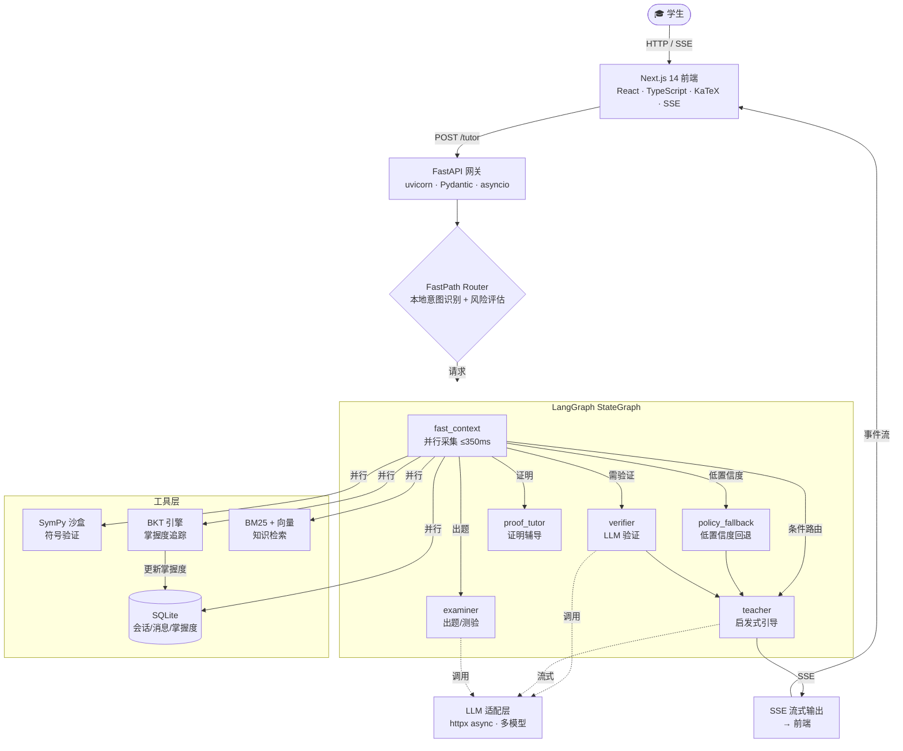
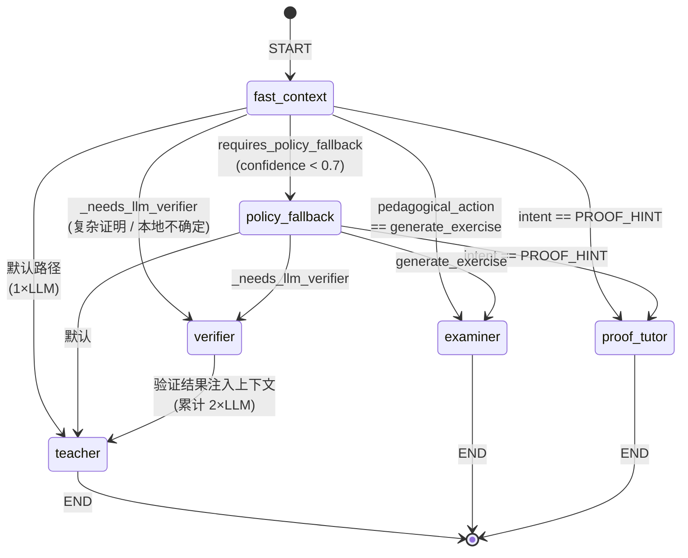
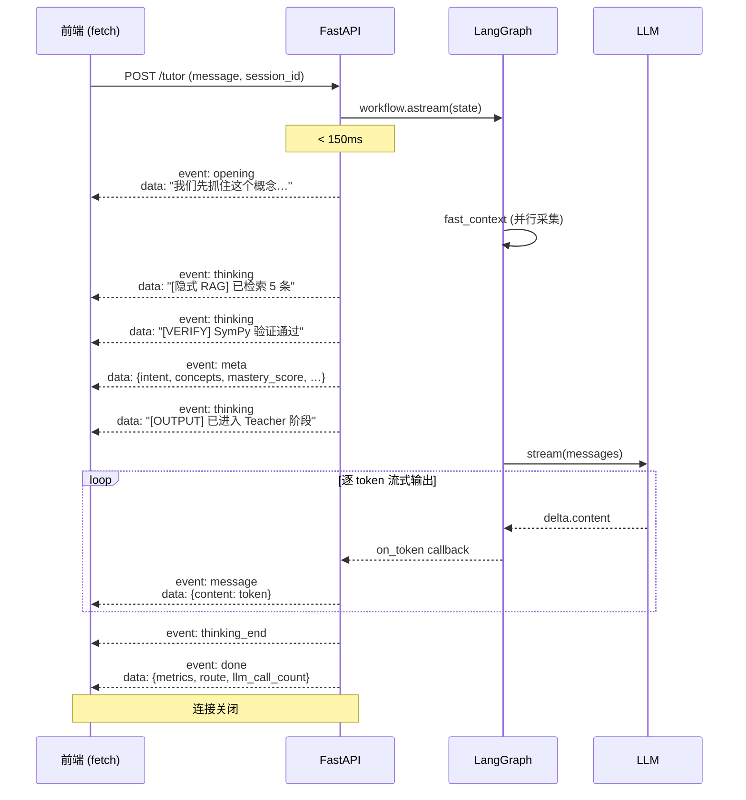

# 珞珈数智助教 · Agent 技术栈解析文档

> 本文档系统阐述「珞珈数智助教」Agent 系统及配套轮播前端实现中使用的所有核心技术、工具和方法论，适用于技术面试时全面阐述项目细节与技术能力。

---

## 目录

1. [系统架构总览](#1-系统架构总览)
2. [后端核心：Python + FastAPI](#2-后端核心python--fastapi)
3. [智能体编排：LangGraph 状态图](#3-智能体编排langgraph-状态图)
4. [确定性验证：SymPy 符号计算引擎](#4-确定性验证sympy-符号计算引擎)
5. [学生建模：BKT 贝叶斯知识追踪](#5-学生建模bkt-贝叶斯知识追踪)
6. [LLM 适配层：OpenAI-Compatible 多模型客户端](#6-llm-适配层openai-compatible-多模型客户端)
7. [状态持久化：SQLite 异步仓储](#7-状态持久化sqlite-异步仓储)
8. [流式输出：SSE Server-Sent Events](#8-流式输出sse-server-sent-events)
9. [知识检索：BM25 + 向量混合搜索](#9-知识检索bm25--向量混合搜索)
10. [前端技术栈：Next.js + React + TypeScript](#10-前端技术栈nextjs--react--typescript)
11. [前端数学渲染：KaTeX](#11-前端数学渲染katex)
12. [性能优化：FastContext 并行采集与延迟预算](#12-性能优化fastcontext-并行采集与延迟预算)
13. [轮播前端实现：HTML/CSS/JS 技术解析](#13-轮播前端实现htmlcssjs-技术解析)
14. [技术难点与解决方案汇总](#14-技术难点与解决方案汇总)
15. [面试高频问答（技术深度自检）](#15-面试高频问答技术深度自检)

---

## 1. 系统架构总览

### 1.1 整体架构

项目采用 **前后端分离 + 多智能体编排** 架构：

```
┌─────────────────────────────────────────────────────────────┐
│                     前端 (Next.js 14)                        │
│    React 18 · TypeScript · Tailwind CSS · KaTeX · SSE       │
└──────────────────────────┬──────────────────────────────────┘
                           │ HTTP / SSE
┌──────────────────────────┴──────────────────────────────────┐
│                   后端 API (FastAPI)                         │
│              uvicorn · Pydantic · asyncio                    │
├─────────────────────────────────────────────────────────────┤
│              LangGraph 状态图编排引擎                         │
│  ┌──────────┐  ┌──────────┐  ┌──────────┐  ┌──────────┐    │
│  │  Router  │→ │ Teacher  │  │ Verifier │  │ Examiner │    │
│  │(FastPath)│  │  Agent   │  │  Agent   │  │  Agent   │    │
│  └──────────┘  └──────────┘  └────┬─────┘  └──────────┘    │
│                                   │                          │
│              ┌────────────────────┼──────────┐              │
│              │   SymPy 沙盒   │  BKT 引擎  │  SQLite    │   │
│              │  (符号验证)     │ (掌握度)   │  (持久化)  │   │
│              └─────────────────────────────────────────────  │
├─────────────────────────────────────────────────────────────┤
│             LLM 适配层 (httpx async)                         │
│   DeepSeek · Qwen · GLM · Moonshot · OpenAI-compatible      │
└─────────────────────────────────────────────────────────────┘
```

#### Mermaid 架构流程图



### 1.2 技术栈全景

| 层级 | 技术 | 版本 | 用途 |
|:---|:---|:---|:---|
| **后端语言** | Python | 3.10+ | 异步编程、类型标注 |
| **Web 框架** | FastAPI | 0.100+ | 高性能异步 API |
| **ASGI 服务器** | uvicorn | - | 异步事件循环 |
| **数据校验** | Pydantic | - | 请求/响应模型校验 |
| **智能体编排** | LangGraph | 1.2+ | 状态图、条件路由 |
| **LangChain 基础** | langchain-core | 1.4+ | Runnable 接口 |
| **符号计算** | SymPy | - | 数学表达式等价验证 |
| **HTTP 客户端** | httpx | - | 异步 LLM API 调用 |
| **数据库** | SQLite | 内置 | 会话/消息/掌握度持久化 |
| **前端框架** | Next.js | 14.2+ | SSR/CSR、路由 |
| **UI 库** | React | 18.2+ | 组件化 UI |
| **类型系统** | TypeScript | 5.4+ | 类型安全 |
| **CSS 方案** | Tailwind CSS | 3.4+ | 原子化 CSS |
| **数学渲染** | KaTeX | 0.16+ | LaTeX 公式渲染 |
| **动画** | Framer Motion | 12+ | 声明式动画 |
| **图表** | Recharts | 3.8+ | 数据可视化 |
| **流程图** | @xyflow/react | 12+ | 可视化架构图 |
| **测试** | pytest / Node --test | - | 后端/前端测试 |

---

## 2. 后端核心：Python + FastAPI

### 2.1 为什么选择 FastAPI

**应用场景**：FastAPI 作为后端 API 网关，负责接收前端请求、编排智能体工作流、返回 SSE 流式响应。

**选择原因**：
- **原生 async/await 支持**：智能体工作流中存在大量 I/O 密集操作（LLM 调用、数据库读写、SymPy 计算），asyncio 事件循环可高效并发
- **自动类型校验**：Pydantic 模型确保请求参数类型安全，减少运行时错误
- **高性能**：基于 Starlette + uvicorn，性能接近 Go/Node.js

### 2.2 关键实现

**文件**：`apps/api/app/main.py`

```python
from fastapi import FastAPI
from contextlib import asynccontextmanager

@asynccontextmanager
async def lifespan(app: FastAPI):
    # 启动时初始化 Repository、Workflow
    settings = get_settings()
    repository = Repository(settings)
    app.state.workflow = TutorWorkflow(settings, repository)
    yield
    # 关闭时清理资源

app = FastAPI(lifespan=lifespan)
```

**面试要点**：
- `lifespan` 替代已弃用的 `@app.on_event("startup")`，确保资源生命周期管理
- Repository 和 TutorWorkflow 在启动时初始化一次，避免每请求重建

---

## 3. 智能体编排：LangGraph 状态图

### 3.1 核心概念

**LangGraph** 是 LangChain 团队推出的智能体编排框架，核心能力是构建**有状态的、条件路由的有向图**。

在本项目中，LangGraph 负责编排以下智能体节点：

| 节点 | 职责 | LLM 调用 |
|:---|:---|:---|
| `fast_context` | 并行采集上下文（历史/BKT/BM25/SymPy） | 0 次 |
| `policy_fallback` | 低置信度时的策略回退 | 1 次 |
| `verifier` | 复杂证明的 LLM 验证 | 1 次 |
| `teacher` | 启发式教学引导，流式输出 | 1 次 |
| `examiner` | 出题/测验生成 | 1 次 |
| `proof_tutor` | 证明结构辅导 | 1 次 |

### 3.2 状态定义

**文件**：`apps/api/app/tutor/graph.py`

```python
class AgentState(TypedDict, total=False):
    # 用户输入
    message: str
    session_id: str
    user_id: str
    # 路由决策
    intent: Intent
    pedagogical_action: str
    verification_mode: str
    confidence: float
    requires_policy_fallback: bool
    # 上下文采集结果
    verifier_result: VerifyResult
    mistake: Any | None
    concepts: list[str]
    mastery_score: float
    hint_level: int
    # 输出
    messages: list[dict[str, str]]
    final_output: str
    metrics: dict[str, float | int | str | bool]
```

**设计要点**：
- 使用 `TypedDict` + `total=False` 定义可变状态，允许节点只更新自己负责的字段
- 状态在图中流经各节点时逐步丰富，无需显式传参

### 3.3 条件路由

```python
def route_after_context(state: AgentState) -> str:
    if state.get("requires_policy_fallback"):
        return "policy_fallback"
    if state.get("intent") == Intent.PROOF_HINT:
        return "proof_tutor"
    if state.get("pedagogical_action") == "generate_exercise":
        return "examiner"
    if _needs_llm_verifier(state):
        return "verifier"
    return "teacher"  # 默认路径：仅 1 次 LLM 调用
```

```python
def build_tutor_graph(self) -> CompiledGraph:
    workflow = StateGraph(AgentState)
    workflow.add_node("fast_context", self.fast_context_node)
    workflow.add_node("policy_fallback", self.policy_fallback_node)
    workflow.add_node("verifier", self.verifier_node)
    workflow.add_node("teacher", self.teacher_node)
    workflow.add_node("examiner", self.examiner_node)
    workflow.add_node("proof_tutor", self.proof_tutor_node)

    workflow.add_edge(START, "fast_context")
    workflow.add_conditional_edges("fast_context", route_after_context, {
        "policy_fallback": "policy_fallback",
        "verifier": "verifier",
        "teacher": "teacher",
        "examiner": "examiner",
        "proof_tutor": "proof_tutor",
    })
    workflow.add_edge("verifier", "teacher")  # 验证后进入教学
    workflow.add_edge("teacher", END)
    workflow.add_edge("examiner", END)
    workflow.add_edge("proof_tutor", END)
    return workflow.compile(checkpointer=MemorySaver())
```

**面试要点**：
- **条件边（conditional_edges）** 是 LangGraph 的核心能力——根据当前状态动态决定下一个执行节点，而非固定串行
- `MemorySaver` 内置检查点机制，支持中断恢复和状态回溯
- **延迟控制**：普通请求走 `teacher` 路径仅 1 次 LLM 调用；高风险验证走 `verifier → teacher` 路径 ≤ 2 次

#### LangGraph 状态机流转图



#### 请求处理全链路时序

```mermaid
sequenceDiagram
    participant C as 前端
    participant A as FastAPI
    participant G as LangGraph
    participant T as 工具层
    participant L as LLM

    C->>A: POST /tutor (message, session_id)
    A->>G: workflow.astream(state, config)

    rect rgb(20, 20, 40)
        Note over G,T: Phase 1: fast_context ≤350ms
        G->>T: asyncio.wait({BM25, SymPy, SQLite, BKT})
        T-->>G: 并行返回结果（超时自动取消）
    end

    rect rgb(20, 40, 20)
        Note over G,L: Phase 2: 条件路由
        G->>G: route_after_context(state)
        alt 默认路径
            G->>L: Teacher 流式生成 (1×LLM)
        else 高风险验证
            G->>L: Verifier 验证 (1×LLM)
            L-->>G: 验证结果
            G->>L: Teacher 流式生成 (1×LLM)
        end
    end

    rect rgb(40, 20, 20)
        Note over C,A: Phase 3: SSE 流式输出
        A-->>C: event: opening
        A-->>C: event: thinking (meta)
        loop 逐 token
            A-->>C: event: message
        end
        A-->>C: event: done
    end
```



### 3.4 Fast Path 本地路由

**文件**：`apps/api/app/tutor/fast_path.py`

在进入 LangGraph 图之前，系统先用本地规则做快速路由判断，避免不必要的 LLM 调用：

```python
def route_fast_path(message: str, mode: str, subject: str) -> FastRoute:
    intent = route_intent(message, mode)       # 本地意图识别
    detected_subject = detect_subject(message)  # 关键词匹配学科

    if any(marker in message for marker in _PROOF_MARKERS):
        verification_mode = VerificationMode.LLM      # 证明题需 LLM 验证
    elif intent is Intent.CHECK_STUDENT_STEP and any(...):
        verification_mode = VerificationMode.SYMBOLIC  # 符号验证
    else:
        verification_mode = VerificationMode.NONE

    confidence = 0.55 if len(stripped) < 3 else 0.9
    return FastRoute(intent=..., verification_mode=..., confidence=confidence,
                     requires_policy_fallback=confidence < 0.7)
```

---

## 4. 确定性验证：SymPy 符号计算引擎

### 4.1 为什么需要符号验证

大模型在数学推导中存在**概率性幻觉**——中间一步算错，后续全部崩溃。SymPy 作为 Python 符号数学库，提供**确定性**的表达式等价校验，从根源上消除幻觉风险。

### 4.2 核心实现

**文件**：`apps/api/app/math_tools/verifier.py`

```python
import sympy as sp
from sympy.parsing.sympy_parser import (
    convert_xor, implicit_multiplication_application,
    parse_expr, standard_transformations,
)

TRANSFORMS = standard_transformations + (
    implicit_multiplication_application, convert_xor
)

def verify_equivalent(lhs: str, rhs: str) -> VerifyResult:
    """验证两个数学表达式是否等价"""
    lhs_expr = parse_math(lhs)    # 字符串 → SymPy 表达式
    rhs_expr = parse_math(rhs)
    diff = sp.simplify(lhs_expr - rhs_expr)  # 化简差值
    ok = diff == 0                            # 差为 0 即等价
    return VerifyResult(verified=True, is_correct=bool(ok), ...)
```

#### SymPy 验证管线流程图

```mermaid
flowchart LR
    Input["学生输入<br/>LaTeX 字符串"]
    Norm["normalize_math<br/>LaTeX 归一化"]
    Parse["parse_expr<br/>转为 SymPy Expr 对象"]
    Simplify["simplify lhs - rhs<br/>符号化简"]
    Check{"diff 等于 0?"}
    OK["VerifyResult<br/>verified=True<br/>is_correct=True"]
    Fail["VerifyResult<br/>verified=True<br/>is_correct=False"]
    Error["VerifyResult<br/>verified=False<br/>解析失败"]

    Input --> Norm
    Norm --> Parse
    Parse -->|成功| Simplify
    Parse -->|异常| Error
    Simplify --> Check
    Check -->|是| OK
    Check -->|否| Fail

    style Input fill:rgba(0,212,255,0.1),stroke:#00d4ff
    style OK fill:rgba(34,197,94,0.1),stroke:#22c55e
    style Fail fill:rgba(239,68,68,0.1),stroke:#ef4444
    style Error fill:rgba(251,191,36,0.1),stroke:#fbbf24
```

### 4.3 已实现的验证器

| 验证器 | 函数 | 原理 |
|:---|:---|:---|
| 表达式等价 | `verify_equivalent` | `simplify(lhs - rhs) == 0` |
| 求导验证 | `verify_derivative` | `simplify(diff(expr) - expected) == 0` |
| 积分验证 | `verify_integral` | 对候选结果求导，与被积函数比较 |
| 矩阵乘法 | `compute_matrix_product` | `sp.Matrix(left) * sp.Matrix(right)` |
| 行列式验证 | `verify_determinant_2x2` | `ad - bc` 与候选值比较 |
| 洛必达条件 | `verify_lhopital_conditions` | 检查 0/0 或 ∞/∞ 未定式 |

### 4.4 LaTeX 归一化

学生输入可能包含 LaTeX 语法（`\frac`, `\sqrt`, `\cdot` 等），需要先归一化为 SymPy 可解析的格式：

```python
def normalize_math(text: str) -> str:
    text = text.replace("$", "").replace("\\left", "").replace("\\right", "")
    replacements = {
        "\\cdot": "*", "\\times": "*", "\\pi": "pi",
        "\\sin": "sin", "\\cos": "cos", "\\sqrt": "sqrt",
    }
    # 将 \frac{a}{b} 转为 ((a)/(b))
    text = re.sub(r"\\frac\{([^{}]+)\}\{([^{}]+)\}", r"((\1)/(\2))", text)
    # Unicode 上标转 ^ 语法
    superscript_map = {"¹": "^1", "²": "^2", "³": "^3", ...}
    return text
```

**面试要点**：
- SymPy 的 `simplify()` 是符号化简而非数值近似，结果**确定且可复现**
- `implicit_multiplication_application` 变换允许 `2x` 自动解析为 `2*x`
- `convert_xor` 变换将 `^` 解析为幂运算（而非异或），兼容学生常用写法

---

## 5. 学生建模：BKT 贝叶斯知识追踪

### 5.1 算法原理

**贝叶斯知识追踪 (Bayesian Knowledge Tracing, BKT)** 基于隐马尔可夫模型，通过四参数动态计算学生对某一知识点的掌握概率 P(L)：

$$P(L_{n+1}) = P(L_n) \cdot (1 - P(S)) + (1 - P(L_n)) \cdot P(G)$$

| 参数 | 含义 | 默认值 |
|:---|:---|:---|
| P(L₀) | 初始掌握率 | 0.5 |
| P(S) | 粗心失误率 | 0.10 |
| P(G) | 猜测猜中率 | 动态调整 |
| P(T) | 知识转移率 | 动态调整 |

### 5.2 自适应参数设计

**文件**：`apps/api/app/memory/mastery.py`

本项目的核心创新是 **P(G) 和 P(T) 的自适应设计**——根据提示依赖程度动态调整：

```python
if event.hint_level == 0:       # 独立解答
    base_p_g = 0.10; p_t = 0.15   # 低猜测率，高转移率
elif event.hint_level == 1:     # 少量提示
    base_p_g = 0.40; p_t = 0.05   # 中猜测率，低转移率
else:                           # 大量提示 (Hint Level ≥ 2)
    base_p_g = 0.80; p_t = 0.00   # 高猜测率，零转移率
```

**设计意图**：防止"被动喂饭"导致的分数虚高。如果学生靠大量提示才答对，系统认为其猜测概率极高（0.80），掌握度几乎不变。

### 5.3 后验更新公式

```python
if event.correct:
    # P(L|obs=correct) = P(L)(1-S) / [P(L)(1-S) + (1-L)G]
    numerator = p_l * (1 - p_s)
    denominator = numerator + (1 - p_l) * p_g
    p_l_obs = numerator / denominator
else:
    # P(L|obs=wrong) = P(L)S / [P(L)S + (1-L)(1-G)]
    numerator = p_l * p_s
    denominator = numerator + (1 - p_l) * (1 - p_g)
    p_l_obs = numerator / denominator

new_score = p_l_obs + (1 - p_l_obs) * p_t  # 加入知识转移
```

#### BKT 算法决策流程图

```mermaid
flowchart TD
    Event["LearningEvent<br/>correct / hint_level / difficulty"]
    CheckHint{"hint_level?"}

    H0["P(G)=0.10, P(T)=0.15<br/>独立解答"]
    H1["P(G)=0.40, P(T)=0.05<br/>少量提示"]
    H2["P(G)=0.80, P(T)=0.00<br/>大量提示 — 防虚高"]

    Diff["difficulty_factor<br/>= difficulty ÷ 3.0"]
    AdjG["P(G) = min 0.95<br/>base_P(G) ÷ difficulty_factor"]

    CheckCorrect{"event.correct?"}

    Correct["P(L｜正确) = P(L)(1-S) ÷<br/>P(L)(1-S) + (1-L)G"]
    Wrong["P(L｜错误) = P(L)S ÷<br/>P(L)S + (1-L)(1-G)"]

    Transfer["new_P(L) = P(L｜obs)<br/>+ (1 - P(L｜obs)) × P(T)"]
    Result["MasteryUpdate<br/>old_score / new_score / delta / reason"]

    Event --> CheckHint
    CheckHint -->|0| H0
    CheckHint -->|1| H1
    CheckHint -->|≥2| H2
    H0 --> Diff
    H1 --> Diff
    H2 --> Diff
    Diff --> AdjG
    AdjG --> CheckCorrect
    CheckCorrect -->|正确| Correct
    CheckCorrect -->|错误| Wrong
    Correct --> Transfer
    Wrong --> Transfer
    Transfer --> Result

    style H2 fill:rgba(239,68,68,0.1),stroke:#ef4444
    style H0 fill:rgba(34,197,94,0.1),stroke:#22c55e
    style Result fill:rgba(0,212,255,0.1),stroke:#00d4ff
```

**面试要点**：
- BKT 摒弃了简单粗暴的 `正确数/总数` 算分方式
- 四参数模型中 P(G) 和 P(T) 的动态调整是本项目的**核心创新点**
- 难度因子 `difficulty_factor` 会调节 P(G)：难题猜测率更低，更可信

---

## 6. LLM 适配层：OpenAI-Compatible 多模型客户端

### 6.1 设计目标

支持多个 LLM 提供商（DeepSeek、Qwen/通义千问、GLM/智谱、Moonshot/月之暗面等），统一接口，按需切换。

**文件**：`apps/api/app/llm/openai_compatible.py`

### 6.2 异步流式调用

```python
class OpenAICompatibleClient:
    _http_client: httpx.AsyncClient | None = None  # 类级共享连接池

    @classmethod
    def get_http_client(cls) -> httpx.AsyncClient:
        if cls._http_client is None or cls._http_client.is_closed:
            cls._http_client = httpx.AsyncClient(timeout=60.0)
        return cls._http_client

    async def stream(self, messages, api_key=None, model=None) -> AsyncIterator[str]:
        url = f"{base_url}/chat/completions"
        payload = {"model": resolved_model, "messages": messages,
                   "stream": True, "temperature": 0.3}
        async with client.stream("POST", url, json=payload, headers=headers) as response:
            async for line in response.aiter_lines():
                if line.startswith("data: "):
                    chunk = json.loads(line.removeprefix("data: "))
                    delta = chunk["choices"][0].get("delta", {})
                    if delta.get("reasoning_content"):
                        yield {"type": "reasoning", "content": delta["reasoning_content"]}
                    if delta.get("content"):
                        yield {"type": "content", "content": delta["content"]}
```

### 6.3 关键设计

| 设计点 | 实现 | 原因 |
|:---|:---|:---|
| **连接池复用** | `_http_client` 类级单例 | 避免每请求创建新 TCP 连接 |
| **reasoning 过滤** | 过滤 `reasoning_content` | 不向学生暴露模型内部思考链 |
| **本地 fallback** | `_fallback_stream()` | 无 API Key 时仍可演示核心功能 |
| **多提供商** | `resolve_base_url(model)` | 运行时动态解析 API 端点 |
| **用户自有 Key** | `allow_user_api_key` | 用户可携带自己的 API Key |

**面试要点**：
- httpx 的 `AsyncClient` 基于 asyncio，与 FastAPI 事件循环无缝集成
- 流式 SSE 解析中 `aiter_lines()` 逐行读取，避免缓冲区积压
- `reasoning_content` 过滤是教学场景的关键——学生不应看到模型"偷想答案"的过程

---

## 7. 状态持久化：SQLite 异步仓储

### 7.1 为什么用 SQLite

- **零配置**：无需独立数据库服务，适合教育场景的轻量部署
- **文件级事务**：ACID 保证，单文件便于备份迁移
- **性能足够**：读多写少的会话场景下性能优异

### 7.2 异步访问模式

**文件**：`apps/api/app/memory/repository.py`

SQLite 的同步 I/O 会阻塞 asyncio 事件循环，项目中使用 `asyncio.to_thread` 将数据库操作移至线程池：

```python
class Repository:
    def connect(self) -> sqlite3.Connection:
        conn = sqlite3.connect(self.db_path)
        conn.row_factory = sqlite3.Row  # 行以字典方式访问
        return conn
```

在 `FastContextCollector` 中：

```python
history, document_id, previous_concepts = await asyncio.to_thread(
    self._prepare_session,
    state["user_id"], state["session_id"], state["message"],
)
```

### 7.3 数据模型

```sql
CREATE TABLE users (id TEXT PRIMARY KEY, display_name TEXT, created_at TEXT);
CREATE TABLE sessions (id TEXT PRIMARY KEY, user_id TEXT, title TEXT, subject TEXT, ...);
CREATE TABLE messages (id TEXT PRIMARY KEY, session_id TEXT, role TEXT, content TEXT, intent TEXT, ...);
CREATE TABLE attempts (id TEXT PRIMARY KEY, session_id TEXT, user_id TEXT, ...);
```

**面试要点**：
- `asyncio.to_thread` 是 Python 3.9+ 的标准方案，比 `run_in_executor` 更简洁
- `row_factory = sqlite3.Row` 让查询结果可通过列名访问，比元组更安全
- 后续可平滑迁移至 PostgreSQL，只需替换连接层

---

## 8. 流式输出：SSE Server-Sent Events

### 8.1 SSE 协议

SSE 是 HTTP 长连接单向流式协议，服务端持续推送事件。相比 WebSocket 更轻量，适合 LLM 流式输出场景。

### 8.2 事件序列设计

```python
def sse(event: str, data: dict) -> str:
    return f"event: {event}\ndata: {json.dumps(data, ensure_ascii=False)}\n\n"
```

系统定义了完整的事件序列：

| 事件 | 时机 | 内容 |
|:---|:---|:---|
| `opening` | 请求开始 | 快速开场白（目标 < 150ms） |
| `thinking` | 上下文采集中 | `[PLAN]` `[隐式 RAG]` `[VERIFY]` `[OUTPUT]` 摘要 |
| `meta` | 路由决策后 | 意图、学科、概念、验证结果、掌握度 |
| `message` | 流式生成中 | 逐 token 的回答内容 |
| `thinking_end` | 思考结束 | - |
| `done` | 完成 | 最终指标 |

### 8.3 前端消费

前端使用 `fetch` + `ReadableStream` 消费 SSE 流，而非 `EventSource`（后者不支持自定义 Header 携带 API Key）。

#### SSE 事件流时序图



**面试要点**：
- SSE 相比 WebSocket 的优势：基于标准 HTTP，无需升级协议，穿透代理更可靠
- `thinking` 事件只发送四类公开摘要，**不发送模型原始 reasoning_content**，防止答案泄露
- 首个 `message` token 到达后，前端从"思考中"切换为流式回答

---

## 9. 知识检索：BM25 + 向量混合搜索

### 9.1 混合检索策略

**文件**：`apps/api/app/knowledge/search.py`

系统采用 **本地 BM25 + 语义向量** 的混合检索：

- **BM25**：基于词频的本地全文检索，零延迟，适合精确概念匹配
- **语义向量**：调用 LLM Embedding API 进行语义相似度搜索，覆盖同义/近义表达
- **融合策略**：本地 BM25 先行（350ms 截止），语义搜索作为后台异步任务预热缓存

### 9.2 学科自动检测

```python
SUBJECT_HINTS = {
    "calculus": ["高数", "微积分", "导数", "积分", "极限", "洛必达"],
    "linear_algebra": ["线代", "矩阵", "行列式", "特征值", "秩"],
    "probability": ["概率", "随机", "分布", "期望", "方差", "互斥"],
}

def detect_subject(query: str) -> str | None:
    for subject, hints in SUBJECT_HINTS.items():
        if any(hint in query for hint in hints):
            return subject
    return None
```

---

## 10. 前端技术栈：Next.js + React + TypeScript

### 10.1 技术选型

**文件**：`apps/web/package.json`

| 技术 | 版本 | 用途 |
|:---|:---|:---|
| Next.js | 14.2+ | App Router、SSR/CSR |
| React | 18.2+ | 组件化 UI、Hooks |
| TypeScript | 5.4+ | 类型安全 |
| Tailwind CSS | 3.4+ | 原子化 CSS |
| KaTeX | 0.16+ | LaTeX 公式渲染 |
| Framer Motion | 12+ | 声明式动画 |
| Recharts | 3.8+ | 数据可视化图表 |
| @xyflow/react | 12+ | 可拖拽流程图 |
| lucide-react | 1.16+ | 图标库 |

### 10.2 关键设计

- **SSE 消费**：使用 `fetch` + `ReadableStream` 替代 `EventSource`，支持自定义 Header
- **数学渲染**：KaTeX 在前端实时渲染 LaTeX，与后端 SymPy 形成闭环
- **架构可视化**：`@xyflow/react` 渲染可交互的双轨智能体架构图
- **掌握度图表**：Recharts 展示 BKT 掌握度变化趋势

---

## 11. 前端数学渲染：KaTeX

KaTeX 是一个快速的 Web 数学排版库，用于在浏览器中渲染 LaTeX 公式。

```typescript
// 前端渲染数学公式
import katex from 'katex';

const renderMath = (latex: string) => {
  return katex.renderToString(latex, {
    throwOnError: false,
    displayMode: true,
  });
};
```

**面试要点**：
- KaTeX 相比 MathJax 的优势：同步渲染、性能更高、CSS 隔离
- 后端 SymPy 验证 + 前端 KaTeX 渲染，形成"验证→展示"的数学闭环

---

## 12. 性能优化：FastContext 并行采集与延迟预算

### 12.1 并行上下文采集

**文件**：`apps/api/app/tutor/fast_context.py`

```python
class FastContextCollector:
    def __init__(self, repository, timeout_seconds=0.35):
        self.timeout_seconds = timeout_seconds  # 350ms 截止

    async def collect(self, state) -> FastContext:
        tasks = {
            asyncio.create_task(self._collect_local_hits(state)): "hits",
            asyncio.create_task(self._collect_document_chunks(...)): "document_chunks",
            asyncio.create_task(self._collect_symbolic_result(state)): "symbolic",
        }
        done, pending = await asyncio.wait(tasks, timeout=self.timeout_seconds)
        # 超时任务自动取消，部分结果仍可用
```

#### FastContext 并行采集与超时控制流程图

```mermaid
flowchart TD
    Start(["collect state 调用"])
    Prep["_prepare_session<br/>线程池: ensure_user / list_messages / add_message<br/>提取 previous_concepts"]
    Spawn["asyncio.create_task × 3<br/>注册到任务字典"]

    subgraph Parallel ["并行采集 timeout 350ms"]
        direction LR
        T1["_collect_local_hits<br/>BM25 + 向量检索<br/>返回 EvidencePack"]
        T2["_collect_document_chunks<br/>文档分片检索<br/>返回文档分片列表"]
        T3["_collect_symbolic_result<br/>SymPy check_step<br/>返回 VerifyResult + Mistake"]
    end

    Wait{"asyncio.wait<br/>timeout 0.35s"}
    Done["done 集合<br/>提取 result + duration"]
    Pending["pending 集合<br/>task.cancel + gather 回收"]

    Derive["_derive_concepts<br/>显式概念 ∪ 命中概念 ∪ 错误概念"]
    Final["_finalize_learning_state<br/>线程池: BKT 更新 + 掌握度持久化"]
    Metrics["组装 metrics<br/>fast_context_ms / local_rag_ms /<br/>symbolic_verify_ms / context_timed_out"]
    Out(["FastContext 返回"])

    Start --> Prep
    Prep --> Spawn
    Spawn --> Parallel
    Parallel --> Wait
    Wait -->|已完成| Done
    Wait -->|超时未完成| Pending
    Done --> Derive
    Pending --> Derive
    Derive --> Final
    Final --> Metrics
    Metrics --> Out

    style Start fill:rgba(0,212,255,0.1),stroke:#00d4ff
    style Out fill:rgba(34,197,94,0.1),stroke:#22c55e
    style Pending fill:rgba(239,68,68,0.1),stroke:#ef4444
    style Wait fill:rgba(251,191,36,0.1),stroke:#fbbf24
```

**关键设计解析**：

- **三路并行**：本地知识检索、文档分片、符号验证三者无依赖关系，通过 `asyncio.create_task` 同时发起，理论上三路总耗时等于最慢一路而非三者之和
- **超时硬截止**：`asyncio.wait(timeout=0.35)` 保证 `fast_context` 阶段不超过 350ms，即使某路任务卡死也不拖累整体延迟预算
- **优雅降级**：超时的 `pending` 任务被 `cancel()` 后通过 `gather(return_exceptions=True)` 静默回收，未完成的采集结果以默认值（空列表 / `verified=False`）兜底，**不抛异常**
- **线程池隔离**：SQLite 同步 I/O（`_prepare_session`、`_finalize_learning_state`）和 SymPy CPU 计算（`check_step`）均通过 `asyncio.to_thread` 移出事件循环，避免阻塞其他并发请求
- **可观测性**：每路任务记录独立 `duration_ms`，最终汇入 `metrics` 供 SSE `done` 事件回传，便于前端展示与线上排查

### 12.2 延迟预算体系

| 阶段 | 预算 | 说明 |
|:---|:---|:---|
| `opening_ms` | < 150ms | 本地快速开场 |
| `fast_context_ms` | 350ms | 并行采集上下文截止时间 |
| 普通请求 | LLM × 1 | 仅 Teacher 流式生成 |
| 高风险验证 | LLM × 2 | Verifier + Teacher |

### 12.3 其他优化

- **语义缓存**：`_semantic_cache` 字典缓存后台语义搜索结果，LRU 淘汰（128 条）
- **后台预热**：`schedule_semantic_enrichment` 异步预加载下一轮可能用到的知识
- **客户端取消**：SSE 连接断开时，未完成的图任务同步取消，避免资源浪费
- **可见性感知**：`visibilitychange` 事件触发暂停/恢复

---

## 13. 轮播前端实现：HTML/CSS/JS 技术解析

> 此节解析配套的 `slideshow.html` 轮播应用的技术实现，该轮播以 Agent 技术栈为主题内容。

### 13.1 HTML 结构设计

采用 **语义化 HTML5** 标签构建：

```html
<main class="carousel" role="region" aria-label="Agent技术栈轮播" aria-roledescription="carousel">
  <div class="carousel-track" id="track" aria-live="polite"></div>
  <!-- 导航按钮 -->
  <button class="nav-btn prev" aria-label="上一张" type="button">‹</button>
  <button class="nav-btn next" aria-label="下一张" type="button">›</button>
  <!-- 进度条 -->
  <div class="progress-track"><div class="progress-fill"></div></div>
</main>
```

**设计要点**：
- `role="region"` + `aria-roledescription="carousel"` 告知辅助技术这是轮播区域
- `aria-live="polite"` 让屏幕阅读器在内容变化时温和播报
- 所有按钮包含 `aria-label` 和 `type="button"` 确保可访问性

### 13.2 CSS 核心技术

#### 13.2.1 CSS 变量系统

```css
:root {
  --bg: #0a0a14;
  --accent: #00d4ff;
  --accent-2: #7850ff;
  --slide-trans: 600ms cubic-bezier(0.25,0.46,0.45,0.94);
  --overlay-grad: linear-gradient(180deg, transparent 20%, rgba(0,0,0,0.92) 100%);
}
```

CSS 变量实现**主题统一管理**，修改一处即可全局生效。

#### 13.2.2 Flexbox 轨道布局

```css
.carousel-track {
  display: flex;
  width: 100%; height: 100%;
  transition: transform var(--slide-trans);
  will-change: transform;  /* GPU 加速 */
}
.slide {
  flex: 0 0 100%;  /* 每张幻灯片占 100% 宽度 */
}
```

**原理**：所有幻灯片水平排列在 flex 容器中，通过 `translateX(-${index * 100}%)` 移动轨道实现切换。

#### 13.2.3 Ken Burns 效果

```css
.slide-bg {
  transform: scale(1.0);
  transition: transform 8s ease-out;
}
.slide.active .slide-bg {
  transform: scale(1.1);  /* 激活时缓慢放大 10% */
}
```

**原理**：激活幻灯片的背景图在 8 秒内缓慢放大 10%，营造电影感动态效果。

#### 13.2.4 Glassmorphism 毛玻璃效果

```css
.nav-btn {
  background: rgba(0,0,0,0.45);
  backdrop-filter: blur(8px);
  -webkit-backdrop-filter: blur(8px);
}
```

`backdrop-filter: blur()` 实现毛玻璃质感，`-webkit-` 前缀兼容 Safari。

#### 13.2.5 响应式断点

```css
@media (max-width: 768px) {
  .nav-btn { width: 38px; height: 38px; }
  .code-block { font-size: 0.68rem; }
  .metric-grid { grid-template-columns: repeat(2, 1fr); }
}
@media (max-width: 480px) {
  .code-block { display: none; }  /* 超小屏隐藏代码块 */
  .formula-box { display: none; }
}
```

**策略**：768px 适配平板，480px 适配手机，超小屏隐藏复杂技术内容保留核心文字。

#### 13.2.6 Reduced Motion 支持

```css
@media (prefers-reduced-motion: reduce) {
  .carousel-track { transition: none; }
  .slide-bg { transition: none; transform: none !important; }
}
```

尊重用户系统级"减少动画"偏好，提升可访问性。

### 13.3 JavaScript 交互逻辑

#### 13.3.1 类封装设计

```javascript
class AgentCarousel {
  constructor(data, config = {}) {
    this.data = data;
    this.total = data.length;
    this.current = 0;
    this.isPlaying = false;
    this.interval = config.interval || 6000;
    // ...
  }
}
```

使用 ES6 Class 封装所有状态和行为，避免全局变量污染。

#### 13.3.2 循环索引

```javascript
goTo(index) {
  index = ((index % this.total) + this.total) % this.total;
  // 负数取模修正：-1 % 5 = -1 → ((-1) + 5) % 5 = 4
  this.track.style.transform = `translateX(-${index * 100}%)`;
}
```

**技术细节**：JavaScript 的 `%` 运算符对负数返回负值（`-1 % 5 = -1`），通过 `((x % n) + n) % n` 修正为正索引。

#### 13.3.3 进度条管理

```javascript
startProgress() {
  this.progressVal = 0;
  this.progressTimer = setInterval(() => {
    this.progressVal += (this.progressRate / this.interval) * 100;
    this.progressFill.style.width = `${this.progressVal}%`;
    if (this.progressVal >= 100) this.next();  // 自动切换
  }, this.progressRate);  // 每 50ms 更新
}
```

**原理**：`setInterval` 每 50ms 递增进度值，到达 100% 时触发 `next()`。相比 `setTimeout` 单次定时，进度条提供视觉反馈。

#### 13.3.4 事件委托

```javascript
// 指示器使用事件委托，无需为每个 dot 单独绑定
this.indicators.addEventListener('click', (e) => {
  const dot = e.target.closest('.dot');
  if (!dot) return;
  this.goTo(parseInt(dot.dataset.index, 10));
});
```

**优势**：即使动态增删幻灯片也无需重新绑定事件。

#### 13.3.5 触摸手势

```javascript
this.carousel.addEventListener('touchstart', (e) => {
  this.touchStartX = e.changedTouches[0].screenX;
}, { passive: true });

this.carousel.addEventListener('touchend', (e) => {
  const diff = this.touchStartX - e.changedTouches[0].screenX;
  if (Math.abs(diff) > this.touchThreshold) {
    diff > 0 ? this.next() : this.prev();  // 左滑下一张，右滑上一张
  }
}, { passive: true });
```

**要点**：`passive: true` 告知浏览器不会调用 `preventDefault()`，允许触摸滚动立即响应。

#### 13.3.6 图片懒加载与预加载

```javascript
loadImage(i) {
  const img = this.slideEls[i].querySelector('.slide-bg');
  if (img.classList.contains('loaded')) return;  // 已加载跳过
  img.onload = () => img.classList.add('loaded');
  img.src = img.dataset.src;  // data-src → src 触发加载
}

goTo(index) {
  this.loadImage(index);                              // 加载当前
  this.loadImage((index + 1) % this.total);           // 预加载下一张
  this.loadImage((index - 1 + this.total) % this.total); // 预加载上一张
}
```

**策略**：首屏加载前 2 张（`loading="eager"`），其余懒加载；切换时预加载相邻幻灯片，确保滑动无白屏。

#### 13.3.7 页面可见性优化

```javascript
document.addEventListener('visibilitychange', () => {
  if (document.hidden && this.isPlaying) this.stopProgress();
  else if (!document.hidden && this.isPlaying) this.startProgress();
});
```

**场景**：用户切换浏览器标签页时暂停自动播放，返回后恢复，避免不必要的计时器运行。

---

## 14. 技术难点与解决方案汇总

### 14.1 难点一：大模型数学幻觉

| 维度 | 问题 | 解决方案 |
|:---|:---|:---|
| 表现 | LLM 推导中间步骤算错，后续全错 | SymPy `simplify(lhs - rhs) == 0` 确定性校验 |
| 原理 | 自回归模型概率生成，无内在正确性保证 | 符号计算引擎提供数学等价性的确定性证明 |
| 效果 | 学生被错误推导误导 | 验证未通过的步骤会触发纠错引导 |

### 14.2 难点二：多智能体延迟控制

| 维度 | 问题 | 解决方案 |
|:---|:---|:---|
| 表现 | 串行调用多个 Agent 导致高延迟 | LangGraph 条件路由 + Fast Path 本地预判 |
| 原理 | 每轮请求都经过全部 Agent | 根据风险和置信度按需调度，普通请求仅 1 次 LLM |
| 效果 | 端到端延迟过高 | 普通请求 ≤ 1 次 LLM，高风险 ≤ 2 次 |

### 14.3 难点三：被动喂饭导致分数虚高

| 维度 | 问题 | 解决方案 |
|:---|:---|:---|
| 表现 | 学生靠大量提示答对，BKT 仍判为掌握 | P(G) 和 P(T) 自适应调整 |
| 原理 | 标准 BKT 的 P(G)/P(T) 为固定值 | Hint Level ≥ 2 时 P(G)=0.80, P(T)=0.00 |
| 效果 | 掌握度虚高，推荐进度不准 | "被动喂饭"答对几乎不提升掌握度 |

### 14.4 难点四：SSE 连接中断后的状态恢复

| 维度 | 问题 | 解决方案 |
|:---|:---|:---|
| 表现 | 用户刷新页面后会话状态丢失 | thinking 摘要 + 首个 token 耗时写入 SQLite |
| 原理 | SSE 是无状态长连接 | 持久化关键元数据，刷新后从数据库恢复 |
| 效果 | 刷新后无法展开思考过程 | 刷新/重进会话后仍可展开查看思考摘要 |

### 14.5 难点五：轮播触摸与点击事件冲突

| 维度 | 问题 | 解决方案 |
|:---|:---|:---|
| 表现 | 移动端触摸滑动误触发按钮点击 | `touchThreshold = 50px` 位移阈值 + `passive: true` |
| 原理 | touchstart → click 存在 300ms 延迟 | 仅当水平位移超过阈值才判定为滑动手势 |
| 效果 | 误触率高 | 滑动与点击互不干扰 |

### 14.6 难点六：SQLite 阻塞事件循环

| 维度 | 问题 | 解决方案 |
|:---|:---|:---|
| 表现 | SQLite 同步 I/O 阻塞 asyncio 事件循环 | `asyncio.to_thread()` 移至线程池 |
| 原理 | sqlite3 是同步库，直接调用会阻塞 | 在独立线程执行，返回 Future 等待结果 |
| 效果 | 高并发时 API 响应变慢 | 事件循环不被阻塞，可继续处理其他请求 |

---

## 15. 面试高频问答（技术深度自检）

> 本节按「考察点 → 参考答案要点」组织，覆盖架构权衡、数学正确性、学生建模、性能并发、工程实践五大维度，便于面试时主动引导话题深度。

### 15.1 架构与设计权衡

**Q1. 为什么用 LangGraph 编排，而不是直接写 `if/else` 串行调用，或用 LangChain 的 AgentExecutor？**

- **考察点**：智能体编排框架的选型动机与取舍
- **答案要点**：
  - 纯 `if/else` 串行无法表达「条件路由 + 状态累积 + 检查点恢复」，且状态在函数间手工传递易出错
  - LangChain `AgentExecutor` 是「工具调用循环」范式，适合让 LLM 自主决定调用哪个工具；而本项目的路由决策是**确定性的、基于本地规则的**（Fast Path），不需要 LLM 反复决策
  - LangGraph 的 `StateGraph` 提供：① `TypedDict` 状态在节点间自动流转；② `add_conditional_edges` 声明式条件路由；③ `MemorySaver` 检查点支持中断恢复
  - 核心收益：**普通请求只走 `fast_context → teacher` 一条路径，仅 1 次 LLM 调用**，把 LLM 调用次数从「编排框架决定」变成「风险驱动决定」

**Q2. 为什么要把「教学引导」和「解题验证」拆到不同 Agent，而不是一个 Agent 全包？**

- **考察点**：职责分离 / 单一职责在 Agent 设计中的应用
- **答案要点**：
  - **Prompt 污染风险**：一个 Prompt 同时承担「验证」和「教学」会让模型在「该直接给答案」还是「该启发」之间摇摆，输出风格不一致
  - **确定性边界**：验证职责尽量交给 SymPy（确定性），教学职责交给 LLM（生成性）；verifier 节点只在 SymPy 无法判定时才用 LLM 验证，把概率性压到最低
  - **可观测性**：分离后每段都有独立 metrics（`fast_context_ms` / `symbolic_verify_ms` / LLM 调用次数），便于定位延迟瓶颈
  - 这就是「双轨执行引擎」——启发式引导轨 + 确定性校验轨

**Q3. Fast Path 本地路由会不会误判？误判了怎么兜底？**

- **考察点**：本地规则路由的容错设计
- **答案要点**：
  - Fast Path 用关键词和长度启发式给 `confidence`（如输入 < 3 字符给 0.55，否则 0.9）
  - **兜底机制**：`confidence < 0.7` 时强制走 `policy_fallback` 节点，额外消耗 1 次 LLM 调用重新判定意图，再路由
  - 也就是说：宁可多花 1 次 LLM，也不让低置信度请求直接进入错误路径；这是「延迟」换「正确性」的有意识权衡

**Q4. 为什么用 SQLite，而不是 PostgreSQL 或 Redis？后续如何演进？**

- **考察点**：存储选型的场景匹配与演进路径
- **答案要点**：
  - 教育场景**读多写少**、单机部署优先，SQLite 零配置、单文件、ACID，备份即拷文件
  - 通过 `asyncio.to_thread` 把同步 sqlite3 移出事件循环，避免阻塞；`row_factory = sqlite3.Row` 让结果按列名访问
  - 演进路径：仓储层 `Repository` 已抽象数据访问，迁移 PostgreSQL 只需替换连接层与 SQL 方言；掌握度热数据可加 Redis 缓存层

### 15.2 数学正确性

**Q5. SymPy 的 `simplify(lhs - rhs) == 0` 一定能判定等价吗？有什么边界？**

- **考察点**：符号计算的局限性认知
- **答案要点**：
  - `simplify` 是启发式化简，**不存在能判定任意表达式等价的通用算法**（Richardson 定理）；对涉及绝对值、分段函数、超越方程的边界可能失效
  - 工程应对：`verify_equivalent` 返回 `VerifyResult(verified=False, ...)` 表示「无法确定性判定」，此时**降级**到 LLM verifier 节点做语义级验证
  - 也就是说 SymPy 不是「万能裁判」，而是「高置信度快通道」——能判则判，不能判交给 LLM 兜底

**Q6. 既然有 SymPy，为什么还需要 LLM verifier？**

- **考察点**：确定性工具与概率性工具的互补
- **答案要点**：
  - SymPy 处理的是**表达式等价**，但「证明题」需要验证的是**推理链**（每一步是否成立、是否充分），SymPy 无法判断「证明过程」对不对
  - `_needs_llm_verifier` 在「复杂证明 / 本地不确定」时触发 LLM verifier，验证结果注入 state 供 teacher 使用
  - 分层策略：表达式级 → SymPy（快、确定）；推理级 → LLM（慢、概率）；默认级 → 不验证（最快）

**Q7. LaTeX 归一化有哪些坑？**

- **考察点**：真实学生输入的鲁棒性处理
- **答案要点**：
  - 学生输入形态多样：`\frac{a}{b}`、`a/b`、`a÷b`、Unicode 上标 `x²`、`\cdot` / `\times` / `*` 混用
  - `normalize_math` 做：去 `$` / `\left` / `\right`；`\frac{a}{b}` → `((a)/(b))` 正则替换；Unicode 上标映射 `²→^2`
  - `parse_expr` 加 `implicit_multiplication_application`（`2x`→`2*x`）和 `convert_xor`（`^`→幂运算而非异或）
  - 任何解析失败都返回 `verified=False`，**绝不抛异常到上层**，保证主流程不被脏输入打断

### 15.3 学生建模

**Q8. BKT 的 P(G) 和 P(T) 为什么做成自适应的？固定值不行吗？**

- **考察点**：BKT 参数的教育学意义与创新点
- **答案要点**：
  - 标准 BKT 用固定 P(G)=0.25、P(T)=0.1，会**奖励「被动喂饭」**：学生靠大量提示答对，P(T) 仍把掌握度推高，导致虚高
  - 本项目按 `hint_level` 分档：独立解答 P(G)=0.10/P(T)=0.15（低猜测、高转移）；大量提示 P(G)=0.80/P(T)=0.00（高猜测、零转移）
  - 直觉：提示越多，答对越可能是「猜的」（P(G)↑），且这次答对**不构成学习证据**（P(T)=0）
  - 再用 `difficulty_factor` 调节 P(G)：难题猜测率更低，答对更可信

**Q9. 为什么不用 DKT（深度知识追踪）或 IRT？**

- **考察点**：模型选型对数据量与可解释性的权衡
- **答案要点**：
  - DKT 需要大量序列数据训练，冷启动阶段数据稀疏；且黑盒不可解释，老师无法理解为什么掌握度变了
  - IRT 是静态能力估计，不建模「学习过程」，无法反映单次作答后的掌握度变化
  - BKT 四参数：数据需求小、可冷启动、参数有明确教育含义、可解释，**最适合辅导场景的实时反馈**

### 15.4 性能与并发

**Q10. `asyncio.wait` 超时后，那些没完成的任务还在跑怎么办？会泄漏吗？**

- **考察点**：异步超时的资源回收
- **答案要点**：
  - `asyncio.wait` 超时后，未完成任务进入 `pending` 集合但**仍在事件循环中运行**
  - 必须显式 `task.cancel()`，再用 `await asyncio.gather(*pending, return_exceptions=True)` 等待 `CancelledError` 落地，否则任务会泄漏
  - `return_exceptions=True` 确保 `CancelledError` 不抛到外层；这是项目 `fast_context.py` 的标准回收模式
  - 即便被 cancel，已写库的副作用（如 `add_message`）不会回滚——所以**有副作用的操作放在 cancel 前的 `_prepare_session`**

**Q11. 为什么流式输出用 SSE 而不是 WebSocket？**

- **考察点**：单向流 vs 双向通道的选型
- **答案要点**：
  - 辅导场景是**单工**的：客户端发一次请求，服务端持续推 token，无需双向实时通信
  - SSE 基于标准 HTTP，天然支持断线自动重连、穿透企业代理更可靠；WebSocket 需协议升级，部分代理会截断
  - 唯一限制：`EventSource` 不支持自定义 Header，所以前端用 `fetch` + `ReadableStream` 手动解析 SSE 帧，以携带用户 API Key

**Q12. httpx 连接池为什么做成类级单例？**

- **考察点**：连接复用与并发模型
- **答案要点**：
  - 每请求新建 `AsyncClient` 会重建 TCP/TLS 握手，LLM 调用延迟叠加几百毫秒
  - 类级 `_http_client` 单例复用连接池，`is_closed` 检查防御意外关闭
  - `timeout=60.0` 兼顾长生成；与 FastAPI 事件循环共享，无需额外线程

### 15.5 工程实践

**Q13. 如何保证 LLM 流式输出的可靠性？中途出错怎么办？**

- **考察点**：流式输出的错误处理
- **答案要点**：
  - 流式解析逐行 `aiter_lines()`，只处理 `data: ` 前缀行，JSON 解析失败静默跳过，避免单帧损坏中断整流
  - 上游异常通过 SSE `done` 事件回传 `metrics`，前端据此展示降级提示
  - `reasoning_content` 被过滤，避免模型内部思考链泄漏给学生（教学场景的关键）

**Q14. 没有 LLM_API_KEY 时系统还能用吗？**

- **考察点**：可演示性与降级策略
- **答案要点**：
  - LLM 适配层有 `_fallback_stream()` 本地兜底，无 Key 时仍返回结构化回复，保证核心流程可演示
  - `ALLOW_USER_API_KEY` 允许用户自带 Key，SSE 请求头携带，服务端优先使用用户 Key
  - 这让产品在「无后端 Key」环境下也能跑通，降低部署门槛

**Q15. 项目的可观测性是怎么做的？**

- **考察点**：线上可观测性设计
- **答案要点**：
  - **指标层**：每个请求在 `done` 事件回传 `metrics`（`fast_context_ms` / `local_rag_ms` / `symbolic_verify_ms` / `context_timed_out` / `llm_call_count` / 路由路径），前端可展开「思考过程」
  - **日志层**：`logging.getLogger(__name__)` 分模块记录，`asyncio` 任务异常用 `logger.exception` 捕获完整堆栈
  - **持久化层**：每条消息写 SQLite 时带 `learning_meta`（concepts / intent / mastery_delta），可离线分析学习轨迹
  - **前端可见性**：`visibilitychange` 暂停轮询与自动播放，减少无效请求

### 15.6 一句话总结（电梯演讲版）

> 「珞珈数智助教」是一个**可验证的数学辅导智能体**：用 LangGraph 做条件路由把 LLM 调用压到平均 1 次，用 SymPy 做确定性校验从根源消除数学幻觉，用自适应 BKT 科学量化掌握度并防止「被动喂饭」分数虚高，全程 SSE 流式输出，单机 SQLite 部署、延迟可控、教学可验证。

---

## 附：项目文件结构

```
luojia-math-tutor-skill/
├── apps/
│   ├── api/                          # 后端 FastAPI 服务
│   │   ├── app/
│   │   │   ├── main.py               # FastAPI 入口
│   │   │   ├── config.py             # 配置管理
│   │   │   ├── tutor/                # 智能体编排核心
│   │   │   │   ├── graph.py          # LangGraph 状态图定义
│   │   │   │   ├── fast_path.py      # 本地快速路由
│   │   │   │   ├── fast_context.py   # 并行上下文采集
│   │   │   │   ├── intent_router.py  # 意图识别
│   │   │   │   ├── hint_policy.py    # 提示策略
│   │   │   │   ├── orchestrator.py   # 编排器
│   │   │   │   └── prompt_builder.py # Prompt 构建
│   │   │   ├── math_tools/
│   │   │   │   └── verifier.py       # SymPy 符号验证
│   │   │   ├── memory/
│   │   │   │   ├── mastery.py        # BKT 掌握度算法
│   │   │   │   ├── repository.py     # SQLite 仓储
│   │   │   │   └── models.py         # 数据模型
│   │   │   ├── llm/
│   │   │   │   └── openai_compatible.py  # LLM 适配层
│   │   │   └── knowledge/
│   │   │       ├── search.py         # BM25 + 向量搜索
│   │   │       └── vector_store.py   # 本地向量存储
│   │   ├── pyproject.toml            # Python 依赖
│   │   └── requirements.txt
│   └── web/                          # 前端 Next.js 应用
│       ├── package.json              # 前端依赖
│       ├── components/               # React 组件
│       └── lib/                      # 工具库
├── docs/                             # 文档
├── README.md                         # 项目说明
├── Project_Story.md                  # 架构演进故事
└── slideshow.html                    # Agent 技术栈轮播应用
```

---

## 结语

本项目的技术栈选择始终围绕一个核心命题：**如何在保证数学正确性的前提下，实现低延迟、可验证、自适应的智能辅导**。

- **LangGraph** 解决了多智能体编排的条件路由问题
- **SymPy** 解决了大模型概率性幻觉问题
- **BKT** 解决了学生掌握度的科学量化问题
- **FastAPI + asyncio** 解决了高并发下的延迟控制问题
- **SSE** 解决了 LLM 流式输出的实时反馈问题
- **SQLite + asyncio.to_thread** 解决了轻量部署与异步兼容的平衡问题

每一项技术选型都有明确的问题驱动和权衡考量，而非堆砌技术栈。
