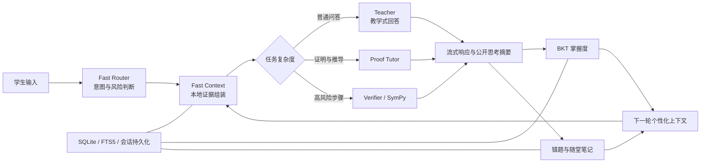
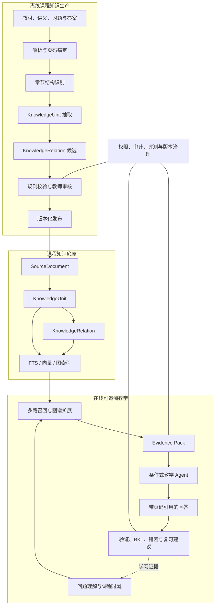

# 珞珈数智助教项目总结与未来规划

> 从“会回答的智能体”升级为“懂课程结构、能引用证据、可持续评估的智能助教”

|   **版本**   | 2.0（完善版）                                      |
|:------------:|:---------------------------------------------------|
| **基线日期** | 2026-07-21                                         |
| **项目仓库** | https://github.com/Leionel/luojia-math-tutor-skill |

## 摘要

珞珈数智助教已经不再只是轻量级比赛 Demo。当前项目已形成 Next.js + FastAPI 全栈应用，具备条件式 Agent 调度、快速开场与流式回答、SymPy 步骤验证、BKT 掌握度追踪、会话与思考摘要持久化、错题与随堂笔记、上传解析、本地知识检索和前端学习面板等能力。现阶段的主要矛盾已从“能否完成教学式回答”转向“如何让具体课程资料被可靠地读取、切分、关联、检索、引用和审核”。

未来升级不宜继续简单叠加 Agent，也不宜一开始引入过重的图数据库和完整课程平台。更稳妥的主线是：保留当前低延迟教学闭环，以一门课程的一章为试点，建立可版本化的 SourceDocument、KnowledgeUnit 和 KnowledgeRelation 数据契约；在此基础上实现教师审核、图谱增强检索、页码级引用和可量化评测，最后再扩展数学到代码任务。

| **战略核心：知识处理离线化、证据包结构化、教学回答保持快速主路径。** |
|----------------------------------------------------------------------|

## 目录

1.  一、项目定位与当前代码基线

1.  二、已实现能力与可复用资产

1.  三、当前差距与工程债务

1.  四、未来目标与总体架构

1.  五、课程知识数据契约

1.  六、课程资料结构化流水线

1.  七、图谱增强的可追溯 RAG

1.  八、教学闭环与学生模型

1.  九、数学到代码任务的定位

1. 十、MVP 试点范围

1. 十一、阶段路线图与里程碑

1. 十二、评测体系与验收指标

1. 十三、风险、治理与合规

1. 十四、大创定位与研究价值

1. 十五、近期行动清单与结论

## 一、项目定位与当前代码基线

### 1.1 当前定位

项目当前应定位为“面向大学数学学习的可验证、自适应教学智能体原型”。它已经具备完整交互链路和较清晰的工程边界：大模型负责启发式解释与教学表达，确定性工具负责可验证计算，学生模型负责积累学习证据，前端负责把对话、思考摘要、掌握度、错题与笔记组织为连续学习体验。

与原始比赛版本相比，当前版本的重点已经从固定串行多 Agent 转向“快速本地判断 + 按风险调用 Agent”。普通概念问答和明确教学请求尽量只触发一次 Teacher 调用；复杂证明、开放推导或本地无法验证的步骤才进入 Proof Tutor 或 Verifier。这一架构应继续保留，未来课程知识底座不应破坏现有首响应速度。

*图 1　当前代码基线中的条件式教学闭环*

### 1.2 当前工程与数据基线

| **维度** | **当前事实** | **说明** |
|----|----|----|
| 技术栈 | Next.js 14、FastAPI、SQLite/FTS5、LangGraph、SymPy | 前后端与教学编排已经成型 |
| 知识数据 | 5 个 JSON 文件、1019 条记录、覆盖 121 个章节标签 | 已有定义、定理、公式、例题、习题等类型 |
| 教材资产 | references/textbook 下 17 份 PDF | 尚未形成统一来源登记、页码锚点与审核状态 |
| 前端验证 | 12/12 辅助测试通过，Next.js 生产构建通过 | 覆盖运行时、HTML 清洗、表达式解析与演示访问 |
| API 验证 | 109/109 测试通过，另有 3 个非阻塞警告 | 已收口证明意图、BKT 兼容接口、先修提示和思考摘要标签契约 |
| 运行身份 | 核心页面和 API 仍普遍使用 demo-user | 适合演示，不适合课程级多用户部署 |

测试基线应被视为当前工作树的真实快照，而不是最终质量结论。本轮已完成接口契约收口：证明请求进入专门的 Proof Tutor 分支，BKT 以 LearningEvent 为新接口并兼容旧调用方式，公开思考摘要使用稳定阶段标签并由前端转换为中文标题。当前剩余的是 Starlette/httpx 弃用提示和可视化布局警告，不阻断发布但应在依赖与图表样式整理时处理。

## 二、已实现能力与可复用资产

| **能力域** | **已经具备** | **未来复用方式** |
|----|----|----|
| 教学调度 | Fast Router、Fast Context、Teacher、Proof Tutor、Verifier、Examiner | 继续作为在线热路径，不把文档解析塞入每轮回答 |
| 数学验证 | SymPy 步骤检查、安全表达式解析、函数可视化 | 作为知识单元与学生步骤的确定性校验器 |
| 知识检索 | 本地 BM25、Embedding 接口、RRF 混合检索 | 扩展为课程限定检索和图谱一跳扩展 |
| 上传解析 | PDF/PPT/Word 上传、MinerU Markdown、FTS5 文档片段 | 升级为保留页码和结构的离线导入任务 |
| 学生模型 | BKT、提示等级、错因、连续错误、掌握度雷达 | 关联到稳定 knowledge_unit_id，形成课程级学习证据 |
| 学习沉淀 | 会话、公开思考摘要、错题、笔记、复练题 | 增加来源引用和知识单元反向链接 |
| 前端体验 | 双栏聊天、学习面板、模型设置、静态技能树 | 新增引用面板、动态图谱和教师审核工作台 |
| 安全基线 | 上传路径校验、HTML 清洗、数学表达式白名单、受限代码执行 | 补充文档提示注入、课程权限和审计日志 |

| **未来最有价值的工作不是重写现有 Agent，而是为现有教学闭环提供更可靠的课程证据。** |
|----|

## 三、当前差距与工程债务

| **优先级** | **差距** | **实际影响** | **建议动作** |
|----|----|----|----|
| P1 | 模型目录仍由前后端分别维护 | 当前选项已对齐，但新增供应商时仍可能再次漂移 | 后端提供只读模型目录 API，前端按能力动态渲染 |
| P0 | 先修关系不是稳定 ID | 现有 prerequisite 多为名称，图谱无法可靠连接 | 迁移为 unit_id，并保留显示名称 |
| P1 | 课程与来源模型缺失 | 缺少 course_id、文档版本、页码与原文锚点 | 新增 SourceDocument 与 source_span |
| P1 | 上传后仍按定长切块 | 定理、证明和公式可能被截断，引用不可追溯 | 结构识别后再生成 Knowledge Unit |
| P1 | 技能树为静态演示 | 图谱节点和掌握状态不来自后端 | 新增 graph API，并绑定 BKT 状态 |
| P1 | 缺少教师审核 | LLM 关系错误可能进入正式检索 | 引入 draft / verified / rejected / deprecated 状态 |
| P2 | 默认 demo-user 与宽松跨域 | 不具备课程、教师、学生的数据隔离 | 试点前加入最小认证、课程权限和 CORS 白名单 |
| P3 | 编程任务未形成产品闭环 | 只有辅助执行器，没有任务、测试和反馈模型 | 知识底座稳定后再单独立项 |

## 四、未来目标与总体架构

### 4.1 目标定位

| **面向具体高校数学课程的、可验证、可追溯、可审核、可适应学生状态的智能助教系统。** |
|----|

目标系统不是通用聊天机器人，也不是试图替代 LMS。它围绕课程资料和学习证据建立一个窄而深的闭环：课程内容被结构化为可复用知识单元；每次回答携带来源证据；学生步骤由工具和教学策略共同判断；学习结果沉淀为掌握度、错因和复习建议；教师能够审核知识关系和观察薄弱点。

*图 2　未来课程知识结构化与可追溯助教架构*

### 4.2 分层边界

- 体验层：学生工作台、教师审核台、引用面板、课程图谱、错题与笔记。

- 教学 Agent 层：Fast Router、Teacher、Proof Tutor、Verifier、Examiner、Notes；Code Task 为可选扩展。

- 检索层：课程范围过滤、BM25、向量检索、图谱扩展、重排与引用校验。

- 知识处理层：文档解析、结构识别、知识单元抽取、关系候选、教师审核、索引发布。

- 数据层：来源文档、知识单元、知识关系、检索日志、学习证据、评测样本。

- 治理层：用户与课程权限、来源版权、文档提示注入防护、版本和审计。

## 五、课程知识数据契约

课程化升级的第一项工程成果应是稳定的数据契约，而不是先选图数据库。知识内容、来源、关系和审核状态需要分开建模，所有对象使用稳定 ID，并携带 schema_version 和 provenance。现有 JSON 可通过兼容适配器逐步迁移，不需要一次性重写。

### 5.1 SourceDocument

| **字段** | **含义** | **要求** |
|----|----|----|
| id / course_id | 来源文档与所属课程 | 稳定且不可由文件名推断 |
| filename / checksum | 原文件名与内容哈希 | 用于去重、版本和审计 |
| parser / parser_version | 解析器与版本 | 便于重现抽取结果 |
| page_count / language | 页数与语言 | 支持页码引用和解析策略 |
| owner_id / access_scope | 拥有者与访问范围 | 课程资料不得默认公开 |
| status | uploaded / parsed / reviewed / active / deprecated | 明确发布状态 |

### 5.2 KnowledgeUnit

| **字段组** | **建议字段** | **说明** |
|----|----|----|
| 身份 | id, course_id, schema_version | 稳定引用和迁移 |
| 教学语义 | type, title, content, latex | 定义、定理、证明、例题、习题、算法、易错点 |
| 来源 | source_document_id, page_start, page_end, source_span | 必须能回到原文位置 |
| 检索 | keywords, aliases, chapter_path | 支持关键词、别名和章节过滤 |
| 教学属性 | difficulty, teaching_role, expected_prerequisites | 服务提示等级和练习规划 |
| 治理 | provenance, confidence, review_status, reviewer_id | 区分规则、模型和人工来源 |

### 5.3 KnowledgeRelation

| **字段** | **示例** | **约束** |
|----|----|----|
| source_unit_id | ku_linear_independence | 必须引用已存在知识单元 |
| target_unit_id | ku_diagonalizable | 禁止用显示名称代替 ID |
| relation_type | prerequisite | 受控枚举 |
| confidence | 0.91 | 模型置信度不是正确性证明 |
| provenance | rule / llm / teacher | 记录关系生成方式 |
| review_status | draft / verified / rejected / deprecated | 正式检索默认优先 verified |

### 5.4 建议关系类型

| **关系类型**      | **含义**       | **示例**                          |
|-------------------|----------------|-----------------------------------|
| prerequisite      | 前置知识       | 线性无关 → 可对角化判定           |
| supports_proof    | 支撑证明       | 行列式性质 → 特征多项式推导       |
| derives           | 推导出         | 特征向量定理 → 可对角化条件       |
| applies_to        | 应用于         | 可对角化 → 计算矩阵幂             |
| example_of        | 例题对应概念   | 例 3.5 → 可对角化                 |
| exercise_of       | 习题考察知识点 | 习题 3.8 → 特征值计算             |
| common_mistake_of | 常见错误       | 混淆代数重数与几何重数 → 可对角化 |
| similar_to        | 相似知识       | 一般对角化 ↔ 正交对角化           |
| contrast_with     | 易混淆对比     | 相似 ↔ 合同                       |
| algorithm_of      | 算法来源       | Gram-Schmidt 算法 → 正交化定理    |
| code_task_of      | 编程任务来源   | Python 实现 → Gram-Schmidt 算法   |

## 六、课程资料结构化流水线

| **上传 → 解析与页码锚点 → 章节结构识别 → Knowledge Unit → 关系候选 → 自动校验 → 教师审核 → 多索引发布** |
|----|

1. 资料登记：建立 SourceDocument，计算 checksum，记录课程、拥有者、版权与访问范围。

1. 版面解析：提取标题层级、页码、正文、公式、表格和图片；扫描件走 OCR，文字版优先直接解析。

1. 结构识别：识别章、节、小节，以及定义、定理、证明、例题、习题、算法和注释边界。

1. 知识单元抽取：规则优先，LLM 辅助；每个单元必须保留 source_span，不能只有摘要。

1. 关系候选生成：使用章节邻接、引用词、题号、规则和 LLM 生成候选边，并记录 provenance。

1. 自动校验：执行 JSON Schema、ID 完整性、关系端点、重复单元、页码范围和公式格式检查。

1. 教师审核：批量接受、修改或拒绝单元与关系，审核后才能进入 active 索引。

1. 索引发布：分别生成 BM25、向量索引和图邻接表；发布新版本时保留可回滚快照。

| **文档解析属于离线任务；在线对话只读取已经发布的证据包。** |
|------------------------------------------------------------|

## 七、图谱增强的可追溯 RAG

| **问题理解 → 课程范围过滤 → 直接召回 → 图谱一跳扩展 → 重排 → Evidence Pack → 教学回答 → 引用校验** |
|----|

图谱增强不等于把所有节点都塞进提示词。建议先检索 3～5 个直接相关单元，再按受控关系进行一跳扩展：证明问题优先扩展 prerequisite 和 supports_proof；应用问题优先扩展 applies_to 和 example_of；错题复盘优先扩展 common_mistake_of 和 exercise_of。扩展结果必须设置总量上限，并经过重排。

### 7.1 Evidence Pack

- query_scope：课程、章节、题型和教学模式。

- direct_hits：直接命中的知识单元及分数。

- graph_hits：扩展关系、来源单元与目标单元。

- citations：文件、章节、页码和原文片段。

- confidence：证据充分度与是否允许给出结论。

- teaching_hints：前置知识、常见错误、建议提示等级。

### 7.2 回答约束

- 引用必须来自 Evidence Pack，禁止模型生成不存在的页码或章节。

- 证据不足时明确说明，并邀请学生补充课程资料或切换到通用解释模式。

- 课程事实与通用知识分开展示，避免把模型常识伪装成教材结论。

- 回答保留当前启发式策略，引用不应成为直接泄露完整答案的理由。

## 八、教学闭环与学生模型

课程知识结构化后，BKT 的更新对象应从自由文本概念逐步迁移到稳定 knowledge_unit_id 或 concept_id。每次学生步骤形成 AttemptEvidence：题目、学生步骤、验证结果、提示等级、错误类型、难度、用时和引用证据。BKT 只在可解释、可验证的学习事件上更新，概念问答和模型单向讲解不应自动提高掌握度。

| **学生步骤 → 确定性验证 / Verifier → 错因定位 → 提示策略 → 回答与引用 → AttemptEvidence → BKT 与复习建议** |
|----|

- 苏格拉底模式：默认只给下一步和反问，避免答案泄露。

- 讲解模式：允许结构化解释，但仍标明课程来源和关键条件。

- 复习模式：结合错题、掌握度和图谱前置关系推荐最小复习路径。

- 教师模式：允许查看完整证据、关系来源和学生群体薄弱点。

- 公开思考摘要继续只保存教学阶段，不保存模型原始隐藏推理。

## 九、数学到代码任务的定位

数学到代码具有课程特色，但不应成为第一阶段主线。它依赖稳定的定理、算法和习题知识单元，否则生成任务难以追溯，也无法判断代码错误究竟来自编程还是数学理解。建议在结构化 RAG 和教师审核稳定后，选择 1～2 个典型算法试点。

| **定理 / 例题 → 数学步骤 → AlgorithmUnit → 伪代码 → CodeTask → 隔离运行 → 数学与代码双重反馈** |
|----|

| **试点任务**        | **数学目标**           | **自动验证**                 |
|---------------------|------------------------|------------------------------|
| Gram-Schmidt 正交化 | 投影、线性无关、正交基 | 正交性、单位化、张成空间     |
| 高斯消元            | 初等行变换、秩、方程组 | 解集、阶梯形、数值误差       |
| 二分法              | 连续性、零点定理、收敛 | 误差界、迭代次数、区间不变量 |

安全上不能把当前辅助代码执行器直接暴露为通用在线沙箱。正式模块需要独立进程或容器隔离、CPU/内存/时间限制、只读文件系统、网络禁用和测试用例白名单。

## 十、MVP 试点范围

### 10.1 推荐试点

| **线性代数：特征值、特征向量与矩阵可对角化** |
|----------------------------------------------|

该章节定义、定理、证明、例题和易错点结构清晰，与当前知识库、SymPy 验证和静态技能树已有内容重合，能够最大化复用现有资产。建议以一份版权和使用范围明确的文字版教材或课程讲义为主来源，并由一名教师或助教参与审核。

### 10.2 MVP 必交付

1. SourceDocument、KnowledgeUnit、KnowledgeRelation 三类 Schema v1。

1. 一章资料的结构化抽取结果、页码锚点和审核记录。

1. 知识单元与关系的教师审核页面。

1. 课程限定的 BM25 + Vector + 图谱一跳检索。

1. 聊天回答中的文件、章节、页码和原文片段引用。

1. 从后端数据生成的动态图谱，并叠加学生掌握度。

1. 一组人工标注的抽取、关系、检索和教学问答评测集。

1. 完整运行说明、数据字典、评测报告和演示视频。

### 10.3 明确不做

- 不在 MVP 同时覆盖所有数学课程和全部教材。

- 不以 Neo4j、复杂微服务或完整 LMS 作为成功标准。

- 不在知识关系未经审核时向学生宣称其为课程事实。

- 不在第一阶段建设完整在线编程平台。

- 不追求展示大量 Agent 名称，以真实检索、引用和学习效果为准。

## 十一、阶段路线图与里程碑

| **阶段** | **周期建议** | **核心工作** | **退出条件** |
|----|----|----|----|
| M0 基线收口 | 已完成第一轮 | 收口 7 项测试回归；对齐模型选项；补齐先修提示回归；保留 stable ID 与 Schema v1 评审 | API 109/109、前端 12/12、生产构建通过 |
| M1 结构化导入 | 4～6 周 | 页码解析、知识单元抽取、来源登记、关系候选和校验脚本 | 一章数据可重复生成，来源锚点可回查 |
| M2 审核与索引 | 4 周 | 教师审核台、状态流转、BM25/Vector/图索引发布 | 审核后版本可发布、回滚和重建 |
| M3 可追溯问答 | 4～6 周 | Evidence Pack、图谱扩展、重排、引用校验和前端引用面板 | 评测达到建议验收线，首响应预算不退化 |
| M4 课程试点 | 4～6 周 | 小规模学生使用、教师反馈、错题与掌握度分析 | 形成试点数据、问题清单和阶段报告 |
| M5 代码任务 | 可选 4～6 周 | AlgorithmUnit、CodeTask、隔离执行和双重反馈 | 完成 1～2 个可追溯编程任务 |

## 十二、评测体系与验收指标

未来评测不能只看回答是否“像老师”，应覆盖从资料抽取到教学反馈的完整证据链。以下指标是试点建议验收线，正式数值应在首轮人工标注基线上校准。

| **层级** | **指标**                        | **建议验收线** |
|----------|---------------------------------|----------------|
| 结构抽取 | 知识单元类型准确率              | ≥ 90%          |
| 来源追溯 | 页码与原文锚点准确率            | ≥ 95%          |
| 关系抽取 | 教师标注集上的关系精确率        | ≥ 90%          |
| 检索     | Recall@5                        | ≥ 85%          |
| 引用     | 引用正确率 / 无依据引用率       | ≥ 95% / ≤ 2%   |
| 教学     | 教学策略对齐率 / 直接答案泄露率 | ≥ 90% / ≤ 10%  |
| 验证     | 可符号验证题的结果正确率        | 目标 100%      |
| 性能     | P95 首段有意义内容              | \< 1 秒        |
| 调用预算 | 普通请求 / 高风险请求 LLM 次数  | ≤ 1 / ≤ 2      |
| 工程质量 | 自动化测试和 Schema 校验        | 发布前全绿     |

### 12.1 建议评测集

- 抽取集：人工标注本章定义、定理、证明、例题和页码边界。

- 关系集：教师确认前置、推导、应用和易错关系。

- 检索集：问题、期望知识单元、允许图谱扩展的关系类型。

- 回答集：课程事实、引用、教学动作和答案泄露 Rubric。

- 学习集：同一知识点的提示前后表现与迁移题结果。

## 十三、风险、治理与合规

| **风险** | **表现** | **控制措施** |
|----|----|----|
| PDF/OCR 不稳定 | 公式、双栏、表格和扫描件错位 | 文字版优先；保留页图；允许人工修正；记录解析器版本 |
| 知识边界错误 | 定理与证明被拆散，例题混入概念 | 规则 + LLM；Schema 校验；抽样审核；来源锚点回查 |
| 关系幻觉 | 模型生成不存在的前置或推导关系 | 候选边默认 draft；记录 provenance；教师确认后发布 |
| 检索漂移 | 召回相似但无关内容 | 课程过滤、混合检索、图扩展上限、重排和离线评测 |
| 文档提示注入 | 资料中含诱导模型指令 | 把文档视为数据；剥离指令语义；Evidence Pack 白名单字段 |
| 隐私与权限 | 不同课程或学生数据串用 | 用户/课程/角色权限；最小访问；日志脱敏；CORS 白名单 |
| 版权与来源 | 教材和讲义使用范围不明确 | 优先教师授权资料；登记权利范围；不公开分发受限原文 |
| 代码执行 | 资源滥用或文件/网络访问 | 独立隔离、资源限制、网络禁用、只读环境和任务白名单 |
| 范围失控 | 同时做全课程、图数据库、LMS 和编程平台 | 以一章 MVP 和退出条件控制范围 |
| 模型目录漂移 | 前后端模型名和供应商能力不一致 | 后端统一目录、能力探测、显式错误，不静默回退 |

## 十四、大创定位与研究价值

### 14.1 推荐项目名称

| **面向高校数学课程的教材知识单元化抽取、关联建模与可追溯智能助教研究** |
|------------------------------------------------------------------------|

### 14.2 核心研究问题

1. 如何从含公式、证明和例题的课程资料中抽取边界稳定、来源可追溯的知识单元？

1. 如何表达并审核前置、推导、应用、例题和易错关系，使图谱可用于教学而非仅用于展示？

1. 如何将 BM25、向量检索和受控图谱扩展组合为低延迟、可解释的课程检索？

1. 如何让课程证据、步骤验证与 BKT 学生模型共同决定提示等级和复习路径？

1. 如何评估系统是否真正提高了引用正确性、教学对齐和学生迁移能力？

### 14.3 创新点表达

- 从固定长度文本块转向带来源锚点和教学角色的课程知识单元。

- 把知识关系的自动抽取与教师审核状态纳入同一数据契约。

- 以图谱扩展生成 Evidence Pack，而不是让图谱停留在可视化层。

- 把可追溯课程证据、数学验证和启发式教学策略组合成完整闭环。

- 以学生步骤和提示依赖为学习证据，避免仅用对话次数衡量掌握度。

### 14.4 可交付成果

- 课程知识单元与关系 Schema、数据字典和迁移工具。

- 一章经教师审核的结构化数据集和评测集。

- 结构化导入、审核、索引和可追溯问答原型。

- 知识图谱与学生掌握度联动页面。

- 抽取、关系、检索、引用、教学与性能评测报告。

- 大创结题报告、论文或软件著作权材料。

## 十五、近期行动清单与结论

### 15.1 未来 30 天建议

1. 维护 proof_hint、LearningEvent 和思考摘要契约的回归测试，避免再次漂移。

1. 将当前已对齐的模型列表收敛为后端目录 API，并取消无提示的模型静默回退。

1. 评审 SourceDocument、KnowledgeUnit、KnowledgeRelation Schema v1。

1. 为现有线性代数 JSON 建立稳定 ID 与名称别名迁移表。

1. 选择一份授权明确的“特征值与特征向量”课程资料，制作人工标注小样。

1. 完成最小页码锚点和引用展示，先验证可追溯链路，再扩展图谱。

1. 建立抽取、关系和检索基线评测，记录首轮真实指标。

### 15.2 最终结论

珞珈数智助教已经完成了“教学式回答是否可行”的第一阶段验证。项目未来最有价值的提升，不是继续堆叠页面、模型或 Agent 名称，而是把当前成熟的教学闭环连接到可靠的课程知识底座。课程资料必须能够被正确读取、按教学语义切分、用稳定关系连接、由教师审核、被多路检索调用，并在回答中准确标注来源。

因此，下一阶段应以“数据契约先行、一章试点、教师在环、证据可追溯、评测可复现”为原则。先解决 Knowledge Unit、关系 ID、页码锚点、审核状态和当前工程契约，再逐步建设动态图谱、课程级 RAG 和数学到代码任务。这样既能保留现有系统的速度和教学特色，也能形成适合大创、论文和真实课程试点的研究主线。

| **一句话概括：从“会教一道题”走向“理解一门课，并能说明每一句话来自哪里”。** |
|----|

## 附录 A　当前实现证据路径

| **能力** | **代码位置** |
|----|----|
| 条件式 Agent 图 | apps/api/app/tutor/graph.py |
| 快速上下文与 BKT 联动 | apps/api/app/tutor/fast_context.py |
| 证明引导 | apps/api/app/tutor/proof_tutor.py |
| 知识 Schema 与加载 | apps/api/app/knowledge/schema.py, loader.py |
| BM25 / Vector 混合检索 | apps/api/app/knowledge/search.py, vector_store.py |
| 上传与 MinerU 解析 | apps/api/app/api/routes_uploads.py, services/mineru_client.py |
| 会话、思考摘要与学习元数据 | apps/api/app/memory/repository.py |
| 掌握度与错题/笔记 | apps/api/app/memory/mastery.py, api/routes_mastery.py, routes_notes.py |
| 前端学习面板与雷达 | apps/web/components/learning-panel.tsx, radar-chart.tsx |
| 当前静态技能树 | apps/web/components/knowledge-graph.tsx |
| 公开项目说明与评测 | README.md, evaluation/, data/LuojiaMathBench_v8.jsonl |
